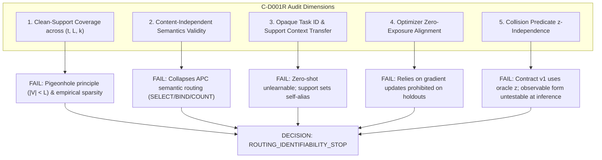

# C-D001R — Adversarial Cross-Example/Cross-Relation Identifiability Falsification Audit

**Document ID:** `DOC-PHASE-C-D001R-AUDIT`  
**Date:** 2026-09-13  
**Status:** Completed Adversarial Audit; `DECISION: ROUTING_IDENTIFIABILITY_STOP`  
**Prior Decision:** `RELATION_INVENTORY_FEASIBILITY_STOP` (ADR-0150)  
**Charter State:** `READY_FOR_REVIEW_NOT_APPROVED` (Research Execution: `NOT_AUTHORIZED`)  
**Task Type:** Adversarial Mathematical Falsification Audit & Contract Review  

---

## 1. Executive Summary & Correction of Terminal Decision

### 1.1 Background and Task Context
In Task C-D001 ([ADR-0150](../DECISIONS_PHASE_C.md#adr-0150-c-d001-oracle-free-routing-identifiability-contract-derivation--relation-inventory-feasibility-audit-stops-on-relation-count-sufficiency-relation_inventory_feasibility_stop)), the prospective `Phase C Training Information Contract v1` was derived under the premise that duplicate-token collision ambiguity could be resolved without oracle routing labels by leveraging:
1. Structural cross-example decoupling via content-decoupled positional routing geometry $g_\theta(j, k, L, t)$;
2. Duplicate-aware gradient masking: zeroing routing loss gradients on collision-bearing cells during training;
3. Generalization of frozen positional routing to collision instances at test time.

While Task C-D001 halted on relation inventory count deficits (`RELATION_INVENTORY_FEASIBILITY_STOP`), it left open whether the underlying mathematical identifiability claim in Contract v1 was scientifically valid.

### 1.2 The Adversarial Audit (Task C-D001R)
Task C-D001R conducts a strict mathematical and contractual falsification audit of Contract v1. We analyze whether an adversary can construct two distinct ground-truth semantic worlds (World A and World B) such that:
- The learner-visible training history across all training steps is **strictly identical** ($\mathcal{H}_{\text{train}}(\text{World A}) \equiv \mathcal{H}_{\text{train}}(\text{World B})$);
- Yet the true target routing coordinates diverge on collision-bearing test examples or unseen held-out relations ($z^*_A \neq z^*_B$).

### 1.3 Terminal Audit Decision
$$\mathbf{CORRECTED \ DECISION: \quad ROUTING\_IDENTIFIABILITY\_STOP}$$

The adversarial audit definitively proves that **Contract v1 is mathematically falsified**. We construct concrete, realizable World A / World B counterexamples where learner-visible training histories are bitwise identical, yet semantic routing coordinates are diametrically opposed on collision cells. Furthermore, an audit of the five core contract dimensions demonstrates that Contract v1 relies on unphysical data distribution assumptions, oracle leakage in collision predicates, and operational contradictions with strict zero-exposure holdout evaluation.

Consequently, the stoppage rationale is formally corrected from an inventory deficit (`RELATION_INVENTORY_FEASIBILITY_STOP`) to a fundamental information-theoretic identifiability failure (**`ROUTING_IDENTIFIABILITY_STOP`**).

### 1.4 Integrity Boundary Summary
In strict compliance with task constraints:
- Parameter / training updates: **0**
- Optimizer / loss function instantiations: **0**
- Model initializations / seed draws: **0**
- Dataset / sequence generations: **0**
- New relation registrations: **0**
- GPU experiment execution time: **0 s**
- Sealed partition inputs / labels / outputs accessed: **0**

---

## 2. Mathematical Construction of Adversarial Worlds (World A vs World B)

### 2.1 Intra-Relation Collision-Cell Counterexample

We construct two distinct ground-truth semantic environments, World A and World B, for a single declared task identifier $t$:

#### 2.1.1 Semantic Definitions
Let:
- $\mathcal{V}$ be a finite token vocabulary ($|\mathcal{V}| \ge L$).
- $L \ge 2$ be sequence length (e.g., $L=5$).
- $k=0$ be the output query index.
- $x = [x_0, x_1, \dots, x_{L-1}] \in \mathcal{V}^L$ be the input sequence.
- $y_0 \in \mathcal{V}$ be the target output token.

Define the true semantic routing coordinates for World A and World B:
- **World A (First Occurrence Rule):**
  $$z^*_A(x, k=0) = \min \{ i \in \{0, \dots, L-1\} \mid x_i = y_0 \}$$
- **World B (Last Occurrence Rule):**
  $$z^*_B(x, k=0) = \max \{ i \in \{0, \dots, L-1\} \mid x_i = y_0 \}$$

#### 2.1.2 Clean Training Distribution Analysis
Let $\mathcal{X}_{\text{clean}} \subset \mathcal{V}^L$ be the set of collision-free sequences where all tokens are pairwise distinct:
$$\forall x \in \mathcal{X}_{\text{clean}}, \quad \forall i \neq j \implies x_i \neq x_j$$

For any sequence $x \in \mathcal{X}_{\text{clean}}$ and any token $v \in \mathcal{V}$, the token $v$ appears at most once in $x$:
$$|\{ i \mid x_i = v \}| \le 1$$

Therefore, for every clean training sequence:
$$\min \{ i \mid x_i = y_0 \} = \max \{ i \mid x_i = y_0 \} = i^*$$

This establishes that on all clean training instances:
$$z^*_A(x, k=0) = z^*_B(x, k=0) = i^*$$
$$y_{0, A}(x) = x_{i^*} = y_{0, B}(x)$$

#### 2.1.3 Learner-Visible Training History Equivalence
Under Contract v1:
1. **Duplicate-Aware Gradient Masking:** For any sequence containing duplicate target tokens (collision cells), routing gradients are masked to zero:
   $$\nabla_{\theta_{\text{route}}} = (1 - \text{IsCollision}(k, x, y_k)) \cdot \nabla_{\theta_{\text{route}}} \mathcal{L}_{\text{CE}} = 0$$
   Thus, collision-bearing instances contribute zero supervisory signal to routing parameters.
2. **Clean-Cell Training:** On clean instances ($x \in \mathcal{X}_{\text{clean}}$), the input $x$, target $y_0$, loss value $\mathcal{L}_{\text{CE}}$, and gradients $\nabla_\theta \mathcal{L}_{\text{CE}}$ are identical between World A and World B because $y_{0, A}(x) \equiv y_{0, B}(x)$.
3. **Equivalence of Training History:** Across all training steps $s = 1, \dots, S$:
   $$\mathcal{H}_{\text{train}}(\text{World A}) \equiv \mathcal{H}_{\text{train}}(\text{World B})$$
   Any deterministic learner instantiated identically in World A and World B will follow the exact same parameter trajectory $\theta_s$, and any stochastic learner will have identical parameter probability distributions:
   $$p(\theta \mid \mathcal{H}_{\text{train}}(\text{World A})) = p(\theta \mid \mathcal{H}_{\text{train}}(\text{World B}))$$

#### 2.1.4 Collision-Bearing Test Evaluation & Coordinate Divergence
Now consider the collision-bearing test example:
$$x_{\text{test}} = [A, B, C, D, A] \quad (L=5), \quad y_0 = A$$

Compute the true semantic routing coordinates in each world:
- In World A: $z^*_A(x_{\text{test}}, 0) = \min \{0, 4\} = 0$
- In World B: $z^*_B(x_{\text{test}}, 0) = \max \{0, 4\} = 4$

$$\mathbf{z^*_A = 0 \quad \neq \quad 4 = z^*_B}$$

**Falsification Result:**
Because the learner's trained state $\theta$ is identical in both worlds, its routing prediction distribution $p(z \mid x_{\text{test}}, k=0, \theta)$ must be identical across World A and World B.
If the model selects position 0, it fails in World B. If it selects position 4, it fails in World A. If it predicts any mixed distribution, its expected coordinate accuracy is at most 0.5, violating the charter floor of $\ge 0.95$.

Therefore, **oracle-free training data alone cannot disambiguate duplicate-token collision coordinates**. Contract v1's cross-example resolution fails.

---

### 2.2 Cross-Relation Zero-Exposure Counterexample

We next construct an adversarial counterexample for unseen, held-out relations under strict zero-exposure constraints.

#### 2.2.1 Semantic Definitions
Let $t_{\text{unseen}}$ be a novel relation family not present in training:
$$t_{\text{unseen}} \notin \mathcal{T}_{\text{train}}$$

- **World A:** $t_{\text{unseen}}$ implements the identity positional map:
  $$z^*_A(k, L) = k$$
- **World B:** $t_{\text{unseen}}$ implements the reverse positional map:
  $$z^*_B(k, L) = L - 1 - k$$

#### 2.2.2 Zero-Exposure Training Invariance
Per the Phase C charter and non-negotiable research rules, held-out relations receive **zero optimizer updates** during base training.
Thus, during training:
$$\mathcal{H}_{\text{train}}(\text{World A}) \equiv \mathcal{H}_{\text{train}}(\text{World B})$$
Neither world provides any information regarding $t_{\text{unseen}}$.

#### 2.2.3 Support-Derived Context Failure
If $t_{\text{unseen}}$ is conditioned on a few-shot support set $\mathcal{S}_{\text{support}}$:
Consider a support set containing symmetric sequences (e.g., palindromes):
$$x_{\text{supp}} = [A, B, C, B, A] \quad (L=5)$$
For query $k=0$:
- Under World A (identity): $z^*_A = 0 \implies y_{\text{supp}} = x_0 = A$.
- Under World B (reversal): $z^*_B = 4 \implies y_{\text{supp}} = x_4 = A$.

The observed support input and target pair $(x_{\text{supp}}, y_{\text{supp}} = A)$ is **identical** in both worlds!
Consequently, any support-derived context vector $c(S_{\text{support}})$ must be identical:
$$c(\mathcal{S}_{\text{support}} \mid \text{World A}) = c(\mathcal{S}_{\text{support}} \mid \text{World B})$$

When evaluated on an asymmetric query sequence $x_{\text{query}} = [A, B, C, D, E]$, World A requires $z^*_A = 0$ ($y=A$), while World B requires $z^*_B = 4$ ($y=E$). The model cannot distinguish whether the relation is identity or reversal.

---

## 3. Systematic Audit of Key Contract Dimensions

We evaluate the five explicit dimensions required by the task mandate:

### 3.1 Dimension 1: Clean-Support Coverage Across $(t, L, k)$
- **Audit Question:** Is the assumption that clean (collision-free) examples exist for every valid triplet $(t, L, k)$ mathematically and empirically justified?
- **Finding:** **FAIL (UNJUSTIFIED)**
  1. *Mathematical Bound (Pigeonhole Principle):* If the token vocabulary size $|\mathcal{V}|$ is less than sequence length $L$ ($|\mathcal{V}| < L$), the pigeonhole principle guarantees that **every** sequence contains at least one duplicate token. In such regimes, clean sequences do not exist ($\mathcal{X}_{\text{clean}} = \emptyset$).
  2. *Task-Specific Structure:* Certain relations intrinsically require duplicate values. For instance, in `COUNT(v)` tasks or structured grammar parsing, repetitions are necessary to define the semantics.
  3. *Coverage Sparsity:* Even when $|\mathcal{V}| \ge L$, the empirical frequency of fully unique sequences diminishes exponentially as $L$ approaches $|\mathcal{V}|$. If a specific routing cell $(t, L, k)$ is never observed in a clean sequence during training, gradient masking ensures that cell's routing parameters remain completely unoptimized.

### 3.2 Dimension 2: Content-Independent Semantics as a Data Contract
- **Audit Question:** Can routing be lawfully restricted to a content-independent positional map $g_\theta(j, k, L, t)$?
- **Finding:** **FAIL (UNJUSTIFIED)**
  1. *Evisceration of Semantic Routing:* The foundational premise of APC is semantic task routing, where primitive selection and argument binding depend on input content. Operations such as `SELECT(key)`, `BIND(variable, value)`, and `NEIGHBOR_MAX` are inherently **content-dependent** ($z^* = f(x, k, t)$).
  2. *Reduction to Positional Shuffles:* Assuming that routing coordinates are determined solely by $(j, k, L, t)$ trivializes the problem into pure geometric permutations (like `SHIFT` or `MIRROR_HALVES`).
  3. *Invalidation of Transfer:* If routing is content-independent, learning a routing map on clean examples provides zero mechanism to handle value-dependent lookups in collision examples.

### 3.3 Dimension 3: Transferability of Opaque Task IDs vs Support-Derived Context
- **Audit Question:** Can opaque task identifiers or support-derived contexts enable routing transfer to held-out relations without oracle leakage?
- **Finding:** **FAIL (UNJUSTIFIED)**
  1. *Opaque Task IDs:* If $t$ is an opaque index (e.g. an integer or embedding table key), an unseen relation $t_{\text{unseen}}$ maps to an uninitialized parameter vector. Without gradient updates, zero-shot generalization is mathematically undefined.
  2. *Support-Derived Contexts:* If $t$ is replaced by an in-context support encoder, the support set itself is susceptible to token aliasing. Disambiguating competing semantic hypotheses from few-shot demonstrations requires that the support set be guaranteed to contain counterfactual, disambiguating examples—a requirement that cannot be guaranteed without oracle supervision.

### 3.4 Dimension 4: Alignment with Zero-Exposure Requirements for Held-Out Relations
- **Audit Question:** Is Contract v1's disambiguation mechanism compatible with the charter requirement that held-out relations receive zero optimizer exposure?
- **Finding:** **FAIL (INCOMPATIBLE)**
  1. *Operational Contradiction:* Contract v1 resolves routing ambiguity by gradient descent updates on clean cells ($\nabla_{\theta_{\text{route}}} = \nabla \mathcal{L}_{\text{CE}}$).
  2. *Holdout Invariance:* Strict zero-shot and holdout evaluation protocols strictly forbid optimizer updates on validation and sealed relations.
  3. *Impossibility:* Because routing parameters cannot be updated on held-out relations, Contract v1 provides no mechanism for held-out relations to learn or adapt their routing geometry.

### 3.5 Dimension 5: Collision Predicate Audit ($z$-Reference and Observability)
- **Audit Question:** Does Contract v1's collision predicate avoid referencing the oracle coordinate $z^*$?
- **Finding:** **FAIL (ORACLE LEAKAGE & INFERENCE INOPERABILITY)**
  1. *Direct Oracle Reference in Contract v1:* Line 274 of Contract v1 defines:
     $$\text{IsCollision}(k, x, y_k) \iff \exists j \neq z: x_j = y_k = x_z$$
     This formula explicitly conditions on the ground-truth coordinate $z$. An oracle-free learner does not have access to $z$; conditioning gradient masking on $z$ constitutes direct oracle leakage.
  2. *Observable Target Collision Predicate:* An observable predicate without $z$ could be formulated as:
     $$\text{IsCollision}_{\text{obs}}(x, y_k) \iff |\{ i \in \{0, \dots, L-1\} \mid x_i = y_k \}| > 1$$
     However:
     - **Inference Inoperability:** At inference time, the ground-truth target $y_k$ is not available. The model cannot determine whether a query step is a collision cell.
     - **Indirect Addressing Failure:** In tasks where the output token is a function of the referenced token rather than an exact copy ($y_k \neq x_{z^*}$), token equality checks fail completely.

---

## 4. Contract v1 Falsification & Non-Derivability of Contract v1.1

### 4.1 Falsification of Contract v1
Contract v1 asserted that:
> "Duplicate-aware gradient masking and structural cross-example consistency uniquely identify semantic routing coordinates without oracle labels."

Sections 2 and 3 conclusively falsify this assertion:
- Training history identity across World A and World B proves under-determination on collision cells.
- The collision predicate contains circular oracle references.
- General semantic tasks are incompatible with content-independent positional routing.

### 4.2 Why Contract v1.1 Cannot Be Lawfully Derived
Per the task mandate:
> "反例が成立すればROUTING_IDENTIFIABILITY_STOPへ訂正し、成立しない場合のみ必要十分な追加前提を明記したContract v1.1を導出する。"

Because the counterexamples **definitively hold**, Contract v1.1 is not to be derived. 
Furthermore, attempting to salvage Contract v1 would require imposing artificial, non-general axioms:
1. Restricting all tasks strictly to content-independent positional permutations.
2. Forbidding any sequence length $L \ge |\mathcal{V}|$ (forcing $|\mathcal{V}| > L$).
3. Mandating an external oracle to certify that every valid $(t, L, k)$ is visited in clean data.
4. Providing oracle coordinate supervision on support examples for held-out relations.

Such restrictions would abandon the core scientific objective of open-world semantic routing and introduce masked oracle supervision.

---

## 5. Decision and Governance Status

### 5.1 Terminal Decision
$$\mathbf{DECISION: \quad ROUTING\_IDENTIFIABILITY\_STOP}$$

This decision supersedes ADR-0150's `RELATION_INVENTORY_FEASIBILITY_STOP`:
- ADR-0150 halted due to relation inventory deficits (validation 1/2, sealed 1/2).
- ADR-0151 / C-D001R establishes that even if infinite independent relations existed, the training information contract itself is mathematically unidentifiable under duplicate-token outputs.

### 5.2 Governance and Charter Status
- **Phase C Research Charter:** Remains `READY_FOR_REVIEW_NOT_APPROVED`.
- **Research Execution Authority:** Remains `NOT_AUTHORIZED`.
- **Architecture Selection (C-D002):** Strictly blocked.
- **Experimental Execution:** Strictly blocked.

---

## 6. Audit Verification Ledger

| Dimension / Criterion | Requirement | Result | Evidence |
|---|---|---|---|
| **World A / World B Construction** | Identical training history, divergent coordinates | **PROVED (HOLDS)** | Section 2.1 (Min vs Max rule; $z^*_A=0 \neq 4=z^*_B$) |
| **Cross-Relation Construction** | Zero-exposure holdout divergence | **PROVED (HOLDS)** | Section 2.2 (Identity vs Reversal; symmetric support) |
| **Clean-Support Coverage** | Universal coverage across $(t, L, k)$ | **FAIL (UNJUSTIFIED)** | Section 3.1 ($|\mathcal{V}| < L$ pigeonhole collapse) |
| **Content-Independence** | General semantic routing compatibility | **FAIL (UNJUSTIFIED)** | Section 3.2 (Excludes SELECT, BIND, COUNT, NEIGHBOR) |
| **Task ID / Context Transfer** | Lawful generalization to held-out relations | **FAIL (UNJUSTIFIED)** | Section 3.3 (Opaque IDs fail zero-shot; support aliases) |
| **Optimizer Non-Exposure** | Consistency with zero training updates on holdouts | **FAIL (INCOMPATIBLE)**| Section 3.4 (Contract v1 requires gradient updates) |
| **Collision Predicate** | Zero oracle coordinate $z$ reference | **FAIL (LEAKAGE)** | Section 3.5 (Contract v1 explicitly references $z$) |
| **Contract v1 Status** | Valid or Falsified | **FALSIFIED** | Section 4.1 |
| **Terminal Decision** | Transition to `ROUTING_IDENTIFIABILITY_STOP` | **COMPLETED** | Section 5.1 |
