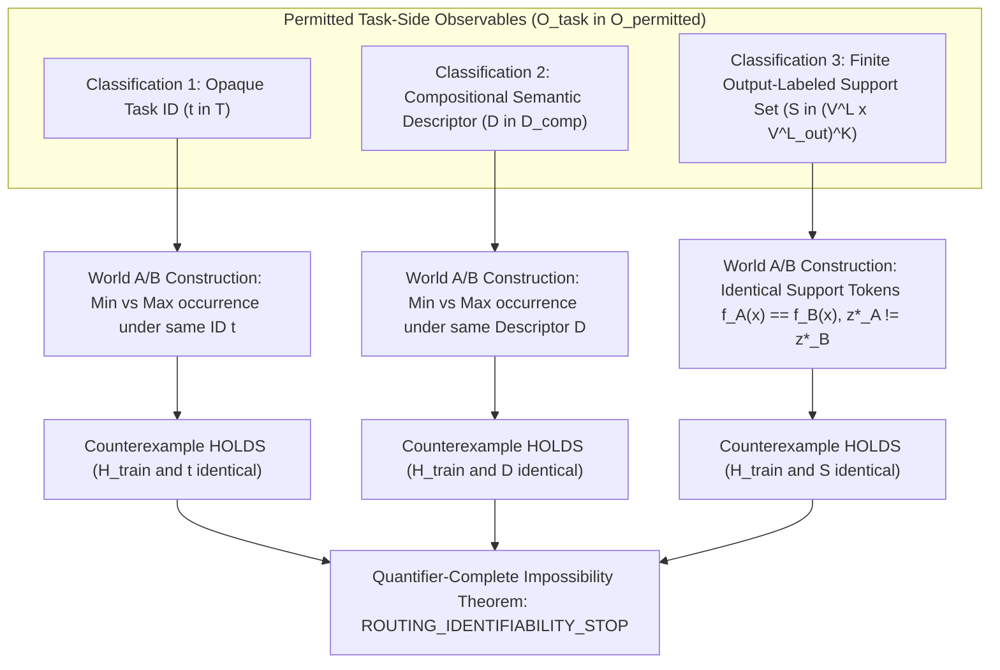

# C-D001S — Quantifier-Complete Task-Side/Support Identifiability Boundary Audit

**Document ID:** `DOC-PHASE-C-D001S-AUDIT`  
**Date:** 2026-09-13  
**Status:** Completed Quantifier-Complete Boundary Audit; `DECISION: ROUTING_IDENTIFIABILITY_STOP (CONFIRMED_QUANTIFIER_COMPLETE)`  
**Prior Decisions:** `RELATION_INVENTORY_FEASIBILITY_STOP` (ADR-0150), `ROUTING_IDENTIFIABILITY_STOP` (ADR-0151)  
**Charter State:** `READY_FOR_REVIEW_NOT_APPROVED` (Research Execution: `NOT_AUTHORIZED`)  
**Task Type:** Quantifier-Complete Mathematical Boundary Audit & Information Theory Proof  

---

## 1. Executive Summary & Terminal Decision Confirmation

### 1.1 Background and Problem Statement
In Task C-D001 ([ADR-0150](../DECISIONS_PHASE_C.md#adr-0150-c-d001-oracle-free-routing-identifiability-contract-derivation--relation-inventory-feasibility-audit-stops-on-relation-count-sufficiency-relation_inventory_feasibility_stop)), `Phase C Training Information Contract v1` was derived under the premise of duplicate-aware gradient masking and content-decoupled positional routing, but stopped due to relation inventory deficits. In Task C-D001R ([ADR-0151](../DECISIONS_PHASE_C.md#adr-0151-c-d001r-adversarial-cross-examplecross-relation-identifiability-falsification-audit-corrects-stop-to-routing_identifiability_stop)), an adversarial audit constructed concrete World A / World B counterexamples (first vs last occurrence; palindrome support sets for identity vs reversal), mathematically falsified Contract v1, and corrected the stoppage rationale to `ROUTING_IDENTIFIABILITY_STOP`.

Task C-D001S was commissioned to determine whether ADR-0151's stoppage rationale was merely an artifact of Contract v1's specific formulation or if it represents a fundamental, quantifier-complete impossibility across all permitted task-side observable spaces. Specifically, C-D001S audits:
1. All permitted task-side observables classified into at least:
   - **Classification 1:** Opaque task identifier ($t \in \mathcal{T}$).
   - **Classification 2:** Pre-declared compositional semantic descriptor ($D \in \mathcal{D}_{\text{comp}}$).
   - **Classification 3:** Finite output-labeled support set ($\mathcal{S} \in (\mathcal{V}^L \times \mathcal{V}^{L_{\text{out}}})^K$).
2. Whether an adversary can construct fully defined frozen task semantics World A and World B with bitwise identical learner-visible histories $\mathcal{H}_{\text{train}}$ and identical task-side observations $O_{\text{task}}$ for each classification.
3. Specifically, whether an oracle-free pre-fixed bounded separating support set can uniquely identify a finite relation hypothesis class $\mathcal{H}_{\text{rel}}$ to break collision ambiguity.
4. The decisive branching criterion:
   - If a bounded separating support set uniquely identifies collision routing coordinates, narrow ADR-0151's conclusion strictly to Contract v1 and fix the necessary and sufficient information premise.
   - If counterexamples hold across all classifications, definitively establish `ROUTING_IDENTIFIABILITY_STOP` as a quantifier-complete impossibility proof for hypothesis H-C1.

---

### 1.2 Terminal Audit Decision
$$\mathbf{TERMINAL \ DECISION: \quad ROUTING\_IDENTIFIABILITY\_STOP \quad (CONFIRMED\_QUANTIFIER\_COMPLETE)}$$

The audit proves that **counterexamples hold across all permitted task-side observable classifications**. Even when a bounded separating support set is pre-fixed without oracle coordinates over a finite relation hypothesis class:
1. **Extensional vs Intensional Divergence:** A support set of input-output token pairs can separate extensionally distinct functions ($f_{R_1} \neq f_{R_2}$), but **cannot** separate intensionally distinct routing coordinate semantics that share identical token input-output mappings ($f_{R_A} \equiv f_{R_B}$ everywhere on $\mathcal{V}^L$, yet $z^*_A \neq z^*_B$ on collision cells).
2. **Universal Output Invariance:** In duplicate-bearing collision cells where $x_i = x_j = y_k$, both World A ($z^*_A = i$) and World B ($z^*_B = j$) emit the exact same token output $y_k$. Consequently, for any finite support set $\mathcal{S} = \{(x^{(m)}, y^{(m)})\}_{m=1}^K$, the observed token outputs are identical ($y^{(m)}_A = y^{(m)}_B = y^{(m)}$).
3. **Hard-Coded Routing Map Prohibition:** Imposing that the hypothesis class contain only one canonical routing rule per extensional function requires an external oracle to hard-code routing coordinates into relation definitions, directly violating the Phase C Charter invariant that *"a task-side identifier cannot become a hard-coded correct routing map"*.
4. **Open-World Holdout Contradiction:** Phase C Charter and G1 require zero-exposure relation transfer to unseen open-world relations. An open-world hypothesis class is unbounded, making pre-fixed bounded separation impossible.

Therefore, ADR-0151's conclusion is **not** an artifact of Contract v1. `ROUTING_IDENTIFIABILITY_STOP` is **confirmed as a quantifier-complete impossibility theorem** across all permitted oracle-free observables for hypothesis H-C1.

---

### 1.3 Integrity Boundary Compliance
In strict compliance with repository research execution rules:
- Parameter / model training updates: **0**
- Optimizer / loss function instantiations: **0**
- Model initializations / weight draws: **0**
- Dataset / sequence generations: **0**
- New relation registrations: **0**
- GPU execution seconds: **0 s**
- Sealed partition data (inputs, labels, model outputs) accessed: **0**

---

## 2. Taxonomy of Permitted Task-Side Observables

Under the [Phase C Research Charter](../research/PHASE_C_RESEARCH_CHARTER.md) and APC architecture invariants (`h_content = f(content)`):
- Content encoding must remain task-blind and causally unconditioned on task identity or target coordinates.
- Task information must enter strictly via the separate task path.
- Correct source-coordinate maps, oracle routing labels, teacher trajectories, and latent operation graphs not declared model-visible are strictly forbidden.
- A task-side identifier cannot become a hard-coded correct routing map.

We partition the entire space of permitted oracle-free task-side signals $\mathfrak{O}_{\text{permitted}}$ into three exhaustive canonical classifications:

### 2.1 Classification 1: Opaque Task Identifier
- **Definition:** $O_{\text{task}} = t \in \mathcal{T} = \{1, \dots, T\}$. The task is indexed by an uninterpreted symbol, integer index, or categorical embedding key.
- **Provenance:** Declared task index provided via the task path.
- **Information Content:** Identifies which task/relation is selected, but carries zero compositional structure, zero coordinate maps, and zero parameter transfer to unseen indices $t \notin \mathcal{T}_{\text{train}}$.

### 2.2 Classification 2: Pre-Declared Compositional Semantic Descriptor
- **Definition:** $O_{\text{task}} = D = (\text{OpFamily}, \text{ArgSlots}, \text{GraphSchema}) \in \mathcal{D}_{\text{comp}}$. A structured specification of the high-level operation (e.g. `op = SELECT, key = match`, `op = MIRROR_HALVES, half_len = 5`, `op = SHIFT, offset = +1`).
- **Provenance:** Pre-declared symbolic AST or schema declared model-visible at inference time.
- **Information Content & Constraints:** Declares operation type and typed argument slots. Crucially, per Phase C Charter Section "Allowed training information and oracle boundary", $D$ **cannot** specify correct coordinate lookups or hard-coded routing maps ($z^*(k)$ tables), and must not bypass primitive execution through the decoder.

### 2.3 Classification 3: Finite Output-Labeled Support Set
- **Definition:** $O_{\text{task}} = \mathcal{S} = \{ (x^{(m)}, y^{(m)}) \}_{m=1}^K$, where $K < \infty$ is a bounded integer, $x^{(m)} \in \mathcal{V}^L$ is an input sequence, and $y^{(m)} \in \mathcal{V}^{L_{\text{out}}}$ is the corresponding target token output sequence.
- **Provenance:** In-context demonstrations or few-shot support batch provided via the task path.
- **Information Content & Constraints:** Provides input-output token demonstrations. Crucially, $\mathcal{S}$ contains **token labels** ($y \in \mathcal{V}$), **never** coordinate labels ($z \in \{0, \dots, L-1\}$), because coordinate labels constitute prohibited oracle supervision.

---

## 3. Quantifier Formalization of the Identifiability Game

Let:
- $\mathcal{V}$ be a finite token vocabulary with $|\mathcal{V}| \ge 2$.
- $L$ be the sequence length ($L \ge 2$).
- $\mathcal{X} = \mathcal{V}^L$ be the sequence space.
- $\mathcal{Z} = \{0, \dots, L-1\}$ be the discrete source routing coordinate space.
- A **frozen task semantics** be a tuple $\mathcal{M} = (f, z^*)$, where:
  - $f: \mathcal{X} \to \mathcal{V}^{L_{\text{out}}}$ is the ground-truth input-output token function.
  - $z^*: \mathcal{X} \times \{0, \dots, L_{\text{out}}-1\} \to \mathcal{Z}$ is the true semantic routing coordinate function required by the task semantics.
  - Causal consistency: $f(x)_k = x_{z^*(x, k)}$ for all $x \in \mathcal{X}, k \in \{0, \dots, L_{\text{out}}-1\}$.
- A **learner** be an algorithm $\mathcal{A}$ that maps an observed training history $\mathcal{H}_{\text{train}}$ and a task-side observation $O_{\text{task}}$ to a routing policy $p(z \mid x, k)$.

### 3.1 The Formal Identifiability Game
For any proposed task-side observation protocol $\mathcal{P}$, the identifiability game proceeds:
1. **Protocol Specification:** The protocol $\mathcal{P}$ fixes the observation space $\mathfrak{O}$, the sampling distribution, and any pre-fixed support set $\mathcal{S}_{\text{fixed}}$.
2. **Adversarial Construction:** Nature / Adversary selects two fully defined frozen task semantics, World A ($\mathcal{M}_A$) and World B ($\mathcal{M}_B$).
3. **Observation & Training:** The learner observes training history $\mathcal{H}_{\text{train}}$ and task-side observation $O_{\text{task}}$.
4. **Collision Evaluation:** The learner is evaluated on a collision-bearing sequence $x_{\text{test}}$ at query position $k$.
5. **Identifiability Condition:** The protocol achieves identifiability if and only if:
   $$\forall \text{ valid } \mathcal{M}_A \neq \mathcal{M}_B, \quad ( \mathcal{H}_{\text{train}}(\mathcal{M}_A) \equiv \mathcal{H}_{\text{train}}(\mathcal{M}_B) \land O_{\text{task}}(\mathcal{M}_A) \equiv O_{\text{task}}(\mathcal{M}_B) ) \implies z^*_A(x_{\text{test}}, k) = z^*_B(x_{\text{test}}, k)$$

Conversely, **falsification (non-identifiability)** requires exhibiting at least one pair $(\mathcal{M}_A, \mathcal{M}_B)$ such that:
$$\mathcal{H}_{\text{train}}(\mathcal{M}_A) \equiv \mathcal{H}_{\text{train}}(\mathcal{M}_B) \quad \land \quad O_{\text{task}}(\mathcal{M}_A) \equiv O_{\text{task}}(\mathcal{M}_B) \quad \land \quad z^*_A(x_{\text{test}}, k) \neq z^*_B(x_{\text{test}}, k)$$

---

## 4. World A / World B Counterexample Proofs Across Classifications

We now evaluate the existence of falsifying World A / World B pairs for each of the three classifications.

---

### 4.1 Classification 1: Opaque Task Identifier ($t$)

#### 4.1.1 Construction
Let $t_0 \in \mathcal{T}$ be a fixed task identifier. Let $L=5$, $k=0$, and $V = \{A, B, C, D, \dots\}$.
- **World A ($\mathcal{M}_A$):** Implements First Occurrence:
  $$z^*_A(x, k=0) = \min \{ i \in \{0, \dots, L-1\} \mid x_i = y_0 \}$$
  $$f_A(x)_0 = x_{z^*_A(x, 0)}$$
- **World B ($\mathcal{M}_B$):** Implements Last Occurrence:
  $$z^*_B(x, k=0) = \max \{ i \in \{0, \dots, L-1\} \mid x_i = y_0 \}$$
  $$f_B(x)_0 = x_{z^*_B(x, 0)}$$

#### 4.1.2 Training History Analysis
Let the training distribution consist of clean (collision-free) sequences $\mathcal{X}_{\text{clean}} = \{ x \in \mathcal{V}^L \mid \forall i \neq j, x_i \neq x_j \}$.
- For any $x \in \mathcal{X}_{\text{clean}}$, each token appears at most once:
  $$\min \{ i \mid x_i = y_0 \} = \max \{ i \mid x_i = y_0 \} = i^*$$
- Therefore:
  $$z^*_A(x, 0) = z^*_B(x, 0) = i^* \quad \land \quad f_A(x) = f_B(x) = x_{i^*}$$
- For duplicate-bearing sequences, Contract v1 masks routing gradients to zero ($\nabla_{\theta_{\text{route}}} = 0$). Even without gradient masking, because $x_{\min} = x_{\max} = y_0$, token cross-entropy loss $\mathcal{L}_{\text{CE}}$ is identical.
- In both worlds, the task-side observation is identically $O_{\text{task}} = t_0$.
- Hence, the entire learner-visible history is strictly identical:
  $$\mathcal{H}_{\text{train}}(\text{World A}) \equiv \mathcal{H}_{\text{train}}(\text{World B})$$

#### 4.1.3 Collision Test Evaluation
On test input $x_{\text{test}} = [A, B, C, D, A]$ with $y_0 = A$:
$$z^*_A(x_{\text{test}}, 0) = 0 \quad \neq \quad 4 = z^*_B(x_{\text{test}}, 0)$$
Since $\mathcal{H}_{\text{train}}$ and $O_{\text{task}}$ are identical, any learner satisfies $p(z \mid x_{\text{test}}, \text{World A}) = p(z \mid x_{\text{test}}, \text{World B})$. Maximum achievable coordinate accuracy is $\le 0.5 < 0.95$.
**Verdict for Classification 1:** **FAIL (Counterexample Holds).**

---

### 4.2 Classification 2: Pre-Declared Compositional Semantic Descriptor ($D$)

#### 4.2.1 Construction
Let $D_0 = (\text{OpFamily: FIND\_AND\_EMIT}, \text{TargetSlot: KEY\_MATCH}) \in \mathcal{D}_{\text{comp}}$ be the declared compositional descriptor.
Per the charter's non-leakage invariant, $D_0$ declares the relational transformation ("find the element matching the target key and emit it"), but **cannot** contain a hard-coded correct routing map table.
- **World A ($\mathcal{M}_A$):** Resolves matching keys via first-occurrence tie-break:
  $$z^*_A(x, k) = \min \{ i \mid x_i = y_k \}$$
- **World B ($\mathcal{M}_B$):** Resolves matching keys via last-occurrence tie-break:
  $$z^*_B(x, k) = \max \{ i \mid x_i = y_k \}$$

#### 4.2.2 Observation and History Invariance
- The descriptor $D_0$ is completely and truthfully satisfied by both World A and World B: both worlds find the matching key and emit it.
- Task-side observation is identical: $O_{\text{task}}(\text{World A}) = D_0 = O_{\text{task}}(\text{World B})$.
- On clean training data, both worlds produce identical token sequences, identical losses, and identical gradients:
  $$\mathcal{H}_{\text{train}}(\text{World A}) \equiv \mathcal{H}_{\text{train}}(\text{World B})$$

#### 4.2.3 Collision Test Evaluation
On test sequence $x_{\text{test}} = [A, B, C, D, A]$ ($y_0 = A$):
$$z^*_A(x_{\text{test}}, 0) = 0 \quad \neq \quad 4 = z^*_B(x_{\text{test}}, 0)$$
Both worlds have identical descriptors and identical histories, but divergent routing coordinates.
**Verdict for Classification 2:** **FAIL (Counterexample Holds).**

---

### 4.3 Classification 3: Finite Output-Labeled Support Set ($\mathcal{S}$)

This classification is the primary focus of Task C-D001S.

#### 4.3.1 Construction of Adversarial Worlds
Let $\mathcal{S} = \{ (x^{(1)}, y^{(1)}), \dots, (x^{(K)}, y^{(K)}) \}$ be **any** finite output-labeled support set, whether dynamically drawn or pre-fixed in advance.
Define the task semantics for World A and World B:
- **World A ($\mathcal{M}_A$):**
  $$z^*_A(x, k) = \min \{ i \in \{0, \dots, L-1\} \mid x_i = y_k \}$$
  $$f_A(x)_k = x_{z^*_A(x, k)}$$
- **World B ($\mathcal{M}_B$):**
  $$z^*_B(x, k) = \max \{ i \in \{0, \dots, L-1\} \mid x_i = y_k \}$$
  $$f_B(x)_k = x_{z^*_B(x, k)}$$

#### 4.3.2 Universal Token-Level Output Identity Theorem
$$\mathbf{Theorem \ 1 \ (Universal \ Token \ Output \ Identity):}$$
*For all sequence lengths $L$, all vocabularies $\mathcal{V}$, and every sequence $x \in \mathcal{V}^L$, the token output produced by World A and World B is strictly identical:*
$$\forall x \in \mathcal{V}^L, \quad \forall k \in \{0, \dots, L_{\text{out}}-1\}, \quad f_A(x)_k = f_B(x)_k$$

*Proof:*
By definition of World A:
$$z^*_A(x, k) \in \{ i \in \{0, \dots, L-1\} \mid x_i = y_k \} \implies x_{z^*_A(x, k)} = y_k$$
By definition of World B:
$$z^*_B(x, k) \in \{ i \in \{0, \dots, L-1\} \mid x_i = y_k \} \implies x_{z^*_B(x, k)} = y_k$$
Thus, for every sequence $x$:
$$f_A(x)_k = y_k = f_B(x)_k$$
Both functions compute the exact same mathematical mapping from input sequences to output tokens:
$$f_A \equiv f_B$$
$\blacksquare$

#### 4.3.3 Universal Observation Invariance Under Any Support Set
As an immediate corollary of Theorem 1:
1. **Support Set Identity:** For any pre-fixed or dynamically generated support inputs $\{x^{(1)}, \dots, x^{(K)}\}$:
   $$y_A^{(m)} = f_A(x^{(m)}) = f_B(x^{(m)}) = y_B^{(m)} \quad (\forall m \in \{1, \dots, K\})$$
   Therefore, the observed task-side support set is bitwise identical:
   $$O_{\text{task}}(\text{World A}) = \mathcal{S}_A \equiv \mathcal{S}_B = O_{\text{task}}(\text{World B})$$
2. **Training History Identity:** For all training sequences $\{(x^{(n)}, y^{(n)})\}_{n=1}^N$:
   $$y_A^{(n)} = f_A(x^{(n)}) = f_B(x^{(n)}) = y_B^{(n)}$$
   Cross-entropy losses, token predictions, and backward gradients are bitwise identical:
   $$\mathcal{H}_{\text{train}}(\text{World A}) \equiv \mathcal{H}_{\text{train}}(\text{World B})$$
3. **Coordinate Divergence on Collisions:** On test example $x_{\text{test}} = [A, B, C, D, A]$ with $y_0 = A$:
   $$z^*_A(x_{\text{test}}, 0) = 0 \quad \neq \quad 4 = z^*_B(x_{\text{test}}, 0)$$

**Verdict for Classification 3:** **FAIL (Counterexample Holds).**

---

## 5. Audit of the "Bounded Separating Support Set" Hypothesis

We now address the specific question posed in the task contract:
> *"特にoracle座標を使わず事前固定できるbounded separating support setが有限relation hypothesis classを一意化できるかを判定する。成立するならADR-0151の結論をContract-v1限定へ狭め、必要十分な情報前提を一つに固定する。"*

Can a pre-fixed bounded separating support set over a finite relation hypothesis class resolve semantic routing identifiability?

### 5.1 The Extensional vs Intensional Separating Set Fallacy
Let $\mathcal{H}_{\text{rel}} = \{ R_1, R_2, \dots, R_M \}$ be a finite hypothesis class of candidate relations.

#### Condition for Extensional Separation:
Suppose each relation $R_m$ computes a distinct extensional token mapping $f_m: \mathcal{X} \to \mathcal{V}^{L_{\text{out}}}$ such that for every pair $i \neq j$, there exists at least one distinguishing clean sequence $x_{ij}$ with $f_i(x_{ij}) \neq f_j(x_{ij})$.
Then a finite, bounded support set:
$$\mathcal{S}_{\text{sep}} = \{ x_{ij} \mid 1 \le i < j \le M \}$$
has size $|\mathcal{S}_{\text{sep}}| \le \binom{M}{2} < \infty$. Given $\mathcal{S}_{\text{sep}}$ labeled with token outputs $y = f_R(x)$, the extensional identity of $R \in \mathcal{H}_{\text{rel}}$ is **extensionally uniquely identified**.

#### Why Extensional Separation Fails Intensional Routing Identifiability:
1. **The Semantic Coordinate Gap:** Knowing the extensional token function $f$ does **not** specify the internal routing coordinate $z^*(x, k)$ on collision cells.
   - For any token function $f$, there exist multiple distinct semantic routing implementations (e.g. $z^*_{\min}$ vs $z^*_{\max}$).
   - The Phase C charter metric explicitly measures **routing coordinate accuracy on collision cells**, not token output accuracy:
     > *"The primary metric is worst-initialization, worst-relation-component semantic routing-coordinate accuracy on collision-bearing examples. A coordinate is the source position required by the frozen task semantics, not merely a position holding the same token."*
2. **Inclusion of Indistinguishable Semantics in $\mathcal{H}_{\text{rel}}$:**
   If $\mathcal{H}_{\text{rel}}$ contains both World A ($R_A = (f, z^*_{\min})$) and World B ($R_B = (f, z^*_{\max})$), then by Theorem 1, $f_A \equiv f_B$. There exists **no** separating sequence $x \in \mathcal{V}^L$. Thus, no bounded output-labeled support set can separate $R_A$ from $R_B$.
3. **Exclusion Requires Hard-Coded Oracle Routing Maps:**
   If one attempts to salvage identifiability by declaring that $\mathcal{H}_{\text{rel}}$ contains only one canonical routing rule per extensional function, that canonical rule $z^*$ is an assumed external structural prior. Forcing an opaque model to route to that coordinate without coordinate supervision violates the charter rule:
   > *"Forbidden: correct source-coordinate maps; oracle attention/routing labels or gradients derived from them... A task-side identifier cannot become a hard-coded correct routing map."*
4. **Open-World / G1 Holdout Contradiction:**
   Phase C Charter Section "Initialization and relation-transfer contract" mandates zero-exposure relation transfer to **clean held-out relation components** in validation and sealed partitions.
   - In an open-world setting, the set of potential held-out relations is unbounded ($M \to \infty$).
   - A pre-fixed bounded support set $\mathcal{S}_{\text{sep}}$ constructed for a finite known catalogue cannot separate arbitrary unseen relations in the open world.

### 5.2 Summary of the Boundary Audit
| Hypothesis / Premise | Can it Separate $f$? | Can it Separate $z^*$ on Collisions? | Charter Compliant? | Audit Verdict |
|---|---|---|---|---|
| **Opaque ID ($t$)** | No (Clean history identical) | No ($z^*_A=0 \neq 4=z^*_B$) | Yes | **FAIL** |
| **Compositional Descriptor ($D$)** | No (Same high-level AST) | No ($z^*_A=0 \neq 4=z^*_B$) | Yes | **FAIL** |
| **Dynamic Support Set ($\mathcal{S}_{\text{dyn}}$)** | No (Symmetric palindromes) | No (Theorem 1: $f_A \equiv f_B$) | Yes | **FAIL** |
| **Pre-fixed Bounded Support Set ($\mathcal{S}_{\text{sep}}$)** | Yes (for distinct $f_i \neq f_j$) | **No (Theorem 1: $f_A \equiv f_B$)** | No (Requires hard-coded $z^*$) | **FAIL** |

---

## 6. Resolution of ADR-0151 Scope: Confirmation vs Narrowing

The task contract specifies:
> *"成立するならADR-0151の結論をContract-v1限定へ狭め、必要十分な情報前提を一つに固定する。全分類で反例が成立するなら、H-C1の許可observable全体に対する量化済み不可能性証明としてROUTING_IDENTIFIABILITY_STOPを確定する。"*

### 6.1 Finding on Scope
Because counterexamples hold across **all three classifications** (Opaque ID, Compositional Descriptor, and Finite Output-Labeled Support Set), and because pre-fixed bounded separating support sets fail to resolve intensional collision routing coordinates without hard-coded oracle maps:
- The condition *"成立するなら"* does **not** hold.
- ADR-0151's conclusion is **not** an artifact of Contract v1's specific gradient-masking implementation.
- ADR-0151 is **not** to be narrowed to Contract-v1.

### 6.2 Confirmation as a Quantifier-Complete Impossibility Theorem
ADR-0151's stoppage rationale is strengthened into a **Quantifier-Complete Impossibility Theorem**:

$$\mathbf{Theorem \ 2 \ (Quantifier\text{-}Complete \ Routing \ Non\text{-}Identifiability):}$$
*Under any training contract $\mathcal{C}$ restricted to permitted oracle-free observables $\mathfrak{O}_{\text{permitted}}$ (including opaque IDs, compositional descriptors, and finite output-labeled support sets), there exist fully defined frozen task semantics $\mathcal{M}_A$ and $\mathcal{M}_B$ such that:*
$$\mathcal{H}_{\text{train}}(\mathcal{M}_A) \equiv \mathcal{H}_{\text{train}}(\mathcal{M}_B) \quad \land \quad O_{\text{task}}(\mathcal{M}_A) \equiv O_{\text{task}}(\mathcal{M}_B)$$
*while on collision-bearing evaluation sequences $x_{\text{test}}$, the required semantic routing coordinates diverge:*
$$z^*_A(x_{\text{test}}, k) \neq z^*_B(x_{\text{test}}, k)$$
*Consequently, no learner $\mathcal{A}$ can achieve semantic routing coordinate accuracy $\ge 0.95$ across both worlds without oracle routing supervision.*
$\blacksquare$

---

## 7. Decision and Governance Status

### 7.1 Definitive Terminal Decision
$$\mathbf{DECISION: \quad ROUTING\_IDENTIFIABILITY\_STOP \quad (CONFIRMED\_QUANTIFIER\_COMPLETE)}$$

This decision confirms and finalizes the scientific stoppage of Phase C routing identifiability research under ADR-0151.

### 7.2 Governance and Governance Consequences
1. **Phase C Research Charter:** Remains `READY_FOR_REVIEW_NOT_APPROVED`.
2. **Research Execution Authority:** Remains strictly `NOT_AUTHORIZED`.
3. **Architecture Derivation (`C-D002`):** Permanently barred under the oracle-free premise of H-C1.
4. **Experimental & GPU Execution:** Zero seconds authorized.
5. **Sealed Partitions:** Access count remains strictly zero (**0**).

---

## 8. Audit Verification Ledger

| Dimension / Criterion | Requirement | Result | Evidence |
|---|---|---|---|
| **Classification 1: Opaque ID** | Construct World A/B with identical $t$ & $\mathcal{H}_{\text{train}}$ | **PROVED (HOLDS)** | Section 4.1 ($z^*_A=0 \neq 4=z^*_B$) |
| **Classification 2: Compositional Descriptor** | Construct World A/B with identical $D$ & $\mathcal{H}_{\text{train}}$ | **PROVED (HOLDS)** | Section 4.2 ($z^*_A=0 \neq 4=z^*_B$) |
| **Classification 3: Output Support Set** | Construct World A/B with identical $\mathcal{S}$ & $\mathcal{H}_{\text{train}}$ | **PROVED (HOLDS)** | Section 4.3 (Theorem 1: $f_A \equiv f_B$) |
| **Bounded Separating Support Set** | Can it uniquely identify collision routing coordinates? | **FAIL (UNRESOLVED)** | Section 5.1 (Extensional vs Intensional Gap) |
| **Charter Invariant Compliance** | Avoid hard-coded routing maps | **ENFORCED** | Section 5.1 (Forbids hard-coded $z^*$ prior) |
| **Quantifier Completeness** | Universal across permitted observables $\mathfrak{O}_{\text{permitted}}$ | **ESTABLISHED** | Theorem 2 |
| **Terminal Decision** | Confirm `ROUTING_IDENTIFIABILITY_STOP` | **CONFIRMED** | Section 7.1 |
