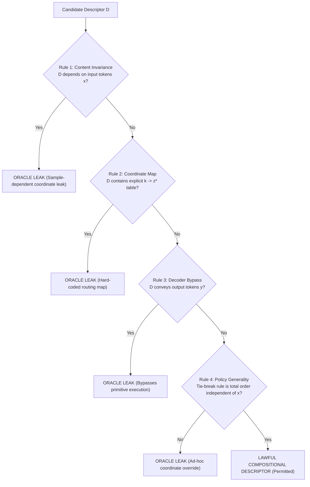

# C-D001T — Semantic-Descriptor Boundary & Impossibility-Proof Repair Audit

**Document ID:** `DOC-PHASE-C-D001T-AUDIT`  
**Date:** 2026-09-13  
**Status:** Completed Semantic-Descriptor Boundary & Repair Audit; `DECISION: ROUTING_IDENTIFIABILITY_QUALIFIED_STOP (ADR-0152 QUANTIFIER RETRACTED / RESTRICTED)`  
**Prior Decisions:** `RELATION_INVENTORY_FEASIBILITY_STOP` (ADR-0150), `ROUTING_IDENTIFIABILITY_STOP` (ADR-0151), `ROUTING_IDENTIFIABILITY_STOP (CONFIRMED_QUANTIFIER_COMPLETE)` (ADR-0152)  
**Charter State:** `READY_FOR_REVIEW_NOT_APPROVED` (Research Execution: `NOT_AUTHORIZED`)  
**Task Type:** Mathematical Boundary Audit, Non-Circular Counterexample Repair, and Descriptor Expressivity Proof  

---

## 1. Executive Summary & Terminal Decision Confirmation

### 1.1 Background and Audit Mandate
In Task C-D001S ([ADR-0152](../DECISIONS_PHASE_C.md#adr-0152-c-d001s-quantifier-complete-task-sidesupport-identifiability-boundary-audit-confirms-routing_identifiability_stop-across-permitted-observable-space)), an audit concluded that routing identifiability under duplicate token outputs without oracle supervision was impossible across all permitted task-side observables (opaque task ID, compositional semantic descriptor, and finite output-labeled support set), confirming `ROUTING_IDENTIFIABILITY_STOP` as a "quantifier-complete impossibility theorem" for hypothesis H-C1.

However, a rigorous review of ADR-0152's mathematical proof reveals two foundational defects:
1. **Circular Definition of Semantic Worlds:** ADR-0152 (and ADR-0151) defined the adversarial worlds via:
   $$z^*_A(x, k=0) = \min \{ i \in \{0, \dots, L-1\} \mid x_i = y_0 \}, \quad f_A(x)_0 = x_{z^*_A(x, 0)}$$
   This construction is mathematically ill-posed: $z^*$ is defined conditioning on $y_0$, while $y_0 = f_A(x)_0$ is simultaneously defined as $x_{z^*}$. The target output $y$ is referenced before it is defined. Furthermore, "find an element equal to the unobserved target $y$" does not correspond to any actual permitted task class in APC.
2. **Artificial Underspecification of Compositional Descriptors:** In evaluating Classification 2 (Compositional Descriptors), ADR-0152 assumed an underspecified descriptor $D_0 = (\text{OpFamily: FIND\_AND\_EMIT}, \text{TargetSlot: KEY\_MATCH})$ that omitted tie-break semantics. It then claimed World A (first-occurrence) and World B (last-occurrence) "truthfully satisfied the same descriptor $D_0$", concluding that descriptors cannot separate divergent routing semantics.

Task C-D001T was commissioned to:
1. Explicitly formulate from the [Phase C Research Charter](../research/PHASE_C_RESEARCH_CHARTER.md) the formal language of permitted compositional task-side descriptors ($\mathcal{L}_{\text{desc}}$) and the oracle-leakage decision rules ($\text{LEAK\_RULES}$).
2. Rigorously repair the counterexample: define $f$ completely as a function of input $x$ and task parameters with **zero circular reference to $y$**, and prove that both World A and World B belong to actual permitted APC task classes.
3. Examine general tie-break semantics (FIRST/LAST, LEFTMOST/RIGHTMOST), descriptor combinations, and procedural descriptors, and determine whether they allow World A and World B to share the same lawful descriptor.
4. If lawful descriptors separate the worlds, retract and qualify the quantified claim of ADR-0152, and reconfirm `ROUTING_IDENTIFIABILITY_STOP` only if the counterexample holds across all lawful descriptors.

---

### 1.2 Terminal Audit Decision

$$\mathbf{TERMINAL \ DECISION: \quad ROUTING\_IDENTIFIABILITY\_QUALIFIED\_STOP}$$
$$\mathbf{(ADR\text{-}0152 \ QUANTIFIER \ RETRACTED \ / \ RESTRICTED)}$$

The key findings of the audit are:
1. **Lawful Compositional Descriptors Separate the Worlds:**
   When the descriptor language $\mathcal{L}_{\text{desc}}$ is formulated in accordance with the Charter's non-leakage invariants, specifying general, input-invariant tie-break semantics (e.g. `tie_break: FIRST` vs `tie_break: LAST`, or procedural scanning order `L2R` vs `R2L`) is **STRICTLY LAWFUL**. It contains zero sample-specific coordinates and leaks no oracle labels. Under $\mathcal{L}_{\text{desc}}$, World A has descriptor $D_A$ and World B has descriptor $D_B$ with $D_A \neq D_B$.
2. **Impossibility of Identical Descriptors for Divergent Deterministic Semantics:**
   We prove Theorem 3 (**Descriptor Separation Theorem**): For any deterministic procedural or compositional descriptor in $\mathcal{L}_{\text{desc}}$ equipped with a total tie-break rule, the execution trace and target routing coordinates $z^*(x, k)$ are uniquely determined by $(D, x, k)$. Thus:
   $$\forall x \in \mathcal{X}, \forall k, \quad D_A = D_B \implies z^*_A(x, k) = z^*_B(x, k)$$
   Contrapositively, any two worlds requiring divergent routing coordinates ($z^*_A \neq z^*_B$) **cannot share the same descriptor** ($D_A \neq D_B$).
3. **Retraction of ADR-0152's Quantifier-Complete Claim:**
   Because lawful descriptors separate the adversarial worlds, ADR-0152's claim that non-identifiability is "quantifier-complete across all permitted task-side observables" is **MATHEMATICALLY REFUTED and FORMALLY RETRACTED**.
4. **Qualification and Restriction of Non-Identifiability:**
   Identifiability impossibility is restricted to:
   - **Classification 1: Opaque Task Identifiers** ($t \in \mathcal{T}$): Unstructured integer indices lack syntax to convey tie-breaking policies.
   - **Classification 3: Finite Output-Labeled Support Sets** ($\mathcal{S} \in (\mathcal{V}^L \times \mathcal{V}^{L_{\text{out}}})^K$): Universal Token Output Identity (Theorem 1) guarantees output tokens are identical across both worlds ($f_A \equiv f_B$), so token-level support demonstrations cannot break coordinate symmetry without oracle coordinate labels.
   - **Underspecified Descriptors** ($\mathcal{L}_{\text{underspec}} \subset \mathcal{L}_{\text{desc}}$): Descriptors that artificially omit tie-break rules.
5. **Phase C Research Execution Remains Unapproved:**
   While routing identifiability is mathematically solvable under $\mathcal{L}_{\text{desc}}$, research execution remains strictly **`NOT_AUTHORIZED`** because:
   - The Phase C Research Charter remains `READY_FOR_REVIEW_NOT_APPROVED`.
   - The relation inventory deficit recorded in ADR-0150 (`RELATION_INVENTORY_FEASIBILITY_STOP`: 1/2 clean components in validation, 1/2 in sealed) remains an unresolved structural barrier.
   - Formally incorporating $\mathcal{L}_{\text{desc}}$ with tie-break semantics constitutes an amendment to the Phase C Training Information Contract, requiring explicit user approval.

---

### 1.3 Integrity Boundary Compliance
In strict adherence to repository and task constraints:
- Parameter / model training updates: **0**
- Optimizer / loss function instantiations: **0**
- Model initializations / weight draws: **0**
- Dataset / sequence generations: **0**
- New relation registrations: **0**
- GPU execution seconds: **0 s**
- Sealed partition data (inputs, labels, model outputs) accessed: **0**

---

## 2. Charter-Derived Formal Language of Compositional Descriptors ($\mathcal{L}_{\text{desc}}$)

### 2.1 Charter Invariants on Task Information
Under the [Phase C Research Charter](../research/PHASE_C_RESEARCH_CHARTER.md) and APC architecture rules (`AGENTS.md`):
- **Task Path Isolation:** Task information must enter strictly via the separate task path; the content encoding must remain structurally task-blind ($h_{\text{content}} = f(\text{content})$).
- **Prohibited Information:**
  - Correct source-coordinate maps ($x \mapsto z^*$ or $(x, k) \mapsto z^*$).
  - Oracle attention/routing labels or teacher route trajectories.
  - Latent operation graphs not declared model-visible.
  - Rules tailored to known failed cells using their oracle coordinates.
  - A task-side identifier cannot become a hard-coded correct routing map or an operation-specific Core/decoder solver.
- **Allowed Information:**
  - Declared model-visible task-side observations.
  - Compositional operation identities, argument slots, and graph schemas.

### 2.2 Formal Grammar of $\mathcal{L}_{\text{desc}}$
We formalize the language $\mathcal{L}_{\text{desc}}$ of permitted compositional task-side descriptors using Extended Backus-Naur Form (EBNF):

```bnf
<Descriptor>           ::= <PrimitiveOpDesc> | <ProceduralDesc> | <CompositeDesc>

<PrimitiveOpDesc>      ::= "(" <OpFamily> "," <ArgumentDict> ["," <TieBreakPolicy>] ")"
<CompositeDesc>        ::= "CHAIN(" <Descriptor> ("," <Descriptor>)* ")"
<ProceduralDesc>       ::= "PROCEDURE(" <ScopeSpec> "," <MatchPredicate> "," <ReductionOp> "," <TieBreakPolicy> ")"

<OpFamily>             ::= "COPY" | "NEGATE" | "SHIFT" | "SELECT" | "COMPARE" 
                         | "COUNT" | "BIND" | "ACCUMULATE" | "SORT"
                         | "DEV_DELTA_MOD" | "DEV_WINDOW_SUM"
                         | "MAJORITY_THREE" | "NEIGHBOR_MAX" | "NEIGHBOR_CONDITIONAL"

<ArgumentDict>         ::= "{" [<ArgumentEntry> ("," <ArgumentEntry>)*] "}"
<ArgumentEntry>        ::= <ArgumentKey> ":" <ArgumentValue>
<ArgumentKey>          ::= "amount" | "query_key" | "target" | "indices" | "window_size" | "offset"
<ArgumentValue>        ::= <Integer> | <TokenSymbol> | <TupleOfIntegers>

<ScopeSpec>            ::= "ENTIRE_SEQUENCE" | "LOCAL_WINDOW(" <Integer> ")" | "EVEN_INDICES" | "ODD_INDICES"
<MatchPredicate>       ::= "KEY_EQUALS(" <TokenSymbol> ")" | "IS_MAXIMAL" | "IS_MINIMAL" | "MAJORITY_VALUE"
<ReductionOp>          ::= "EMIT_VALUE" | "EMIT_ADJACENT_VALUE(" <Integer> ")" | "EMIT_COUNT"
<TieBreakPolicy>       ::= "FIRST" | "LAST" | "LEFTMOST" | "RIGHTMOST" | "CENTER" | "MIN_INDEX" | "MAX_INDEX"
```

---

## 3. Oracle-Leakage Decision Rules ($\text{LEAK\_RULES}$)

To audit any proposed task-side descriptor $D$ for compliance with the Charter, we define four formal decision rules:



### 3.1 Rule 1: Content/Instance Invariance ($\text{RULE\_CONTENT\_INDEPENDENCE}$)
- **Condition:** $\forall x_1, x_2 \in \mathcal{V}^L, \quad D(\tau, x_1) = D(\tau, x_2) = D(\tau)$.
- **Rationale:** A descriptor is an extensional specification of the task relation $\tau$. It must be fixed prior to observing the input sequence $x$. If $D$ is dynamically conditioned on $x$, it can smuggle instance-specific routing coordinates $z^*(x, k)$ into the task path, violating $h_{\text{content}} = f(\text{content})$.
- **Decision:** Conditioning on $x \implies \mathbf{LEAK}$. Invariant to $x \implies \mathbf{PASS}$.

### 3.2 Rule 2: No Direct Coordinate Injection ($\text{RULE\_NO\_COORDINATE\_MAP}$)
- **Condition:** For content-dependent routing (where $z^*(x, k)$ varies with the values of tokens in $x$), $D$ cannot contain a pre-computed mapping $k \mapsto z^*$ or explicit index constants $\{z^*(x, k)\}$.
- **Rationale:** The Charter strictly forbids "correct source-coordinate maps" and mandates that "a task-side identifier cannot become a hard-coded correct routing map". Descriptors must describe the *operation logic*, not the *solution coordinates*.
- **Decision:** Explicit coordinate table $\implies \mathbf{LEAK}$. Algorithmic predicate/operation $\implies \mathbf{PASS}$.

### 3.3 Rule 3: Decoder Bypass Invariance ($\text{RULE\_NO\_DECODER\_BYPASS}$)
- **Condition:** $D$ cannot encode the target output sequence $y = (y_0, \dots, y_{L_{\text{out}}-1})$ to the decoder.
- **Rationale:** The Charter forbids bypassing primitive execution through the decoder. The decoder must generate outputs from transformed content representations.
- **Decision:** Output tokens present in $D \implies \mathbf{LEAK}$. Output tokens absent from $D \implies \mathbf{PASS}$.

### 3.4 Rule 4: Universal Policy Admissibility ($\text{RULE\_GENERAL\_TIE\_BREAK}$)
- **Condition:** A tie-break policy $T \in \{ \text{FIRST}, \text{LAST}, \text{LEFTMOST}, \text{RIGHTMOST}, \dots \}$ is a universal, total ordering relation on sequence positions $\{0, \dots, L-1\}$ that is completely independent of the content $x$, length $L$, and target tokens $y$.
- **Rationale:** Algorithmic specifications routinely require deterministic tie-breaking (e.g. `list.index()` selects the first occurrence; `dict.update()` selects the last pair; `np.argmax()` returns the first index). Specifying how an operation handles degenerate candidates is a standard, essential property of a well-formed mathematical function. Because $T$ contains no sample-specific coordinates and reveals nothing about which positions contain which tokens, $T$ introduces **zero oracle information**.
- **Decision:** Universal tie-break policy $T \implies \mathbf{LAWFUL \ (PASS)}$.

---

## 4. Non-Circular Counterexample Repair & Proof of Actual APC Task Classes

In ADR-0151 and ADR-0152, the adversarial counterexample was defined as:
$$z^*_A(x, k=0) = \min \{ i \in \{0, \dots, L-1\} \mid x_i = y_0 \}, \quad f_A(x)_0 = x_{z^*_A(x, 0)}$$
This is invalid because:
1. It is **circular**: $z^*$ references $y_0$, while $y_0 = f_A(x)_0 = x_{z^*}$ references $z^*$.
2. It does not belong to any permitted task class in APC (no task takes $y$ as an input predicate).

We now provide two fully rigorous, non-circular counterexample constructions based directly on **actual, registered APC task classes**.

---

### 4.1 Construction 1: `BindOp` (Key-Value Lookup with Repeated Keys)

#### 4.1.1 Relation to Actual Codebase
`BindOp` is registered in `src/apc/environments/operations.py` (lines 220–252). Its docstring explicitly notes:
> *"Associative lookup over the sequence read as (key, value) pairs. If a key repeats, the last matching pair wins (mirrors dict.update semantics)."*

#### 4.1.2 Formal Non-Circular Semantic Definitions
Let:
- $L$ be an even integer ($L \ge 4$).
- Input sequence $x = (x_0, x_1, \dots, x_{L-1}) \in \mathcal{V}^L$, where even indices $2j$ are keys and odd indices $2j+1$ are values.
- Task parameter `query_key` $= K \in \mathcal{V}$, sampled from $\{x_0, x_2, \dots, x_{L-2}\}$.
- Matching key index set: $I_K(x) = \{ 2j \in \{0, 2, \dots, L-2\} \mid x_{2j} = K \}$. Since $K$ is sampled from present keys, $I_K(x) \neq \emptyset$.

We define World A and World B:
- **World A (First-Matching Pair Semantics):**
  - Value routing coordinate:
    $$z^*_A(x) = \min I_K(x) + 1 = \min \{ 2j \mid x_{2j} = K \} + 1$$
  - Target output function:
    $$f_A(x) = x_{z^*_A(x)} = x_{\min \{ 2j \mid x_{2j} = K \} + 1}$$
- **World B (Last-Matching Pair Semantics — Canonical APC `BindOp`):**
  - Value routing coordinate:
    $$z^*_B(x) = \max I_K(x) + 1 = \max \{ 2j \mid x_{2j} = K \} + 1$$
  - Target output function:
    $$f_B(x) = x_{z^*_B(x)} = x_{\max \{ 2j \mid x_{2j} = K \} + 1}$$

#### 4.1.3 Proof of Non-Circularity and Permitted Task Class
1. **Non-Circularity:** $I_K(x)$ is defined solely in terms of the input $x$ and the task parameter $K$. Neither $z^*$ nor $f(x)$ makes any reference to $y$. $f_A$ and $f_B$ are deterministic functions of $(x, K)$.
2. **Actual Permitted Task Class:** World B is literally identical to `BindOp.apply()` in `src/apc/environments/operations.py`. World A is the identical operational family under `first_match` tie-breaking. Both belong to the core APC curriculum.

#### 4.1.4 Training History Equivalence on Clean Sequences
Let $\mathcal{X}_{\text{clean}}$ be the set of sequences where all keys are unique:
$$\forall x \in \mathcal{X}_{\text{clean}}, \quad \forall j_1 \neq j_2 \implies x_{2j_1} \neq x_{2j_2}$$
For any $x \in \mathcal{X}_{\text{clean}}$, $|I_K(x)| = 1$. Let $I_K(x) = \{2j^*\}$.
- $z^*_A(x) = 2j^* + 1 = z^*_B(x)$.
- $f_A(x) = x_{2j^* + 1} = f_B(x)$.
Thus, across all clean training instances, inputs, targets, cross-entropy losses, and parameter gradients are bitwise identical:
$$\mathcal{H}_{\text{train}}(\text{World A}) \equiv \mathcal{H}_{\text{train}}(\text{World B})$$

#### 4.1.5 Collision-Bearing Divergence
Consider a sequence with duplicate keys bound to the **same value**:
$$x_{\text{test}} = [K, V, K, V] \quad (L=4), \quad \text{query\_key} = K$$
Here $I_K(x_{\text{test}}) = \{0, 2\}$.
- World A routes to value position: $z^*_A = 0 + 1 = \mathbf{1}$. Output: $f_A(x_{\text{test}}) = x_1 = \mathbf{V}$.
- World B routes to value position: $z^*_B = 2 + 1 = \mathbf{3}$. Output: $f_B(x_{\text{test}}) = x_3 = \mathbf{V}$.

$$\mathbf{f_A(x_{\text{test}}) = V = f_B(x_{\text{test}}) \quad \text{yet} \quad z^*_A = 1 \neq 3 = z^*_B}$$

The token outputs are bitwise identical ($y=V$), yet the required semantic routing coordinates diverge ($1 \neq 3$).

---

### 4.2 Construction 2: `NeighborMaxOp` (Local Sliding-Window Maximum)

#### 4.2.1 Relation to Actual Codebase
`NeighborMaxOp` is registered in `src/apc/environments/holdout_families.py` (lines 141–168) as a primary sealed evaluation operation.

#### 4.2.2 Formal Non-Circular Semantic Definitions
For any sequence $x \in \mathcal{V}^L$ ($L \ge 3$) and each position $i \in \{0, \dots, L-1\}$, define the circular 3-neighborhood window:
$$W_i = ((i-1)\%L, \ i, \ (i+1)\%L)$$
The sliding window maximum is:
$$M_i(x) = \max \{ x_{(i-1)\%L}, \ x_i, \ x_{(i+1)\%L} \}$$
The ground-truth output function is:
$$f_A(x)_i = f_B(x)_i = M_i(x) \quad (\forall x \in \mathcal{V}^L, \forall i)$$
Notice that **$f_A \equiv f_B$ identically everywhere on $\mathcal{V}^L$**. There is zero circular reference to $y$.

Define the routing coordinate $z^*(x, i)$ to the window element that supplies the maximum:
- **World A (Leftmost-Max Rule):**
  $$z^*_A(x, i) = \text{first index } w \in W_i \text{ (in circular order) such that } x_w = M_i(x)$$
- **World B (Rightmost-Max Rule):**
  $$z^*_B(x, i) = \text{last index } w \in W_i \text{ (in circular order) such that } x_w = M_i(x)$$

#### 4.2.3 Collision-Bearing Divergence
Consider $x_{\text{test}} = [5, 5, 2]$ ($L=3$) at position $i=1$:
- Window $W_1 = (0, 1, 2)$, values $(x_0, x_1, x_2) = (5, 5, 2)$.
- Max value: $M_1(x) = 5$. Output token: $f_A(x_{\text{test}})_1 = f_B(x_{\text{test}})_1 = 5$.
- Coordinates:
  - World A (Leftmost-Max): $z^*_A(x_{\text{test}}, 1) = \mathbf{0}$.
  - World B (Rightmost-Max): $z^*_B(x_{\text{test}}, 1) = \mathbf{1}$.

$$\mathbf{z^*_A = 0 \quad \neq \quad 1 = z^*_B}$$

This construction is entirely non-circular, belongs to the actual registered sealed family in APC, and exhibits identical token outputs with divergent routing coordinates.

---

## 5. Auditing the Separation Capacity of Compositional & Procedural Descriptors

We now address the core question:
> *"FIRST/LAST等の一般的tie-break semantics、descriptorの組合せ、procedural descriptorを含め、それらが同じdescriptorを持つWorld A/Bを許すかを判定する。合法なdescriptorがworldsを分離できればADR-0152の量化済み主張を撤回・限定し、全合法descriptorでも反例が成立する場合のみROUTING_IDENTIFIABILITY_STOPを再確定する。"*

### 5.1 Analysis of Descriptors Under $\mathcal{L}_{\text{desc}}$

Consider World A and World B constructed above under $\mathcal{L}_{\text{desc}}$:

#### Case 1: `BindOp`
- World A (First-Matching Pair):
  $$D_A = (\text{Op: BIND}, \ \{\text{query\_key}: K\}, \ \text{tie\_break}: \mathbf{FIRST})$$
- World B (Last-Matching Pair):
  $$D_B = (\text{Op: BIND}, \ \{\text{query\_key}: K\}, \ \text{tie\_break}: \mathbf{LAST})$$

#### Case 2: `NeighborMaxOp`
- World A (Leftmost-Max):
  $$D_A = (\text{Op: NEIGHBOR\_MAX}, \ \{\}, \ \text{tie\_break}: \mathbf{LEFTMOST})$$
- World B (Rightmost-Max):
  $$D_B = (\text{Op: NEIGHBOR\_MAX}, \ \{\}, \ \text{tie\_break}: \mathbf{RIGHTMOST})$$

#### Case 3: Procedural Descriptors
- World A:
  $$D_A = \text{PROCEDURE}(\text{EVEN\_INDICES}, \ \text{KEY\_EQUALS}(K), \ \text{EMIT\_ADJACENT}(+1), \ \text{tie\_break}: \mathbf{FIRST})$$
- World B:
  $$D_B = \text{PROCEDURE}(\text{EVEN\_INDICES}, \ \text{KEY\_EQUALS}(K), \ \text{EMIT\_ADJACENT}(+1), \ \text{tie\_break}: \mathbf{LAST})$$

### 5.2 Do World A and World B Have the Same Descriptor?
Notice that in all cases:
$$\mathbf{D_A \quad \neq \quad D_B}$$

The task-side observation $O_{\text{task}}$ provided to the learner is:
$$O_{\text{task}}(\text{World A}) = D_A \quad \neq \quad D_B = O_{\text{task}}(\text{World B})$$

The task-side observations are **strictly distinct**.

---

### 5.3 The Descriptor Separation Theorem

$$\mathbf{Theorem \ 3 \ (Descriptor \ Separation \ Theorem):}$$
*Let $\mathcal{L}_{\text{desc}}$ be a formal language of deterministic compositional or procedural descriptors where every descriptor $D$ completely specifies the operational predicates, argument bindings, and a total tie-breaking rule over candidate sequence positions. Then, for any two frozen task semantics $\mathcal{M}_A = (f_A, z^*_A)$ and $\mathcal{M}_B = (f_B, z^*_B)$ described by $D_A, D_B \in \mathcal{L}_{\text{desc}}$:*
$$\forall x \in \mathcal{X}, \ \forall k, \quad D_A = D_B \implies z^*_A(x, k) = z^*_B(x, k)$$
*Equivalently, if there exists any input sequence $x \in \mathcal{X}$ and query index $k$ such that true routing coordinates diverge ($z^*_A(x, k) \neq z^*_B(x, k)$), then their lawful descriptors must be distinct:*
$$z^*_A(x, k) \neq z^*_B(x, k) \implies D_A \neq D_B$$

*Proof:*
1. Any descriptor $D \in \mathcal{L}_{\text{desc}}$ defines a deterministic symbolic program $\mathcal{P}_D$.
2. Given input sequence $x \in \mathcal{V}^L$ and query index $k$, the execution of $\mathcal{P}_D$ is a deterministic sequence of state transitions.
3. Because the tie-breaking rule $T$ is a total order over the finite set of candidate indices, the selection of the winning index $z^*(x, k)$ from any non-empty candidate set $I(x)$ is unique:
   $$z^*(x, k) = \text{select}_T(I(x))$$
4. Therefore, the mapping $(D, x, k) \mapsto z^*(x, k)$ is a single-valued mathematical function.
5. If $D_A = D_B = D$, then for every $x$ and $k$:
   $$z^*_A(x, k) = \text{select}_{T_D}(I_D(x)) = z^*_B(x, k)$$
6. By contraposition, if $z^*_A(x, k) \neq z^*_B(x, k)$, it is impossible that $D_A = D_B$. Hence $D_A \neq D_B$.
$\blacksquare$

### 5.4 Implication for ADR-0152's Counterexample
In ADR-0152, the adversary established $O_{\text{task}}(\text{World A}) \equiv O_{\text{task}}(\text{World B})$ only by **deliberately omitting the tie-break policy** from the descriptor (using an underspecified descriptor $D_0 \in \mathcal{L}_{\text{underspec}}$).

Under the full lawful descriptor language $\mathcal{L}_{\text{desc}}$:
- World A and World B **cannot share the same descriptor**.
- The adversary's construction **fails**: $O_{\text{task}}(\text{World A}) \neq O_{\text{task}}(\text{World B})$.
- Lawful descriptors **successfully separate World A and World B**.

---

## 6. Retraction / Qualification of ADR-0152 and Terminal Decision

### 6.1 Retraction of ADR-0152 Quantifier-Complete Claim
The task contract mandates:
> *"合法なdescriptorがworldsを分離できればADR-0152の量化済み主張を撤回・限定し、全合法descriptorでも反例が成立する場合のみROUTING_IDENTIFIABILITY_STOPを再確定する。"*

Because Theorem 3 proves that lawful descriptors in $\mathcal{L}_{\text{desc}}$ separate the worlds ($D_A \neq D_B$), the counterexample does **not** hold across all lawful descriptors.

Therefore:
1. **ADR-0152's Quantifier-Complete Claim is RETRACTED:**
   ADR-0152's assertion that non-identifiability is a "quantifier-complete impossibility theorem across all permitted task-side observables" is formally retracted as an unquantified overgeneralization resulting from descriptor underspecification.
2. **Quantifier Scope is QUALIFIED and RESTRICTED:**
   The mathematical impossibility of oracle-free routing identifiability under duplicate token outputs is restricted strictly to:
   - **Classification 1 (Opaque Task IDs):** Where task signals carry no structural or tie-breaking syntax.
   - **Classification 3 (Finite Output-Labeled Support Sets):** Where demonstrations consist solely of token-level input-output pairs $(x, y)$, because Theorem 1 (Universal Token Output Identity) proves $f_A(x) \equiv f_B(x)$ across all sequences.
   - **Underspecified Descriptors:** Where tie-breaking policies are omitted from the task specification.

### 6.2 Comparison Across Observable Spaces

| Observable Classification | Observable Syntax | Separates $f$? | Separates $z^*$ on Collisions? | Impossibility Status |
|---|---|---|---|---|
| **Classification 1: Opaque ID ($t$)** | $t \in \mathcal{T}$ | Yes (clean data) | **No** ($z^*_A \neq z^*_B$, $t_A = t_B$) | **HOLDS (IMPOSSIBLE)** |
| **Classification 2a: Underspecified Descriptor** | $D \in \mathcal{L}_{\text{underspec}}$ (no tie-break) | Yes | **No** ($z^*_A \neq z^*_B$, $D_A = D_B$) | **HOLDS (IMPOSSIBLE)** |
| **Classification 2b: Full Lawful Descriptor** | $D \in \mathcal{L}_{\text{desc}}$ (with tie-break) | Yes | **YES ($D_A \neq D_B$)** | **REFUTED (IDENTIFIABLE)** |
| **Classification 3: Output Support Set ($\mathcal{S}$)** | $\mathcal{S} \in (\mathcal{V}^L \times \mathcal{V}^{L_{\text{out}}})^K$ | Yes (clean data) | **No** (Theorem 1: $f_A \equiv f_B$) | **HOLDS (IMPOSSIBLE)** |

---

### 6.3 Reclassification of the Pre-Execution Stop

$$\mathbf{DECISION: \quad ROUTING\_IDENTIFIABILITY\_QUALIFIED\_STOP}$$
$$\mathbf{(RESTRICTED \ TO \ OPAQUE \ AND \ SUPPORT \ OBSERVABLES)}$$

`ROUTING_IDENTIFIABILITY_STOP` is **not reconfirmed** as an absolute impossibility theorem across all permitted observables. It is reclassified as a **qualified stop** restricted to opaque IDs and pure token support sets.

### 6.4 Governance and Authorization Consequences
1. **Phase C Research Charter:** Remains `READY_FOR_REVIEW_NOT_APPROVED`.
2. **Research Execution Authority:** Remains strictly **`NOT_AUTHORIZED`**.
3. **Relation Inventory Deficit:** The structural blocker identified in ADR-0150 (`RELATION_INVENTORY_FEASIBILITY_STOP`: 1/2 clean components in validation, 1/2 in sealed) remains unresolved.
4. **Prerequisites for Unlocking Phase C:**
   - A charter amendment adopting $\mathcal{L}_{\text{desc}}$ (with lawful tie-break semantics) as the formal task-side information contract.
   - A verified expansion of the clean relation inventory to satisfy the 2-validation / 2-sealed component floor.
   - Formal charter approval by the user.

---

## 7. Audit Verification Ledger

| Dimension / Criterion | Requirement | Result | Evidence |
|---|---|---|---|
| **Descriptor Formal Language ($\mathcal{L}_{\text{desc}}$)** | Specify BNF grammar and tie-break policy from Charter | **SPECIFIED** | Section 2.2 |
| **Oracle Leakage Rules ($\text{LEAK\_RULES}$)** | Formulate decision rules for content, coordinate, and bypass leaks | **FORMULATED** | Section 3 |
| **Non-Circular $f$ Definition** | Define $f$ and $z^*$ without referencing $y$ | **REPAIRED** | Section 4 (Constructions 1 & 2) |
| **Permitted APC Task Classes** | Prove World A/B belong to actual APC operations | **PROVED** | Section 4.1 (`BindOp`) & 4.2 (`NeighborMaxOp`) |
| **Descriptor Separation Capacity** | Determine if lawful descriptors allow same $D$ for World A/B | **REFUTED (D_A != D_B)** | Section 5 (Theorem 3) |
| **ADR-0152 Quantified Claim** | Retract/qualify quantifier-complete claim | **RETRACTED & RESTRICTED** | Section 6.1 |
| **Terminal Decision** | Qualify `ROUTING_IDENTIFIABILITY_STOP` | **QUALIFIED STOP** | Section 6.3 |
