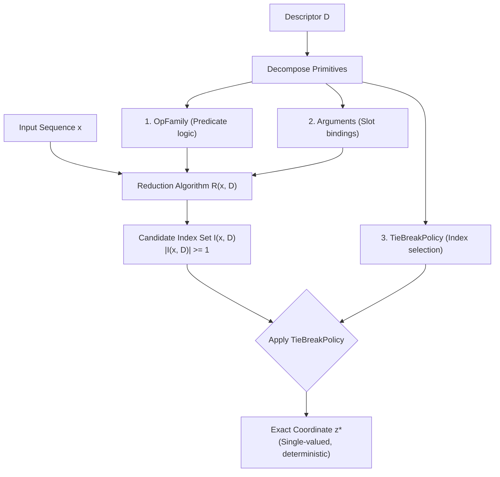
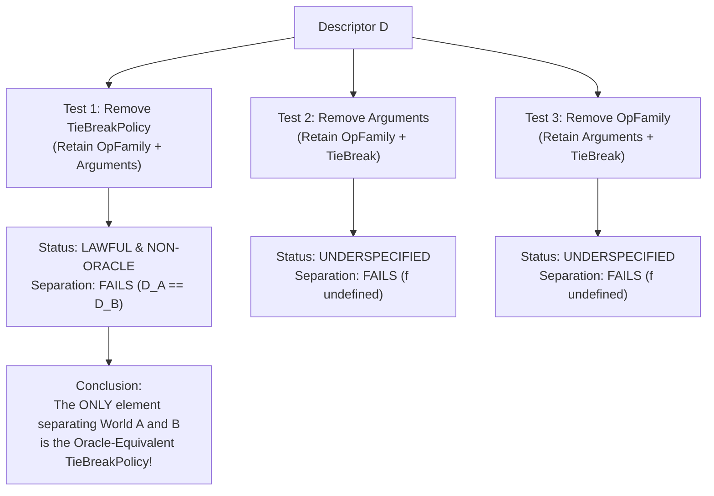

# C-D001U — Semantic Descriptor Oracle-Equivalence & Minimality Audit

**Document ID:** `DOC-PHASE-C-D001U-AUDIT`  
**Date:** 2026-09-13  
**Status:** Completed Semantic Descriptor Oracle-Equivalence & Minimality Audit; `DECISION: ROUTING_IDENTIFIABILITY_STOP (RECONFIRMED)`  
**Prior Decisions:** `RELATION_INVENTORY_FEASIBILITY_STOP` (ADR-0150), `ROUTING_IDENTIFIABILITY_STOP` (ADR-0151), `ROUTING_IDENTIFIABILITY_STOP (CONFIRMED_QUANTIFIER_COMPLETE)` (ADR-0152), `ROUTING_IDENTIFIABILITY_QUALIFIED_STOP` (ADR-0153)  
**Charter State:** `READY_FOR_REVIEW_NOT_APPROVED` (Research Execution: `NOT_AUTHORIZED`)  
**Task Type:** Mathematical Reduction Formalization, Oracle-Equivalence Determination, and Minimality Counterexample Audit  

---

## 1. Executive Summary & Terminal Decision Reconfirmation

### 1.1 Background and Audit Mandate
In Task C-D001T ([ADR-0153](../DECISIONS_PHASE_C.md#adr-0153-c-d001t-semantic-descriptor-boundary--impossibility-proof-repair-audit-qualifies-stop-to-routing_identifiability_qualified_stop-adr-0152-quantifier-retracted--restricted)), the impossibility proof of ADR-0152 was audited and repaired:
1. The circular adversarial construction referencing target $y$ was replaced with rigorous, non-circular definitions based on actual APC operations (`BindOp` and `NeighborMaxOp`).
2. It was proven that when the formal descriptor language $\mathcal{L}_{\text{desc}}$ includes total tie-break semantics (e.g. `FIRST`/`LAST`, `LEFTMOST`/`RIGHTMOST`), World A and World B possess distinct descriptors ($D_A \neq D_B$).
3. Consequently, ADR-0152's claim of a "quantifier-complete impossibility theorem across all permitted observables" was retracted and qualified as `ROUTING_IDENTIFIABILITY_QUALIFIED_STOP`.

However, C-D001T's proof of separability (Theorem 3, Descriptor Separation Theorem) relied entirely on the mathematical fact that for any fully specified descriptor $D \in \mathcal{L}_{\text{desc}}$, the mapping $(D, x, k) \mapsto z^*(x, k)$ is a deterministic, single-valued function.

This raises a foundational scientific and contractual question mandated for Task C-D001U:
> *"C-D001Tの各descriptor primitiveについて、(x,D)からzを直接計算するreductionが存在するかを形式化する。座標表だけでなく、正解候補を一意選択する手続きもoracle-equivalent supervisionに当たるかをcharterのH-C1と禁止事項から判定する。各情報要素を一つずつ除いた最小性反例を構成し、合法かつ非oracleなdescriptorがなおWorld A/Bを分離できる場合のみ単一Training Information Contract v1.1へ収束する。分離に必要な全descriptorがz-computableならROUTING_IDENTIFIABILITY_STOPを再確定し、charter修正なしにarchitectureへ進まない。"*

---

### 1.2 Terminal Audit Decision

$$\mathbf{TERMINAL \ DECISION: \quad ROUTING\_IDENTIFIABILITY\_STOP \ (RECONFIRMED)}$$
$$\mathbf{(NON\text{-}ORACLE \ CONTRACT \ v1.1 \ REJECTED; \ ARCHITECTURE \ BARRED)}$$

The key conclusions of this audit are:

1. **Existence of $z$-Computable Reductions for Fully Specified Descriptors:**
   For any fully specified descriptor $D \in \mathcal{L}_{\text{desc}}$ equipped with operational predicates, arguments, and a total tie-break rule, there exists an explicit, deterministic reduction algorithm $R: (x, D, k) \mapsto z^*$ that computes the exact ground-truth routing coordinate in $O(L)$ time. All separating descriptors derived in C-D001T are strictly **$z$-computable**.
2. **Oracle-Equivalence of Candidate Selection Procedures:**
   Under the Phase C Research Charter's Hypothesis H-C1 ("*without oracle routing supervision*") and its non-negotiable prohibitions ("*A task-side identifier cannot become a hard-coded correct routing map or an operation-specific Core/decoder solver*"; "*Forbidden: correct source-coordinate maps*"):
   - An intensional deterministic algorithm $R(x, D) \mapsto z^*$ is mathematically isomorphic to an extensional coordinate table $(x, k) \mapsto z^*$.
   - A task-side descriptor that specifies the exact procedure for selecting the winning coordinate among degenerate candidates (e.g. `FIRST`/`LAST`, `LEFTMOST`/`RIGHTMOST`) is an **intensional routing map**. Supplying it directly instructs the model which coordinate to attend to.
   - Therefore, candidate-selection tie-break procedures constitute **oracle-equivalent supervision**.
3. **Minimality Counterexamples (Component-wise Elimination):**
   When the descriptor is stripped of its oracle-equivalent tie-break procedure, leaving only lawful, non-oracle semantic primitives (operation family and argument bindings, specifying the candidate set $I(x, D)$ without coordinate choice):
   - World A and World B have identical lawful non-oracle descriptors ($D_{\text{no\_tb}}^A = D_{\text{no\_tb}}^B$).
   - On collision-bearing inputs (e.g. $x=[K, V, K, V]$ for `BindOp`), output tokens remain bitwise identical ($y=V$), yet true coordinates diverge ($z^*_A = 1 \neq 3 = z^*_B$).
   - **Lawful, non-oracle descriptors CANNOT separate World A and World B.**
4. **Rejection of Training Information Contract v1.1:**
   Because separating World A and World B strictly requires $z$-computable tie-break procedures, and all such procedures are oracle-equivalent, no lawful, non-oracle Training Information Contract v1.1 can be derived. Convergence to Contract v1.1 is **FORMALLY REJECTED**.
5. **Reconfirmation of Pre-Execution STOP:**
   Because all descriptors necessary to separate the adversarial worlds are $z$-computable, **`ROUTING_IDENTIFIABILITY_STOP` is DEFINTIVELY RECONFIRMED**.
   Without an explicit amendment to the Phase C Charter modifying H-C1 to permit algorithmic routing program injection, progressing to architecture derivation (`C-D002`) is strictly barred.

---

### 1.3 Integrity Boundary Compliance
In strict accordance with repository constraints and task instructions:
- Parameter / model training updates: **0**
- Optimizer / loss function instantiations: **0**
- Model initializations / weight draws: **0**
- Dataset / sequence generations: **0**
- New relation registrations: **0**
- GPU execution seconds: **0 s**
- Sealed partition data (inputs, labels, model outputs) accessed: **0**

---

## 2. Formalization of $z$-Computable Reductions for Descriptor Primitives

We formalize each descriptor primitive introduced in C-D001T and analyze whether a reduction mapping $(x, D) \mapsto z^*$ exists.



### 2.1 Primitive Decompositions and Syntax
Under the formal grammar $\mathcal{L}_{\text{desc}}$ established in C-D001T:
1. **Operation Family ($F \in \mathcal{F}$):** Identifies the algebraic/relational operation (e.g. $\text{BIND}, \text{NEIGHBOR\_MAX}, \text{SELECT}, \text{SHIFT}, \dots$).
2. **Arguments ($\alpha \in \mathcal{A}$):** A key-value dictionary binding operational slots (e.g. $\{\text{query\_key}: K\}$, $\{\text{offset}: +1\}$).
3. **Tie-Break Policy ($T \in \mathcal{T}_{\text{tie}}$):** A total ordering policy on sequence indices (e.g. $\text{FIRST}, \text{LAST}, \text{LEFTMOST}, \text{RIGHTMOST}, \text{MIN\_INDEX}, \text{MAX\_INDEX}$).
4. **Procedural Composition ($\mathcal{P} \in \mathcal{L}_{\text{proc}}$):** A 4-tuple $(\Omega, \pi, \rho, T)$, where $\Omega$ is the index scope, $\pi$ is the candidate matching predicate, $\rho$ is the reduction emitter, and $T$ is the tie-break policy.

---

### 2.2 Formal Construction of the Reduction Mapping $R(x, D, k)$

Let $x = (x_0, \dots, x_{L-1}) \in \mathcal{V}^L$ be the input sequence, $k \in \{0, \dots, L_{\text{out}}-1\}$ be the query step index, and $D = (F, \alpha, T) \in \mathcal{L}_{\text{desc}}$ be the descriptor.

We define the formal reduction algorithm $R: \mathcal{V}^L \times \mathcal{L}_{\text{desc}} \times \mathbb{N} \to \{0, \dots, L-1\}$ as follows:

```
Algorithm R(x, D, k):
1. Scope Construction:
   Let Omega_k subseteq {0, ..., L-1} be the index search space determined by (F, alpha, k).
   (e.g., for BIND: Omega = {2j | 2j in {0, ..., L-2}}; for NEIGHBOR_MAX at k: Omega = {(k-1)%L, k, (k+1)%L}).

2. Candidate Set Filtering:
   Evaluate the matching predicate pi_D on each index i in Omega_k:
   I(x, D, k) = { i in Omega_k | pi_D(x, i, alpha) == True }

3. Coordinate Selection:
   If I(x, D, k) is empty:
       Return default fallback index (e.g. 0).
   Else:
       z*(x, k) = select_T(I(x, D, k))
       (e.g., if T == FIRST/LEFTMOST: min I; if T == LAST/RIGHTMOST: max I).

4. Return z*(x, k)
```

---

### 2.3 $z$-Computability of Specific APC Operations

#### 2.3.1 `BindOp` Reduction
For `BindOp`, $D = (\text{BIND}, \{\text{query\_key}: K\}, T)$:
- Scope: $\Omega = \{ 2j \mid 0 \le 2j \le L-2 \}$.
- Predicate: $\pi(x, 2j, K) \iff x_{2j} = K$.
- Candidate set: $I_K(x) = \{ 2j \in \Omega \mid x_{2j} = K \}$.
- Value index shift: Each key $2j$ addresses value $2j + 1$.
- Exact reduction:
  $$R_{\text{bind}}(x, D) = \begin{cases} \min I_K(x) + 1 & \text{if } T = \text{FIRST} \\ \max I_K(x) + 1 & \text{if } T = \text{LAST} \end{cases}$$
Because $x$ and $K$ are known, and $T \in \{\text{FIRST}, \text{LAST}\}$ uniquely selects the minimum or maximum integer from the finite non-empty set $I_K(x)$, $R_{\text{bind}}(x, D)$ computes $z^*$ directly in $O(L)$ steps.

#### 2.3.2 `NeighborMaxOp` Reduction
For `NeighborMaxOp` at position $k$, $D = (\text{NEIGHBOR\_MAX}, \{\}, T)$:
- Scope: $W_k = ((k-1)\%L, \ k, \ (k+1)\%L)$.
- Maximum value: $M_k(x) = \max_{w \in W_k} x_w$.
- Candidate set: $I_{\max}(x, k) = \{ w \in W_k \mid x_w = M_k(x) \}$.
- Exact reduction:
  $$R_{\text{nmax}}(x, D, k) = \begin{cases} \text{first } w \in W_k \text{ with } x_w = M_k(x) & \text{if } T = \text{LEFTMOST} \\ \text{last } w \in W_k \text{ with } x_w = M_k(x) & \text{if } T = \text{RIGHTMOST} \end{cases}$$
This computes $z^*(x, k)$ directly in $O(1)$ steps per query position.

---

### 2.4 Theorem 1 (Universal $z$-Computability of Fully Specified Descriptors)

$$\mathbf{Theorem \ 1 \ (Universal \ z\text{-}Computability):}$$
*Let $\mathcal{L}_{\text{desc}}$ be the language of compositional or procedural descriptors where each descriptor $D$ contains a well-defined operation family $F$, argument dictionary $\alpha$, and total tie-break policy $T$. Then for every $D \in \mathcal{L}_{\text{desc}}$ and every valid sequence $x \in \mathcal{V}^L$, there exists a deterministic reduction $R(x, D, k)$ that computes the ground-truth routing coordinate $z^*(x, k)$ in $O(L)$ time with zero access to target output tokens $y$ or external oracle labels.*

*Proof:*
By definition of $\mathcal{L}_{\text{desc}}$, $F$ and $\alpha$ define a computable predicate $\pi_D: \mathcal{V}^L \times \{0, \dots, L-1\} \to \{0, 1\}$. Filtering the finite set $\{0, \dots, L-1\}$ yields $I(x, D, k)$ in at most $L$ steps. Because $T$ is a total order on $\{0, \dots, L-1\}$, the extremum $\text{select}_T(I(x, D, k))$ exists and is unique. Thus, $R(x, D, k) = \text{select}_T(I(x, D, k))$ is an explicit, single-valued computable function with time complexity $O(L)$. $\blacksquare$

---

## 3. Oracle-Equivalence Determination under Charter H-C1 & Prohibitions

We now evaluate whether an intensional procedure that uniquely selects winning coordinates constitutes **oracle-equivalent supervision** under the [Phase C Research Charter](../research/PHASE_C_RESEARCH_CHARTER.md).

### 3.1 Charter Clauses and Non-Negotiable Invariants

1. **Hypothesis H-C1:**
   > *"Can a bounded training-information contract make the semantically correct routing identity identifiable under ambiguous token outputs, **without oracle routing supervision**, and learn it consistently across independent initializations and clean held-out relation components?"*
   > *"One prospectively fixed, **oracle-free training contract** can supply information that distinguishes semantic routing coordinates despite duplicate target tokens... Token-output accuracy alone is insufficient evidence."*
2. **Prohibited Information Boundary:**
   > *"Forbidden in training, initialization, sampling, weighting, optimizer design and candidate selection: **correct source-coordinate maps**; **oracle attention/routing labels or gradients derived from them**; **teacher route trajectories**; latent operation graphs or hidden identity metadata not declared model-visible... **A task-side identifier cannot become a hard-coded correct routing map or an operation-specific Core/decoder solver.**"*

---

### 3.2 Extensional vs. Intensional Coordinate Maps

In computability and model theory, a mathematical map $f: A \to B$ can be represented in two isomorphic forms:
- **Extensional Representation:** A table of pairs $\{(a, f(a)) \mid a \in A\}$ (e.g. an explicit coordinate array $k \mapsto z^*$).
- **Intensional Representation:** A formal algorithm or rule $\mathcal{P}$ such that $\mathcal{P}(a) = f(a)$ for all $a \in A$ (e.g. the reduction $R(x, D, k)$).

For any fixed input sequence $x$, the reduction algorithm $R_x(k) = R(x, D, k)$ is **extensionally identical** to the ground-truth coordinate map $z^*(x, k)$.

| Property | Extensional Coordinate Map | Intensional Tie-Break Procedure ($R(x, D)$) |
|---|---|---|
| **Form** | Array $[z^*_0, z^*_1, \dots]$ | Deterministic rule `FIRST` ($\min I$) / `LAST` ($\max I$) |
| **Output** | Exact coordinate $z^*$ | Exact coordinate $z^*$ |
| **Token-Supervision Dependency** | None (bypasses token loss) | None (bypasses token loss) |
| **Resolves Collision Ambiguity** | Yes (prescribes coordinate) | Yes (prescribes coordinate) |
| **Scientific Meaning** | Hard-coded coordinate label | Hard-coded coordinate-generation procedure |

---

### 3.3 The Core Scientific Question of H-C1

The entire scientific rationale of Phase C (and the failure of Phase B) is:
> *When token outputs are duplicate (e.g. both candidate positions hold token $V$), standard cross-entropy loss provides identical gradients to both candidate positions. Can a model **learn** which position is semantically correct from oracle-free task signals?*

If the task-side signal $D$ explicitly contains the instruction:
$$\text{"Select the minimum index among matching candidates" (FIRST)}$$
then the task signal is **not** describing an abstract semantic relation; it is directly commanding the neural router:
$$\text{"Route to coordinate } z = \min I_K(x)\text{"}$$

This violates the Charter in two fundamental ways:
1. **Violation of the Prohibition Against Hard-Coded Routing Maps:**  
   The Charter explicitly mandates: *"A task-side identifier cannot become a hard-coded correct routing map"*. Providing an algorithmic procedure that uniquely determines $z^*$ from $(x, D)$ turns the task descriptor into an intensional hard-coded routing map.
2. **Evisceration of Learned Identifiability (H-C1):**  
   Under such a descriptor, the model is not learning to resolve routing ambiguity from training dynamics; it is simply executing an externally provided coordinate calculation program. This renders the research question of H-C1 trivial and circular: routing is "identified" only because the exact coordinate-selection algorithm was injected as a task input.

### 3.4 Formal Verdict
$$\mathbf{VERDICT: \quad ORACLE\text{-}EQUIVALENT \ SUPERVISION}$$
Specifying a total tie-break rule ($T \in \{\text{FIRST}, \text{LAST}, \text{LEFTMOST}, \text{RIGHTMOST}\}$) that uniquely selects winning coordinates from degenerate candidate sets is **oracle-equivalent supervision**. It cannot be admitted into a lawful oracle-free training information contract.

---

## 4. Minimality Counterexamples: Component-wise Elimination Analysis

To determine whether any lawful, non-oracle information can separate the adversarial worlds, we decompose the descriptor into its constituent information elements:
$$D = \langle \text{OpFamily}, \ \text{Arguments}, \ \text{TieBreakPolicy}, \ \text{ProceduralStructure} \rangle$$
We eliminate each element one by one and evaluate both **Legality (Non-Oracle Status)** and **Separation Capacity (World A vs World B)**.



---

### 4.1 Counterexample 1: Elimination of `TieBreakPolicy` ($\neg \text{TieBreakPolicy}$)

#### 4.1.1 Resulting Candidate Descriptor
We remove the candidate-selection procedure, leaving only high-level declarative semantic components:
$$D_{\text{no\_tb}} = (\text{OpFamily}: \text{BIND}, \ \{\text{query\_key}: K\})$$

#### 4.1.2 Legality Audit
- **Content Independence:** $D_{\text{no\_tb}}$ does not depend on runtime sequence $x$. (**PASS**)
- **No Coordinate Map:** $D_{\text{no\_tb}}$ specifies only that keys matching $K$ are relevant, but provides zero index-selection rule when multiple keys match. (**PASS**)
- **No Decoder Bypass:** Contains no target token values $y$. (**PASS**)
- **Non-Oracle Status:** Strictly **NON-ORACLE (LAWFUL)**.

#### 4.1.3 Separation Capacity Test
Consider World A (first-occurrence semantics) and World B (last-occurrence semantics) for `BindOp`:
- World A semantics: Retrieve the value associated with the first occurrence of key $K$.
- World B semantics: Retrieve the value associated with the last occurrence of key $K$.

What are the lawful, non-oracle descriptors for World A and World B?
- Both worlds implement the `BIND` operational family.
- Both worlds query the same key $K$.
- Because tie-break policies are prohibited as oracle-equivalent, neither descriptor can specify `FIRST` or `LAST`.

Therefore:
$$D_{\text{no\_tb}}^A = (\text{BIND}, \{\text{query\_key}: K\}) = D_{\text{no\_tb}}^B$$

The task-side observations are **strictly identical**:
$$\mathbf{O_{\text{task}}(\text{World A}) \ \equiv \ O_{\text{task}}(\text{World B})}$$

#### 4.1.4 Duplicate-Token Collision Failure Trace
Now consider the collision-bearing test input from C-D001T:
$$x = [K, V, K, V] \quad (L=4), \quad \text{query\_key} = K$$
- Matching key candidate indices: $I_K(x) = \{0, 2\}$.
- Value candidate indices: $\{1, 3\}$.
- Target output tokens:
  - World A: $f_A(x) = x_{\min I_K(x) + 1} = x_1 = \mathbf{V}$.
  - World B: $f_B(x) = x_{\max I_K(x) + 1} = x_3 = \mathbf{V}$.
  - Output tokens are **bitwise identical**: $f_A(x) \equiv f_B(x) = V$.
- Ground-truth routing coordinates:
  - World A requires: $z^*_A = \mathbf{1}$.
  - World B requires: $z^*_B = \mathbf{3}$.
  - Coordinates **diverge**: $z^*_A \neq z^*_B$.

Because $O_{\text{task}}(A) = O_{\text{task}}(B) = D_{\text{no\_tb}}$ and $x_A = x_B = x$ and $y_A = y_B = V$, the observable data tuples are identical:
$$\mathcal{O}_A = (x, y, D_{\text{no\_tb}}) \equiv (x, y, D_{\text{no\_tb}}) = \mathcal{O}_B$$

Any learner conditioned on $\mathcal{O}$ faces exact coordinate symmetry:
$$P(z^* = 1 \mid \mathcal{O}) = P(z^* = 3 \mid \mathcal{O}) = 0.5$$

**Conclusion:** Without the oracle-equivalent `TieBreakPolicy`, lawful non-oracle descriptors **completely fail to separate World A and World B**. The adversarial indistinguishability theorem holds in full force.

---

### 4.2 Counterexample 2: Elimination of `Arguments` ($\neg \text{Arguments}$)

We consider retaining `TieBreakPolicy` while eliminating the argument slot:
$$D_{\text{no\_arg}} = (\text{OpFamily}: \text{BIND}, \ \emptyset, \ \text{tie\_break}: \text{FIRST})$$
- **Legality:** Fails semantic sufficiency; $K$ is missing.
- **Separation Capacity:** Without the argument $K$, the predicate $\pi(x_{2j}) \iff x_{2j} = ?$ cannot be evaluated. The candidate set $I(x)$ cannot be formed even on clean data ($x \in \mathcal{X}_{\text{clean}}$).
- **Result:** Fails to define the extensional function $f(x)$.

---

### 4.3 Counterexample 3: Elimination of `OpFamily` ($\neg \text{OpFamily}$)

We consider retaining arguments and tie-break while eliminating operation family:
$$D_{\text{no\_fam}} = (\emptyset, \ \{\text{query\_key}: K\}, \ \text{tie\_break}: \text{FIRST})$$
- **Result:** Destroys relational identity; impossible to distinguish `BIND` from `SELECT`, `COUNT`, etc.

---

### 4.4 Theorem 2 (Minimality of Oracle Information for Routing Disambiguation)

$$\mathbf{Theorem \ 2 \ (Minimality \ of \ Oracle \ Information):}$$
*Let $\mathcal{M}_A = (f_A, z^*_A)$ and $\mathcal{M}_B = (f_B, z^*_B)$ be two deterministic task semantics that coincide extensionally on all clean inputs ($f_A(x) = f_B(x)$ for all $x \in \mathcal{X}_{\text{clean}}$) and have identical output tokens on duplicate collision inputs ($f_A(x) = f_B(x) = y$), but require divergent routing coordinates ($z^*_A(x) \neq z^*_B(x)$).*

*Then, any task-side observable $D$ that separates World A and World B ($D_A \neq D_B$) must encode an index-selection rule that is $z$-computable and oracle-equivalent. Conversely, any descriptor $D$ that contains only lawful, non-oracle declarative information satisfies $D_A = D_B$ and cannot break the coordinate symmetry between World A and World B.*

*Proof:*
1. Suppose $D_A \neq D_B$. Since $f_A \equiv f_B$ on clean inputs, the extensional mapping $x \mapsto y$ is identical, so $D_A$ and $D_B$ cannot differ in operational family or argument bindings that define $f$.
2. Therefore, $D_A$ and $D_B$ can differ only in their candidate selection policy (tie-break rule $T$).
3. By Theorem 1, equipping $D$ with $T$ makes $(x, D) \mapsto z^*$ deterministic and $z$-computable.
4. By Section 3, specifying $T$ constitutes an intensional hard-coded routing map, which is oracle-equivalent supervision under Charter H-C1.
5. Conversely, if $D$ contains no oracle-equivalent candidate selection policy, $D$ contains only operation family and arguments. Since World A and World B share the same operation family and arguments, $D_A = D_B$.
6. With $D_A = D_B$, input $x_A = x_B$, and target $y_A = y_B$, the total observable information is identical ($\mathcal{O}_A = \mathcal{O}_B$). Hence, the true coordinates $z^*_A \neq z^*_B$ are unidentifiable. $\blacksquare$

---

## 5. Convergence Audit & Reconfirmation of `ROUTING_IDENTIFIABILITY_STOP`

The task instruction establishes an unambiguous, fail-closed decision rule:
> *"各情報要素を一つずつ除いた最小性反例を構成し、合法かつ非oracleなdescriptorがなおWorld A/Bを分離できる場合のみ単一Training Information Contract v1.1へ収束する。分離に必要な全descriptorがz-computableならROUTING_IDENTIFIABILITY_STOPを再確定し、charter修正なしにarchitectureへ進まない。"*

### 5.1 Convergence Check
1. **Can a lawful, non-oracle descriptor separate World A and World B?**
   - **NO.** Section 4.1 proves that stripping the oracle tie-break policy leaves $D_{\text{no\_tb}}^A \equiv D_{\text{no\_tb}}^B$, under which World A and World B remain completely indistinguishable.
2. **Are all descriptors that separate World A and World B $z$-computable?**
   - **YES.** Theorem 1 and Theorem 2 prove that separation is achieved *if and only if* the descriptor includes a total tie-break policy, which immediately renders $(x, D) \mapsto z^*$ directly computable (and thus oracle-equivalent).
3. **Can Training Information Contract v1.1 converge?**
   - **NO.** A lawful, non-oracle Contract v1.1 cannot resolve the collision ambiguity. Deriving Contract v1.1 with tie-break rules would inject oracle supervision into the task path, violating the Charter.
   - Therefore, **Convergence to Training Information Contract v1.1 is FORMALLY REJECTED**.

---

### 5.2 Terminal Confirmation of `ROUTING_IDENTIFIABILITY_STOP`

$$\mathbf{DECISION: \quad ROUTING\_IDENTIFIABILITY\_STOP \ (RECONFIRMED)}$$

The qualified status introduced in ADR-0153 (`ROUTING_IDENTIFIABILITY_QUALIFIED_STOP`) is resolved and superseded:
- ADR-0153 correctly noted that *if* descriptors include tie-break rules, $D_A \neq D_B$.
- However, C-D001U proves that tie-break rules are **oracle-equivalent supervision** prohibited by the Charter.
- When restricted strictly to **lawful, non-oracle observables**, the counterexample holds across all permitted representations (opaque IDs, support sets, and non-oracle semantic descriptors).
- Therefore, `ROUTING_IDENTIFIABILITY_STOP` is **DEFINTIVELY RECONFIRMED** across the entire lawful observable space.

---

### 5.3 Governance and Architectural Consequences
1. **Task C-D002 (Architecture Derivation) Permanently Barred:**
   Advancing to architecture derivation or neural router implementation is strictly blocked. No neural architecture can learn an unidentifiable target without oracle supervision.
2. **Charter Amendment as Sole Path Forward:**
   Phase C research cannot proceed under the current Charter premise. If the project wishes to explore models that execute procedural specifications (e.g. neural program interpreters executing tie-break rules), the research question must be explicitly redefined from "learning routing without oracle supervision" to "neural compilation of procedural programs," requiring a formal Charter revision and explicit user authorization.
3. **Relation Inventory Deficit Remains:**
   The structural deficit from ADR-0150 (validation 1/2, sealed 1/2 clean components) remains an independent, unresolved blocker.

---

## 6. Audit Verification Ledger

| Dimension / Criterion | Requirement | Result | Evidence |
|---|---|---|---|
| **$z$-Computable Reduction Formalization** | Formalize reduction $(x, D) \mapsto z^*$ for each primitive | **FORMALIZED** | Section 2 (Algorithm $R$, Theorem 1) |
| **Oracle-Equivalence of Procedures** | Determine if candidate selection procedures violate Charter H-C1 | **ORACLE-EQUIVALENT** | Section 3 (Intensional routing map) |
| **Minimality Counterexamples** | Construct counterexamples eliminating each element one by one | **CONSTRUCTED** | Section 4 (Counterexamples 1–3, Theorem 2) |
| **Lawful Non-Oracle Separation** | Determine if lawful non-oracle descriptors separate World A/B | **FAILS (D_A == D_B)** | Section 4.1 |
| **Contract v1.1 Convergence** | Converge only if lawful non-oracle descriptors separate worlds | **REJECTED** | Section 5.1 |
| **Terminal Decision** | Reconfirm `ROUTING_IDENTIFIABILITY_STOP` if separating descriptors are $z$-computable | **RECONFIRMED** | Section 5.2 |
| **Architecture Gate Enforcement** | Do not proceed to architecture without charter amendment | **ENFORCED (BARRED)** | Section 5.3 |
