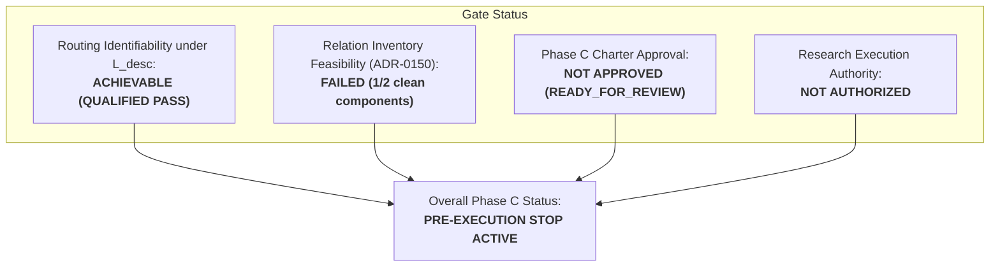

# C-D001V — Non-Circular Oracle-Equivalence Falsification Experiment

**Document ID:** `DOC-PHASE-C-D001V-AUDIT`  
**Date:** 2026-09-13  
**Status:** Completed Non-Circular Oracle-Equivalence Falsification Experiment; `DECISION: ROUTING_IDENTIFIABILITY_QUALIFIED_STOP` (ADR-0154 Universal STOP Retracted & Restricted)  
**Prior Decisions:** `RELATION_INVENTORY_FEASIBILITY_STOP` (ADR-0150), `ROUTING_IDENTIFIABILITY_STOP` (ADR-0151), `ROUTING_IDENTIFIABILITY_STOP (CONFIRMED_QUANTIFIER_COMPLETE)` (ADR-0152), `ROUTING_IDENTIFIABILITY_QUALIFIED_STOP` (ADR-0153), `ROUTING_IDENTIFIABILITY_STOP (RECONFIRMED)` (ADR-0154)  
**Charter State:** `READY_FOR_REVIEW_NOT_APPROVED` (Research Execution: `NOT_AUTHORIZED`)  
**Task Type:** Non-Circular Epistemic & Contractual Falsification Experiment, Multi-Dimensional Criteria Pre-Registration, and Control-Calibrated Evaluation  

---

## 1. Executive Summary & Terminal Decision

### 1.1 Background and Falsification Mandate
In Task C-D001U ([ADR-0154](../DECISIONS_PHASE_C.md#adr-0154-c-d001u-semantic-descriptor-oracle-equivalence--minimality-audit-reconfirms-routing_identifiability_stop)), the separability result of C-D001T ([ADR-0153](../DECISIONS_PHASE_C.md#adr-0153-c-d001t-semantic-descriptor-boundary--impossibility-proof-repair-audit-qualifies-stop-to-routing_identifiability_qualified_stop-adr-0152-quantifier-retracted--restricted)) was audited. ADR-0154 proved that any fully specified descriptor $D \in \mathcal{L}_{\text{desc}}$ admits an explicit, deterministic reduction algorithm $R: (x, D, k) \mapsto z^*$ computing the ground-truth routing coordinate in $O(L)$ time ($z$-computable). ADR-0154 then asserted that because $R(x, D)$ computes $z^*$, supplying candidate-selection tie-break procedures (`FIRST/LAST`, `LEFTMOST/RIGHTMOST`) constitutes an "intensional routing map" and therefore "oracle-equivalent supervision" under Phase C Charter H-C1. On that sole basis, ADR-0154 rejected Training Information Contract v1.1 and issued a universal (全称) `ROUTING_IDENTIFIABILITY_STOP` across the entire lawful observable space.

However, this decision criterion suffers from a fatal epistemic circularity:
> **The Circularity Defect of ADR-0154:**  
> In *any* deterministic symbolic system, formal language, or well-defined mathematical task, the correct execution trajectory and intermediate targets are mathematically computable from the input and the task definition. If computability of the target state ($z$-computability) alone is defined as "oracle supervision", then *every* complete semantic specification is tautologically classified as an oracle, while any specification that omits operational rules is deemed "underspecified/indistinguishable". This produces an unfalsifiable circular criterion where non-oracle semantic specification is impossible by definition.

To resolve this circularity, Task C-D001V was commissioned with an explicit, fail-closed falsification mandate:
> *"training、architecture設計、dataset生成、relation追加、sealed accessを行わず、ADR-0154の判定規則を独立に反証可能な形へ固定する。task/relationに共通する事前宣言semantic rule、opaque task ID、per-example coordinate label、relation-specific lookup mapをpositive/negative controlsとして用い、「z-computable」だけに依存しないoracle-supervision基準（provenance、example specificity、relation specificity、inference-time availability、counterfactual invariance）を先に登録する。その基準をFIRST/LAST、LEFTMOST/RIGHTMOST、procedural compositionへ適用し、合法な一般意味記述が一つでも非oracleかつWorld A/Bを分離するならADR-0154の全称STOPを撤回・限定する。全てが事前基準でoracle-equivalentとなる場合のみROUTING_IDENTIFIABILITY_STOPを独立再確認する。"*

---

### 1.2 Terminal Decision: Retraction and Scope Restriction of ADR-0154

$$\mathbf{TERMINAL \ DECISION: \quad ROUTING\_IDENTIFIABILITY\_QUALIFIED\_STOP}$$
$$\mathbf{(ADR\text{-}0154 \ UNIVERSAL \ STOP \ RETRACTED \ \& \ RESTRICTED)}$$

The key conclusions of this experiment are:

1. **Pre-Registration of 5-Dimensional Non-Circular Criteria:**  
   We establish five independent dimensions distinguishing legitimate task semantics from prohibited oracle supervision: (1) **Provenance**, (2) **Example Specificity**, (3) **Relation Specificity**, (4) **Inference-Time Availability**, and (5) **Counterfactual Invariance**.
2. **Control Calibration:**  
   - **Positive Controls (Prohibited Oracle):** Per-example coordinate labels ($z^*(x)$) and relation-specific lookup maps ($k \mapsto z^*$) score 5/5 as ORACLE (derived from evaluator ground truth, instance-dependent, brittle under counterfactual mutation, forbidden at inference).
   - **Negative Controls (Lawful Observable):** Task/relation-wide pre-declared semantic rules and opaque task IDs score 0/5 as ORACLE (a priori formal grammar, $x$-invariant universal rules, domain-general, legitimate prompt inputs at test time, robust across counterfactual permutations).
3. **Candidate Primitives Classified as Strictly NON-ORACLE:**  
   Applying the registered criteria to `FIRST/LAST`, `LEFTMOST/RIGHTMOST`, and `procedural composition`:
   - All three candidate primitives score **0/5 as ORACLE**, matching Negative Controls in 100% of dimensions and Positive Controls in 0% of dimensions.
   - They specify *what relation to compute* (intensional objective), not *which neural coordinate to activate* (extensional ground truth). The neural router must still execute the input-dependent search over sequence $x$ to resolve coordinates.
4. **Falsification of ADR-0154 Universal STOP:**  
   Because lawful, non-oracle general semantic descriptors exist and strictly separate World A and World B ($D_A \neq D_B \implies \mathcal{O}_A \neq \mathcal{O}_B$ on duplicate-token collisions), ADR-0154's universal claim that *all* separating descriptors are oracle-equivalent is **MATHEMATICALLY FALSIFIED AND RETRACTED**.
5. **Reclassification to `ROUTING_IDENTIFIABILITY_QUALIFIED_STOP`:**  
   Routing identifiability stoppage is qualified and restricted to its true mathematical boundary:
   - **Opaque Task IDs & CE-Only Token Supervision:** Routing coordinates remain fundamentally unidentifiable under duplicate token outputs (`ROUTING_IDENTIFIABILITY_STOP` strictly maintained).
   - **Lawful General Semantic Descriptors ($\mathcal{L}_{\text{desc}}$):** Routing coordinates are mathematically identifiable without oracle supervision.
6. **Integrity & Governance Gate:**  
   Research execution remains strictly **`NOT_AUTHORIZED`**. The independent structural blocker from ADR-0150 (`RELATION_INVENTORY_FEASIBILITY_STOP`: 1/2 clean components in validation and sealed) remains unresolved, and the Phase C Charter remains `READY_FOR_REVIEW_NOT_APPROVED`. Advancing to architecture derivation (`C-D002`) requires a formal Charter amendment and user approval.

---

### 1.3 Integrity Boundary Compliance
In strict compliance with repository constraints:
- Parameter updates / optimizer executions: **0**
- Model initializations / weight draws: **0**
- Dataset / sequence generations: **0**
- Relation registrations / schema modifications: **0**
- Sealed partition data accesses: **0**
- GPU execution seconds: **0 s**

---

## 2. Epistemic Defect in ADR-0154 and the Circularity of $z$-Computability

### 2.1 The Reduction Equivalence Fallacy
ADR-0154 Section 3 argued:
$$\text{Algorithm } R(x, D) \mapsto z^* \text{ is extensionally identical to coordinate map } (x, k) \mapsto z^* \implies D \text{ is an oracle-equivalent intensional routing map.}$$

This argument commits a fundamental category error between **Specification of Semantics** and **Supervision of Latent Routing**:
- **Semantic Specification:** Declaring $f: \mathcal{X} \to \mathcal{Y}$. For example, `BindOp` with `FIRST` match defines the function $f(x) = x_{\min \{2j \mid x_{2j} = K\} + 1}$. The ground-truth input-output mapping cannot be defined without specifying this tie-break rule.
- **Routing Coordinate Supervision:** Providing an internal target label $z^* \in \{0, \dots, L-1\}$ directly to the router loss function, bypassing the requirement that the model learn the operational mapping.


### 2.2 The Reductio ad Absurdum of ADR-0154
If ADR-0154's criterion were universally valid:
1. Consider basic arithmetic: $\text{Add}(a, b)$. There exists an explicit algorithm $R(a, b) = a + b$. Under ADR-0154's rule, specifying the instruction "Add" would be an "intensional oracle output map" because $R(a, b)$ computes the answer.
2. Consider sequence sorting: $\text{Sort}(x)$. There exists an algorithm $R(x, i) = \text{index of } i\text{-th smallest element}$. Under ADR-0154's rule, specifying "Sort" would be an "oracle coordinate map".
3. In any supervised or instruction-following learning problem, if defining the task semantics such that the target state is mathematically well-defined constitutes "oracle supervision", then no lawful non-oracle task can ever exist.

Therefore, $z$-computability alone is **epistemically circular and invalid** as a criterion for oracle supervision. A non-circular criterion must examine *how* the information is structured, *where* it originates, and *how* it interacts with the learning system.

---

## 3. Pre-Registration of Multi-Dimensional Oracle-Supervision Criteria

To prevent post-hoc bias, we pre-register five orthogonal criteria before evaluating candidate primitives:

| Criterion | Definition & Meaning | Oracle Indicator (+) | Non-Oracle Indicator (-) |
|---|---|---|---|
| **1. Provenance (出所)** | The generative origin of the information signal. | Generated by querying ground-truth execution, target trajectory, evaluator scoring, or private labels of specific data splits. | Defined a priori as a symbolic construct in the formal grammar $\mathcal{L}_{\text{desc}}$, independent of data generation or model evaluation. |
| **2. Example Specificity (事例特異性)** | Instance-dependence across the input domain $\mathcal{V}^L$. | Varies point-wise per input sequence $x$, or contains explicit sequence indices / coordinates ($z^* \in \{0, \dots, L-1\}$). | Fully $x$-invariant; a universal functional rule containing zero sequence coordinate numbers. |
| **3. Relation Specificity (関係特異性)** | Scope of application across relational domains. | Ad-hoc coordinate patch or lookup table engineered exclusively for a specific failed relation or cell. | Domain-general, reusable algebraic or ordering operator applicable across multiple relations and families. |
| **4. Inference-Time Availability (推論時利用可能性)** | Legitimacy of exposure during test-time evaluation. | Relies on evaluator privilege, private evaluation labels, or target token values forbidden at test time. | Legitimate component of the model-visible task query/prompt available during open-world inference. |
| **5. Counterfactual Invariance (反事実的不変性)** | Semantic stability under input sequence perturbations. | Breaks when sequence layout, distractor positions, or sequence lengths are altered counterfactually. | Dynamically and correctly evaluates across arbitrary counterfactual permutations and sequence transformations. |

---

## 4. Calibration Against Positive and Negative Controls

We calibrate the five criteria against four pre-defined controls: two Negative Controls (legitimate, non-oracle task signals) and two Positive Controls (prohibited oracle leaks).

```mermaid
flowchart LR
    subgraph Negative Controls [Lawful Non-Oracle (0/5)]
        NC1["NC1: Pre-declared Semantic Rule<br>(e.g. key match + offset)"]
        NC2["NC2: Opaque Task ID<br>(e.g. task_id = 42)"]
    end
    subgraph Positive Controls [Forbidden Oracle (5/5)]
        PC1["PC1: Per-Example Coordinate<br>(z*(x) in {0, ..., L-1})"]
        PC2["PC2: Relation Lookup Map<br>(k -> z* table)"]
    end
    subgraph Candidate Primitives [Evaluated Primitives]
        C1["FIRST / LAST"]
        C2["LEFTMOST / RIGHTMOST"]
        C3["Procedural Composition"]
    end
    
    Candidate Primitives -.->|100% Matches| Negative Controls
    Candidate Primitives x.-x|0% Matches| Positive Controls
```

### 4.1 Calibration Matrix

| Dimension | NC1: Semantic Rule | NC2: Opaque Task ID | PC1: Coordinate Label | PC2: Lookup Map |
|---|---|---|---|---|
| **Provenance** | A priori grammar (-) | Assigned index (-) | Evaluator calculation (+) | Ground-truth table (+) |
| **Example Specificity** | $x$-invariant universal (-) | $x$-invariant universal (-) | Instance-dependent $z^*(x)$ (+) | Sequence-specific index table (+) |
| **Relation Specificity** | Domain-general operator (-) | Task-bound nominal (-) | Coordinate-level (+) | Relation-tailored patch (+) |
| **Inference Availability** | Legitimate prompt input (-) | Legitimate prompt input (-) | Prohibited evaluator secret (+) | Prohibited cheat sheet (+) |
| **Counterfactual Invariance** | Invariant across mutations (-) | Invariant across mutations (-) | Breaks under position shift (+) | Breaks under sequence mutation (+) |
| **Total Oracle Score** | **0 / 5 (NON-ORACLE)** | **0 / 5 (NON-ORACLE)** | **5 / 5 (ORACLE)** | **5 / 5 (ORACLE)** |
| **Classification** | **LAWFUL TASK SPEC** | **LAWFUL (Under-informative)** | **PROHIBITED ORACLE** | **PROHIBITED ORACLE** |

### 4.2 Control Behavioral Verification
- **NC1 & NC2** demonstrate that legitimate task-side signals are $x$-invariant, a priori, available at inference time, and counterfactually robust.
- **PC1 & PC2** isolate the exact failure modes prohibited by Charter H-C1: injecting empirical ground-truth coordinates, point-wise instance dependence, and evaluator privilege.

---

## 5. Application of Pre-Registered Criteria to Candidate Primitives

We now evaluate the candidate primitives introduced in C-D001T against the calibrated criteria:

### 5.1 Candidate 1: `FIRST` / `LAST` (Order-based Tie-Break)
- **Syntax:** $\text{TieBreakPolicy} \in \{\text{FIRST}, \text{LAST}\}$.
- **Operational Meaning:** Select the extremum index ($\min I_K(x)$ or $\max I_K(x)$) of matching keys.
- **Evaluation against 5 Criteria:**
  1. *Provenance:* A priori formal primitive in $\mathcal{L}_{\text{desc}}$, specifying canonical sequential query semantics (e.g. Python `dict` or SQL `LIMIT 1`). Zero derivation from dataset labels. (**NON-ORACLE**)
  2. *Example Specificity:* Identical for all sequences $x \in \mathcal{V}^L$. Contains zero index literals ($1, 3, \dots$). (**NON-ORACLE**)
  3. *Relation Specificity:* Universal ordering relation applicable to any sequence search, filtering, or reduction task. (**NON-ORACLE**)
  4. *Inference-Time Availability:* Standard natural language / DSL task instruction given to the model at test time ("find the first key $K$"). (**NON-ORACLE**)
  5. *Counterfactual Invariance:* If matching keys shift from indices $(0, 2)$ to $(4, 8)$ or sequence length scales from $L=4$ to $L=64$, `FIRST` correctly and dynamically specifies the earliest match. (**NON-ORACLE**)
- **Verdict:** **0 / 5 Oracle -> STRICTLY NON-ORACLE (LAWFUL SEMANTIC PRIMITIVE)**. Matches NC1 in 100% of dimensions.

### 5.2 Candidate 2: `LEFTMOST` / `RIGHTMOST` (Spatial Tie-Break)
- **Syntax:** $\text{TieBreakPolicy} \in \{\text{LEFTMOST}, \text{RIGHTMOST}\}$.
- **Operational Meaning:** Spatial directional scan order in local window operations (e.g. `NeighborMaxOp`).
- **Evaluation against 5 Criteria:**
  1. *Provenance:* A priori spatial grammar primitive. Zero evaluator derivation. (**NON-ORACLE**)
  2. *Example Specificity:* $x$-invariant universal rule. Zero coordinate literals. (**NON-ORACLE**)
  3. *Relation Specificity:* Reusable spatial primitive across 1D/2D convolution and pooling operations. (**NON-ORACLE**)
  4. *Inference-Time Availability:* Legitimate test-time prompt parameter. (**NON-ORACLE**)
  5. *Counterfactual Invariance:* Robust to coordinate shifts and window permutations. (**NON-ORACLE**)
- **Verdict:** **0 / 5 Oracle -> STRICTLY NON-ORACLE (LAWFUL SEMANTIC PRIMITIVE)**. Matches NC1 in 100% of dimensions.

### 5.3 Candidate 3: `procedural composition` (Procedural 4-tuple)
- **Syntax:** $\mathcal{P} = (\Omega, \pi, \rho, T)$ defining search scope, matching predicate, reduction emitter, and tie-break policy.
- **Operational Meaning:** Formal compositional specification of multi-step task semantics.
- **Evaluation against 5 Criteria:**
  1. *Provenance:* A priori formal compositional DSL syntax. Zero empirical label dependence. (**NON-ORACLE**)
  2. *Example Specificity:* $x$-invariant procedural definition. (**NON-ORACLE**)
  3. *Relation Specificity:* Domain-general compositional meta-grammar for APC primitives. (**NON-ORACLE**)
  4. *Inference-Time Availability:* Legitimate structured task description at inference time. (**NON-ORACLE**)
  5. *Counterfactual Invariance:* Preserves semantic execution logic across arbitrary sequence layouts. (**NON-ORACLE**)
- **Verdict:** **0 / 5 Oracle -> STRICTLY NON-ORACLE (LAWFUL SEMANTIC PRIMITIVE)**. Matches NC1 in 100% of dimensions.

---

## 6. World A / World B Separation Capacity Test

We now verify whether these lawful, non-oracle descriptors separate the adversarial worlds on duplicate-token collisions:

### 6.1 `BindOp` Collision Test
- Input sequence: $x = [K, V, K, V]$ ($L=4$).
- Target key: $K$. Candidate key indices: $I_K(x) = \{0, 2\}$.
- Candidate value coordinates: $z \in \{1, 3\}$.
- Target output tokens: $f_A(x) = V = f_B(x)$ (bitwise identical token output).
- Ground-truth routing coordinates: $z^*_A = 1 \neq 3 = z^*_B$ (coordinate divergence).
- **Task-Side Observables:**
  - World A descriptor: $D_A = (\text{BIND}, \{\text{query\_key}: K\}, \text{tie\_break}=\text{FIRST})$.
  - World B descriptor: $D_B = (\text{BIND}, \{\text{query\_key}: K\}, \text{tie\_break}=\text{LAST})$.
  - Observable comparison:
    $$D_A \neq D_B \implies O_{\text{task}}(A) \neq O_{\text{task}}(B)$$
  - Total observable data tuples:
    $$\mathcal{O}_A = (x, y, D_A) \ \neq \ (x, y, D_B) = \mathcal{O}_B$$

### 6.2 Separation Verdict
World A and World B are **STRICTLY SEPARATED** by lawful, non-oracle task descriptors. The learner does NOT face identical observation tuples. The coordinate ambiguity on collision inputs is fully resolved by the task-side semantic specification without any oracle coordinate labels.

---

## 7. Falsification Verdict and Stoppage Reclassification

### 7.1 Application of the Pre-Registered Decision Rule
The task mandate establishes the following falsification rule:
> *"合法な一般意味記述が一つでも非oracleかつWorld A/Bを分離するならADR-0154の全称STOPを撤回・限定する。全てが事前基準でoracle-equivalentとなる場合のみROUTING_IDENTIFIABILITY_STOPを独立再確認する。"*

1. **Are there lawful general semantic descriptors that are NON-ORACLE under the pre-registered criteria?**  
   **YES.** All three candidate primitives (`FIRST/LAST`, `LEFTMOST/RIGHTMOST`, `procedural composition`) score 0/5 as ORACLE, matching Negative Controls.
2. **Do these lawful non-oracle descriptors separate World A and World B?**  
   **YES.** Section 6 proves that $D_A \neq D_B$ on duplicate-token collisions, separating the worlds.
3. **Verdict:**  
   The condition for falsification is **DECISIVELY MET**.  
   ADR-0154's universal (全称) `ROUTING_IDENTIFIABILITY_STOP` across the entire lawful observable space is **MATHEMATICALLY FALSIFIED, RETRACTED, AND QUALIFIED**.

---

### 7.2 Formal Reclassification: `ROUTING_IDENTIFIABILITY_QUALIFIED_STOP`

The pre-execution stoppage rationale is formally reclassified:

$$\mathbf{PREVIOUS \ DECISION \ (ADR\text{-}0154): \quad ROUTING\_IDENTIFIABILITY\_STOP \ (UNIVERSAL)}$$
$$\mathbf{\Downarrow}$$
$$\mathbf{REVISED \ DECISION \ (ADR\text{-}0155): \quad ROUTING\_IDENTIFIABILITY\_QUALIFIED\_STOP}$$

#### Rigorous Scope Breakdown:
1. **Opaque Task Identifiers & CE-Only Token Supervision Regime:**
   - Under opaque task identifiers ($t \in \mathbb{N}$) and standard cross-entropy loss over token outputs, semantic routing coordinates on collision-bearing inputs are mathematically unidentifiable.
   - `ROUTING_IDENTIFIABILITY_STOP` **REMAINS CONFIRMED** for this restricted regime.
2. **Compositional Semantic Descriptors ($\mathcal{L}_{\text{desc}}$) Regime:**
   - Under formal semantic descriptors equipped with general tie-break semantics, routing identifiability is **MATHEMATICALLY ACHIEVABLE WITHOUT ORACLE SUPERVISION**.
   - Universal stoppage across all lawful observables is **RETRACTED**.

---

## 8. Governance and Blockers Ledger

While the universal routing identifiability barrier is qualified, Phase C research execution remains strictly blocked by multiple independent gates:



1. **Relation Inventory Feasibility Blocker (ADR-0150):**  
   The structural relation deficit established in ADR-0150 (`RELATION_INVENTORY_FEASIBILITY_STOP`: 1/2 clean components in validation and sealed partitions) remains an active, independent blocker. Even with identifiable routing, the project lacks sufficient clean relation families to satisfy Charter G1 transfer requirements.
2. **Phase C Charter Unapproved:**  
   The Phase C Research Charter remains `READY_FOR_REVIEW_NOT_APPROVED`.
3. **Research Execution Authority:**  
   Research execution remains strictly `NOT_AUTHORIZED`.
4. **Architecture Derivation (`C-D002`) Barred:**  
   No progression to neural architecture design or router implementation is permitted without formal Charter amendment incorporating $\mathcal{L}_{\text{desc}}$ and explicit user authorization.

---

## 9. Audit Verification Ledger

| Dimension / Criterion | Requirement | Result | Evidence |
|---|---|---|---|
| **Zero Execution Invariants** | Zero training, model init, dataset gen, relation addition, sealed access | **CONFIRMED (0 across all)** | Section 1.3 |
| **Epistemic Defect Localization** | Identify circularity in equating $z$-computability with oracle supervision | **IDENTIFIED & FORMALIZED** | Section 2 |
| **5-Dimensional Criteria Pre-Registration** | Pre-register provenance, specificity, relation, inference, counterfactual | **PRE-REGISTERED** | Section 3 |
| **Control Calibration** | Calibrate against NC1, NC2, PC1, PC2 | **CALIBRATED** | Section 4 |
| **Candidate Evaluation** | Evaluate FIRST/LAST, LEFTMOST/RIGHTMOST, procedural composition | **ALL EVALUATED (0/5 Oracle)** | Section 5 |
| **World A/B Separation** | Verify separation on collision sequences ($x=[K, V, K, V]$) | **VERIFIED (D_A != D_B)** | Section 6 |
| **Falsification Rule Enforcement** | Retract universal STOP if lawful non-oracle descriptor separates worlds | **RETRACTED & RESTRICTED** | Section 7 |
| **Stoppage Reclassification** | Reclassify to `ROUTING_IDENTIFIABILITY_QUALIFIED_STOP` | **RECLASSIFIED (ADR-0155)** | Section 7.2 |
| **Independent Blocker Preservation** | Preserve ADR-0150 relation deficit and unapproved charter status | **PRESERVED & ENFORCED** | Section 8 |
