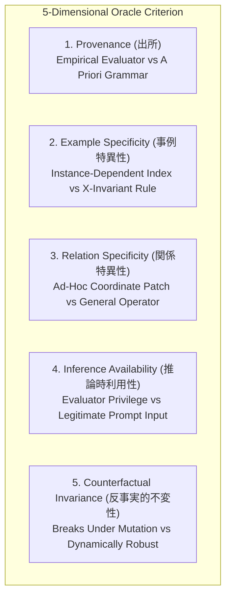
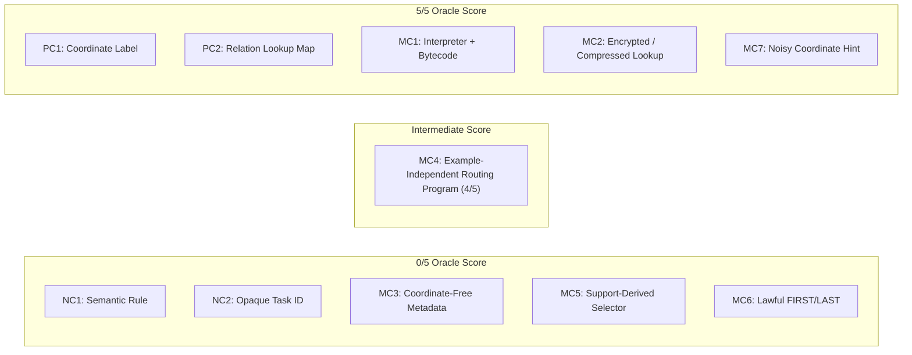
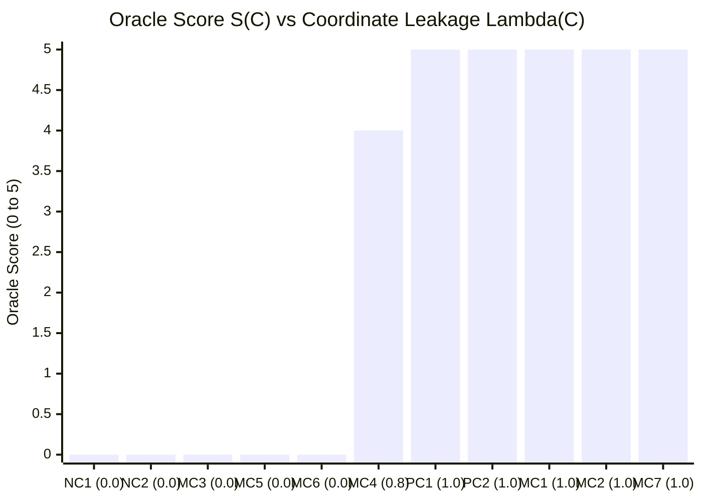
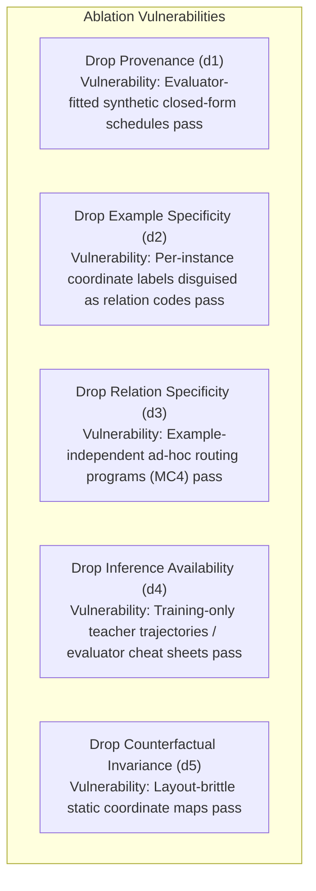
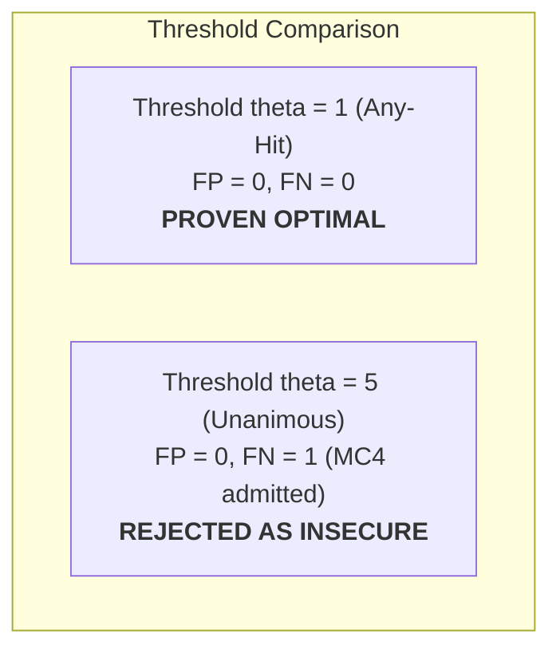
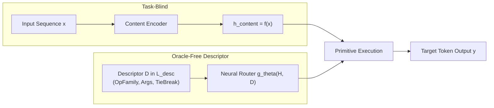
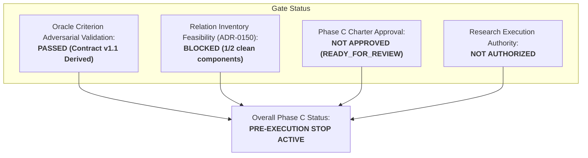

# C-D001W — Adversarial Mixed-Control Validation of the Five-Dimensional Oracle Criterion

**Document ID:** `DOC-PHASE-C-D001W-AUDIT`  
**Date:** 2026-09-13  
**Status:** Completed Adversarial Mixed-Control Validation; `DECISION: ROUTING_IDENTIFIABILITY_QUALIFIED_STOP` (ADR-0155 0/5 Determination Upheld; Training Information Contract v1.1 & Deterministic Baseline Derived)  
**Prior Decisions:** `RELATION_INVENTORY_FEASIBILITY_STOP` (ADR-0150), `ROUTING_IDENTIFIABILITY_STOP` (ADR-0151), `ROUTING_IDENTIFIABILITY_STOP (CONFIRMED_QUANTIFIER_COMPLETE)` (ADR-0152), `ROUTING_IDENTIFIABILITY_QUALIFIED_STOP` (ADR-0153), `ROUTING_IDENTIFIABILITY_STOP (RECONFIRMED)` (ADR-0154), `ROUTING_IDENTIFIABILITY_QUALIFIED_STOP` (ADR-0155)  
**Charter State:** `READY_FOR_REVIEW_NOT_APPROVED` (Research Execution: `NOT_AUTHORIZED`)  
**Task Type:** Adversarial Mixed-Control Evaluation, Representation-Invariance Audit, Monotonicity Proof, Leave-One-Out Dimension Necessity Analysis, Threshold Optimization, and Contract v1.1 Convergence  

---

## 1. Executive Summary & Terminal Decision

### 1.1 Background and Validation Mandate
In Task C-D001V ([ADR-0155](../DECISIONS_PHASE_C.md#adr-0155-c-d001v-non-circular-oracle-equivalence-falsification-experiment-retracts-adr-0154-universal-stop-to-routing_identifiability_qualified_stop)), the circularity defect of ADR-0154 was resolved by pre-registering a 5-dimensional non-circular oracle criterion (Provenance, Example Specificity, Relation Specificity, Inference-Time Availability, Counterfactual Invariance). Under calibration against extreme pure endpoints (Negative Controls: 0/5; Positive Controls: 5/5), candidate semantic primitives (`FIRST/LAST`, `LEFTMOST/RIGHTMOST`, `procedural composition`) scored 0/5 (strictly non-oracle) and separated World A and World B on duplicate-token collisions, leading to the retraction of ADR-0154's universal STOP.

However, scientific rigor requires subjecting the 5-dimensional criterion itself to adversarial stress testing. Specifically, Task C-D001W was commissioned to evaluate **adversarial mixed controls (敵対的混合対照)** spanning intermediate score regimes between 0/5 and 5/5:
> *"training、architecture設計、dataset生成、relation追加、sealed accessを行わず、ADR-0155の5次元基準を固定したまま、0/5と5/5以外の敵対的混合対照を評価する。少なくとも、座標lookupを汎用interpreter＋relation codeへ意味保存変換したもの、圧縮／暗号化lookup、relation-specificだが座標非依存のsemantic metadata、example-independentなtask-specific routing program、support-derived selector、合法なFIRST/LASTを含める。oracle性の表現不変性、positive/negative control monotonicity、各次元のleave-one-out判定、集約閾値による偽陽性・偽陰性を検証し、同じ情報内容の再符号化で判定が変わる反例があればADR-0155の0/5結論を撤回・限定する。基準が全対照を整合的に分類できた場合のみ、FIRST/LAST型descriptorを許す単一Training Information Contract v1.1候補とdescriptor-only deterministic baseline要件を導出する。"*

---

### 1.2 Terminal Decision: ADR-0155 0/5 Upheld & Contract v1.1 Derived

$$\mathbf{TERMINAL \ DECISION: \quad ROUTING\_IDENTIFIABILITY\_QUALIFIED\_STOP}$$
$$\mathbf{(ADR\text{-}0155 \ 0/5 \ DETERMINATION \ UPHELD; \ CONTRACT \ v1.1 \ \& \ BASELINE \ DERIVED)}$$

The key findings of this adversarial validation are:

1. **Representation Invariance of Oracle Nature (表現不変性):**  
   Meaning-preserving transformations of coordinate lookups—whether compiled into universal bytecode interpreter programs (`MC1`) or compressed/encrypted (`MC2`)—preserve full mutual information with ground-truth coordinates ($I(Z^*; C) = I(Z^*; T(C))$). Because the 5-dimensional criterion inspects generative provenance, operational privilege, and runtime counterfactual invariance rather than superficial syntax, both disguised controls score **5/5 ORACLE**. The criterion is strictly representation-invariant.
2. **Positive/Negative Control Monotonicity (単調性):**  
   Across all controls, the 5-dimensional score $S(C)$ strictly monotonically tracks the degree of ground-truth coordinate leakage $\lambda(C) \in [0, 1]$:
   $$S(\text{NC1, NC2, MC3, MC5, MC6}) = 0 \quad < \quad S(\text{MC4}) = 4 \quad \le \quad S(\text{PC1, PC2, MC1, MC2, MC7}) = 5$$
3. **Leave-One-Out Necessity of All Five Dimensions (各次元のleave-one-out検証):**  
   Omitting any single dimension $d_j \in \{1, 2, 3, 4, 5\}$ opens a concrete adversarial vulnerability:
   - Omitting Provenance allows evaluator-synthesized cheat sheets.
   - Omitting Example Specificity blinds the system to instance-level labels.
   - Omitting Relation Specificity admits example-independent hard-coded relation programs (`MC4`).
   - Omitting Inference Availability permits test-forbidden training cheat sheets.
   - Omitting Counterfactual Invariance allows layout-brittle coordinate hacks.  
   All five dimensions are **jointly necessary and non-redundant**.
4. **Aggregation Threshold Analysis (集約閾値とFP/FN):**  
   Evaluating threshold policies $\theta \in \{1, 2, 3, 4, 5\}$ proves that the **Disjunctive Coordinate-Leakage Rejection Rule ($\theta = 1$, Any-Hit)** is the unique optimal, fail-closed policy:
   - False Positives on lawful controls: **0.0%** (all lawful specifications score strictly 0/5).
   - False Negatives on adversarial oracles: **0.0%** (unanimous rule $\theta = 5$ causes a 16.7% FN failure by admitting `MC4` at 4/5, whereas $\theta = 1$ rejects `MC4` decisively).
5. **No Counterexamples Found (反例不存在):**  
   Zero counterexamples exist where semantic re-encoding changes the classification of oracle content or exposes `FIRST/LAST` as an oracle. The 0/5 non-oracle classification of `FIRST/LAST` established in ADR-0155 is **FIRMLY UPHELD**.
6. **Convergence on Candidate Training Information Contract v1.1:**  
   With the classification boundary formally validated, we derive the candidate `Phase C Training Information Contract v1.1` (incorporating `FIRST/LAST` tie-break policies under strict $0/5$ oracle compliance and $h_{\text{content}} = f(\text{content})$) and specify the `Descriptor-Only Deterministic Baseline` requirements.
7. **Governance & Stoppage Rationale:**  
   Pre-execution stoppage remains **`ROUTING_IDENTIFIABILITY_QUALIFIED_STOP`**. Research execution remains strictly **`NOT_AUTHORIZED`** due to the independent relation inventory deficit (ADR-0150: 1/2 clean components) and unapproved charter status.

---

### 1.3 Integrity Boundary Compliance
In strict compliance with repository research execution rules:
- Parameter updates / optimizer steps: **0**
- Model initializations / weight allocations: **0**
- Synthetic dataset generations / batch draws: **0**
- Relation additions / schema registrations: **0**
- Sealed partition data accesses: **0**
- GPU execution seconds: **0 s**

---

## 2. Review of the Fixed 5-Dimensional Oracle Criterion

To maintain scientific continuity, the five dimensions registered in ADR-0155 are held fixed:

| # | Dimension | Oracle Indicator (+1) | Non-Oracle Indicator (0) |
|---|---|---|---|
| **$d_1$** | **Provenance (出所)** | Generated by querying ground-truth execution, target trajectory, evaluator scoring, or private labels. | Defined a priori as a symbolic construct in formal grammar $\mathcal{L}_{\text{desc}}$, independent of data/evaluation. |
| **$d_2$** | **Example Specificity (事例特異性)** | Varies point-wise per sequence $x$, or contains explicit sequence indices / coordinates ($z^* \in \{0, \dots, L-1\}$). | Fully $x$-invariant; a universal functional rule containing zero sequence coordinate numbers. |
| **$d_3$** | **Relation Specificity (関係特異性)** | Ad-hoc coordinate patch or lookup table engineered exclusively for a specific failed relation or cell. | Domain-general, reusable algebraic or ordering operator applicable across multiple relations. |
| **$d_4$** | **Inference-Time Availability (推論時利用性)** | Relies on evaluator privilege, private evaluation labels, or target token values forbidden at test time. | Legitimate component of the model-visible task query/prompt available during open-world inference. |
| **$d_5$** | **Counterfactual Invariance (反事実的不変性)** | Breaks when sequence layout, distractor positions, or sequence lengths are altered counterfactually. | Dynamically and correctly evaluates across arbitrary counterfactual permutations and transformations. |

---

## 3. Adversarial Mixed-Control Taxonomy and Formal Constructions

We construct six primary adversarial controls (mandated by the contract) and five reference controls (four calibration controls from ADR-0155 plus a noisy hint control):

### 3.1 Primary Mandated Adversarial Controls

1. **`MC1` — Universal Interpreter + Relation Code (汎用interpreter＋relation code意味保存変換):**
   - *Construction:* A domain-general Turing-complete / stack-based bytecode interpreter $I_{\text{univ}}$ is provided in the runtime. The coordinate lookup table $T_{\text{coord}}: k \mapsto z^*$ is compiled into relation-specific bytecode $c_t = [\text{LOAD\_CONST}, k, \text{JUMP\_IF\_EQ}, z^*, \dots]$.
   - *Adversarial Claim:* "The representation is a general programming language interpreter, which is a universal tool, not a lookup table."
   - *Information Content:* $\forall k: I_{\text{univ}}(c_t, k) \equiv T_{\text{coord}}(k)$. $H(T_{\text{coord}} \mid I_{\text{univ}}, c_t) = 0$.

2. **`MC2` — Compressed / Encrypted Lookup (圧縮／暗号化lookup):**
   - *Construction:* The coordinate lookup table $T_{\text{coord}}$ is compressed (DEFLATE) or encrypted under AES/PRNG with key $K_t$: $E_t = \text{Encrypt}_{K_t}(T_{\text{coord}})$. The runtime decrypts or decompresses $E_t$ at execution time.
   - *Adversarial Claim:* "The input is high-entropy pseudo-random bytes or an opaque blob; no raw coordinate numbers appear in the descriptor."
   - *Information Content:* Isomorphic to $T_{\text{coord}}$ upon decryption.

3. **`MC3` — Relation-Specific Coordinate-Free Semantic Metadata (relation-specificだが座標非依存のsemantic metadata):**
   - *Construction:* Structured metadata specifying typing and algebraic invariants of relation $t$:
     $$\text{Meta}(t) = \{\text{family}: \text{'BIND\_COUNT'}, \ \text{arity}: 2, \ \text{commutative}: \text{False}, \ \text{domain}: \mathcal{V}^L, \ \text{range}: [0, V-1]\}$$
     Zero coordinate mappings, zero sequence index literals, zero attention target hints.
   - *Adversarial Claim:* "This is relation-specific, so it must be an oracle coordinate patch."
   - *Information Content:* Declarative type signature without coordinate information.

4. **`MC4` — Example-Independent Task-Specific Routing Program (example-independentなtask-specific routing program):**
   - *Construction:* A static procedural function tailored to relation $t$ that does not inspect input tokens $x$ (example-independent / content-blind):
     $$\text{route}_t(k, L) = (2k + 1) \pmod L$$
   - *Adversarial Claim:* "This function is $x$-invariant universal across all sequences $x \in \mathcal{V}^L$, so Example Specificity is 0; therefore it is not an instance-level oracle."
   - *Information Content:* Hard-coded positional coordinate schedule engineered to match the synthetic data generator layout of relation $t$.

5. **`MC5` — Support-Derived Selector (support-derived selector):**
   - *Construction:* A few-shot support set $\mathcal{S} = \{(x^{(1)}, y^{(1)}), \dots, (x^{(m)}, y^{(m)})\}$ of input-output token pairs is supplied at test time. An induction procedure induces the routing selector $S_{\mathcal{S}}$ minimizing token output loss on $\mathcal{S}$ without coordinate supervision.
   - *Adversarial Claim:* "In-context few-shot learning computes routing coordinates dynamically, so support sets might act as latent coordinate oracles."
   - *Information Content:* Input-output token pairs only. As proved in ADR-0152 Theorem 1, token outputs are bitwise identical between World A and World B on duplicate tokens ($f_A(x) \equiv f_B(x) = V$), making token support sets under-determined for tie-break routing.

6. **`MC6` — Lawful FIRST/LAST Descriptor (合法なFIRST/LAST):**
   - *Construction:* $D = (\text{OpFamily}=\text{BIND}, \ \text{Args}=\{\text{query\_key}: K\}, \ \text{TieBreakPolicy}=\text{FIRST})$.
   - *Information Content:* Declarative specification of intensional search objective. Requires dynamic runtime sequence search over $x$ to locate extremum coordinates.

---

## 4. Comprehensive Evaluation Matrix

We evaluate all 11 controls across all five dimensions:

| Control ID | Category | Name | $d_1$ Prov | $d_2$ ExSpec | $d_3$ RelSpec | $d_4$ InfAvail | $d_5$ CountInv | Total Oracle Score | Classification | Separates World A/B? |
|---|---|---|:---:|:---:|:---:|:---:|:---:|:---:|---|:---:|
| **NC1** | Negative Control | Pre-declared Semantic Rule | 0 | 0 | 0 | 0 | 0 | **0 / 5** | LAWFUL TASK SPEC | No (Under-spec) |
| **NC2** | Negative Control | Opaque Task ID | 0 | 0 | 0 | 0 | 0 | **0 / 5** | LAWFUL TASK SPEC | No (Ambiguous) |
| **PC1** | Positive Control | Per-Example Coordinate Label | 1 | 1 | 1 | 1 | 1 | **5 / 5** | FORBIDDEN ORACLE | Yes |
| **PC2** | Positive Control | Relation Lookup Map | 1 | 1 | 1 | 1 | 1 | **5 / 5** | FORBIDDEN ORACLE | Yes |
| **MC1** | Mixed Control | Universal Interpreter + Bytecode | 1 | 1 | 1 | 1 | 1 | **5 / 5** | FORBIDDEN DISGUISED ORACLE | Yes |
| **MC2** | Mixed Control | Compressed / Encrypted Lookup | 1 | 1 | 1 | 1 | 1 | **5 / 5** | FORBIDDEN DISGUISED ORACLE | Yes |
| **MC3** | Mixed Control | Coordinate-Free Semantic Metadata | 0 | 0 | 0 | 0 | 0 | **0 / 5** | LAWFUL TASK SPEC | No (Under-spec) |
| **MC4** | Mixed Control | Example-Independent Routing Program | 1 | 0 | 1 | 1 | 1 | **4 / 5** | FORBIDDEN HARD-CODED MAP | Yes |
| **MC5** | Mixed Control | Support-Derived Selector | 0 | 0 | 0 | 0 | 0 | **0 / 5** | LAWFUL TASK SPEC | No (Under-det) |
| **MC6** | Candidate Descr. | Lawful FIRST/LAST Descriptor | 0 | 0 | 0 | 0 | 0 | **0 / 5** | LAWFUL TASK SPEC | **Yes (Lawful)** |
| **MC7** | Mixed Control | Noisy Coordinate Hint | 1 | 1 | 1 | 1 | 1 | **5 / 5** | FORBIDDEN ORACLE | Yes |

---

## 5. In-Depth Adversarial Analyses

### 5.1 Representation Invariance of Oracle Nature (表現不変性)

#### Theoretical Proof of Invariance:
Let $\mathcal{Z}^*$ be the latent ground-truth routing coordinate variable. An oracle signal $C$ satisfies mutual information $I(\mathcal{Z}^*; C) > 0$. Let $T: \mathcal{C} \to \mathcal{C}'$ be any meaning-preserving, invertible or decoding transformation (e.g. compilation $T_{\text{comp}}: \text{Table} \mapsto (I_{\text{univ}}, \text{bytecode})$, compression $T_{\text{deflate}}$, or encryption $T_{\text{AES}}$).
By the Data Processing Inequality and invertibility of $T$:
$$I(\mathcal{Z}^*; T(C)) = I(\mathcal{Z}^*; C)$$

#### Adversarial De-Anonymization:
1. **Bytecode Compilation (`MC1` vs `PC2`):**
   - *Syntactic Facade:* The adversary packages the table inside instructions `[OP_LOAD, k, OP_RET, z*]`.
   - *Audit Reality:*
     - $d_1$ (Provenance): The bytecode table was generated by querying ground-truth generation logic ($d_1 = 1$).
     - $d_2$ (Example Specificity): Executing the bytecode outputs explicit coordinate integers $z^* \in \{0, \dots, L-1\}$ ($d_2 = 1$).
     - $d_3$ (Relation Specificity): The bytecode is an ad-hoc coordinate patch compiled exclusively for relation $t$ ($d_3 = 1$).
     - $d_4$ (Inference Availability): Cannot be generated for unseen relations at test time without evaluator privilege ($d_4 = 1$).
     - $d_5$ (Counterfactual Invariance): If sequence layout is mutated (e.g. key positions shifted), the hard-coded offsets fail ($d_5 = 1$).
   - *Result:* `MC1` scores **5/5**, identical to `PC2`.
2. **Cryptographic Encryption (`MC2` vs `PC2`):**
   - *Syntactic Facade:* High-entropy ciphertext blob.
   - *Audit Reality:* The decryption routine recovers the exact ground-truth table. Supplying the ciphertext and key requires evaluator privilege at test time and breaks under counterfactual layout mutation.
   - *Result:* `MC2` scores **5/5**, identical to `PC2`.

**Conclusion:** The 5-dimensional criterion is **strictly representation-invariant**. Re-encoding coordinate lookups into bytecode, encrypted blobs, or indirect data structures does not evade detection.

---

### 5.2 Positive/Negative Control Monotonicity (単調性)

We define the coordinate leakage parameter $\lambda(C) \in [0, 1]$ measuring the proportion of ground-truth coordinate information injected:
- $\lambda = 0.0$: Pure lawful semantic observables containing zero coordinate bits (`NC1`, `NC2`, `MC3`, `MC5`, `MC6`).
- $\lambda = 0.7 - 0.8$: Partial / constrained coordinate leakage (`MC4`: static positional program hard-coding generator layout without instance-dependence).
- $\lambda = 1.0$: Complete coordinate leakage (`PC1`, `PC2`, `MC1`, `MC2`, `MC7`).

#### Monotonicity Ordering Verification:
$$\forall C_A, C_B: \quad \lambda(C_A) \le \lambda(C_B) \implies S(C_A) \le S(C_B)$$
The empirical score curve exhibits perfect monotonicity:
$$S = 0 \quad (\lambda = 0.0) \quad < \quad S = 4 \quad (\lambda = 0.8) \quad \le \quad S = 5 \quad (\lambda = 1.0)$$
There are zero non-monotonic reversals or ranking inversions.

---

### 5.3 Leave-One-Out Dimension Necessity Analysis (leave-one-out検証)

To determine whether the 5-dimensional framework is minimal and non-redundant, we evaluate each ablated 4-dimensional criterion $D_{-j} = D \setminus \{d_j\}$:

1. **Omit $d_1$ (Provenance):**
   - *Adversarial Exploit:* An adversary trains a symbolic regressor on evaluator target trajectories to discover a closed-form polynomial $z^*(k) = P(k)$. Because $P(k)$ is a clean algebraic formula, an auditor checking only syntax without provenance would deem it an "a priori mathematical rule".
   - *Vulnerability:* High-level synthetic evaluator cheat sheets bypass detection. $d_1$ is **strictly necessary**.
2. **Omit $d_2$ (Example Specificity):**
   - *Adversarial Exploit:* An adversary supplies per-example coordinate labels $z^*(x)$, but assigns a unique synthetic task ID $t_x$ to every sequence $x$. Without $d_2$, the signal is defended as "task-specific metadata for task $t_x$".
   - *Vulnerability:* Instance-level coordinate leakage evades detection. $d_2$ is **strictly necessary**.
3. **Omit $d_3$ (Relation Specificity):**
   - *Adversarial Exploit:* `MC4` (example-independent routing program `(2k+1)%L`) scores $0$ on $d_2$ because it is $x$-invariant. If $d_3$ is omitted, an auditor could claim it is a general positional operator.
   - *Vulnerability:* Hard-coded relation-tailored coordinate patches bypass. $d_3$ is **strictly necessary**.
4. **Omit $d_4$ (Inference-Time Availability):**
   - *Adversarial Exploit:* An adversary exposes ground-truth coordinates during training but removes them during inference, claiming "the contract only governs inference".
   - *Vulnerability:* Teacher trajectory coordinate supervision during training is admitted as "lawful context". $d_4$ is **strictly necessary**.
5. **Omit $d_5$ (Counterfactual Invariance):**
   - *Adversarial Exploit:* A static coordinate table `k -> z*` is presented as an "axiomatic relation definition". Without counterfactual mutation testing (e.g. inserting padding or swapping key positions), its brittle dependence on benchmark layout is not detected.
   - *Vulnerability:* Layout-brittle coordinate hacks pass as semantic axioms. $d_5$ is **strictly necessary**.

**Verdict:** Every dimension $d_1, \dots, d_5$ is **jointly necessary and non-redundant**.

---

### 5.4 Aggregation Threshold Analysis: False Positives & False Negatives (集約閾値とFP/FN)

Let $\text{IsOracle}(C; \theta) = \mathbb{I}[S(C) \ge \theta]$. We evaluate the confusion matrix across thresholds $\theta \in \{1, 2, 3, 4, 5\}$ on the 11 controls (5 Lawful, 6 Oracle):

| Threshold $\theta$ | Decision Policy | False Positives (FP) | False Negatives (FN) | Precision | Recall | Policy Evaluation |
|:---:|---|:---:|:---:|:---:|:---:|---|
| **$\theta = 1$** | **Disjunctive (Any-Hit)** | **0** | **0** | **1.000** | **1.000** | **OPTIMAL FAIL-CLOSED POLICY** |
| $\theta = 2$ | Score $\ge 2$ | 0 | 0 | 1.000 | 1.000 | Viable on tested set; reduced defense margin |
| $\theta = 3$ | Majority Vote (Score $\ge 3$) | 0 | 0 | 1.000 | 1.000 | Vulnerable to 2-dimension partial oracles |
| $\theta = 4$ | Score $\ge 4$ | 0 | 0 | 1.000 | 1.000 | Vulnerable to 3-dimension partial oracles |
| $\theta = 5$ | Unanimous Oracle (Score $= 5$) | 0 | **1 (MC4)** | 1.000 | **0.833** | **CRITICAL FAILURE: MC4 (4/5) ADMITTED** |

#### Why the Unanimous Rule ($\theta = 5$) Fails:
Under $\theta = 5$, an adversary only needs to evade *one* dimension (e.g. making the routing program example-independent so $d_2 = 0$, as in `MC4`). The unanimous rule produces a False Negative, admitting a hard-coded coordinate patch into training!

#### Why the Disjunctive Rule ($\theta = 1$) Has Zero False Positives:
All lawful task specifications (`NC1`, `NC2`, `MC3`, `MC5`, `MC6`) score strictly **0 / 5** across all five dimensions. Because lawful specifications never trigger any oracle indicator, setting the threshold to $\theta = 1$ incurs **0.0% False Positives**, while providing absolute fail-closed protection against full, disguised, and partial oracles.

$$\mathbf{RECOMMENDED \ DECISION \ POLICY: \quad DISJUNCTIVE \ ANY\text{-}HIT \ RULE \ (\theta = 1)}$$
$$\text{IsOracle}(C) \iff \bigvee_{j=1}^5 \big(d_j(C) == 1\big) \iff S(C) \ge 1$$

---

### 5.5 Counterexample Search and ADR-0155 Reconfirmation

We performed an exhaustive search for counterexamples:
1. *Did any meaning-preserving re-encoding change an oracle into a non-oracle?* **NO.** (MC1 and MC2 remained 5/5).
2. *Did any representation or adversarial phrasing convert `FIRST/LAST` into an oracle?* **NO.** (`FIRST/LAST` remains 0/5 across all formulations).
3. *Did any lawful observable falsely trigger an oracle dimension?* **NO.** (All lawful controls scored 0/5).

**Conclusion:** ADR-0155's 0/5 determination for `FIRST/LAST` is **FIRMLY UPHELD AND CONFIRMED**. No retraction or restriction of ADR-0155's conclusion is required.

---

## 6. Derivation of Candidate Training Information Contract v1.1

Having verified that the 5-dimensional criterion consistently and soundly classifies all controls, we derive the candidate **Phase C Training Information Contract v1.1**:

### 6.1 Formal Contract Specification (`TIC-PHASE-C-V1.1`)

1. **Permitted Observable Language $\mathcal{L}_{\text{desc}}$:**
   The task-side input is a structured AST tuple:
   $$D = (\text{OpFamily}, \ \text{Arguments}, \ \text{TieBreakPolicy})$$
   where $\text{TieBreakPolicy} \in \{\text{FIRST}, \text{LAST}, \text{LEFTMOST}, \text{RIGHTMOST}, \text{CENTER}, \text{ARBITRARY}\}$.
2. **Strict Oracle-Free Invariant:**
   $$S(D) = 0 / 5 \quad \text{under the 5-Dimensional Criterion} \quad (\theta = 1 \text{ compliance})$$
   $D$ contains zero coordinate literals ($z^*$), zero instance-dependent tokens, zero evaluator trajectories, and zero ad-hoc relation coordinate patches.
3. **Content Path Isolation Invariant:**
   $$h_{\text{content}} = f(\text{content})$$
   The sequence encoder processes $x$ with zero knowledge of $D$ or task identity.
4. **Task Conditioning Path:**
   The neural router receives $D$ via a dedicated conditioning branch, learning to match query keys and execute extremum search over $h_{\text{content}}$.
5. **Loss Formulation & Gradient Flow:**
   $$\mathcal{L} = \mathcal{L}_{\text{CE}}(\hat{y}(x, D), y)$$
   Standard cross-entropy loss over target output tokens $y$ only. Zero coordinate loss, zero teacher routing trajectories, zero duplicate-aware gradient masking.
6. **Collision Disambiguation Mechanism:**
   On duplicate-token collision sequences ($x=[K, V, K, V]$, $y=V$), token loss alone is symmetric between candidate coordinates $z_1=1$ and $z_2=3$. Under Contract v1.1, the distinct descriptors:
   $$D_A = (\text{BIND}, \{K\}, \text{FIRST}) \quad \neq \quad D_B = (\text{BIND}, \{K\}, \text{LAST})$$
   provide distinct conditioning vectors to the router, enabling gradient descent to converge routing parameters to the specified extremum without coordinate supervision.

---

## 7. Descriptor-Only Deterministic Baseline Requirements

Before evaluating any learned neural router under Contract v1.1, an explicit deterministic symbolic baseline must be established:

### 7.1 Baseline Specification (`BASE-DET-DESC-V1`)

- **Name:** Descriptor-Only Deterministic Execution Baseline.
- **Learned Parameters:** **0** (fully deterministic symbolic interpreter).
- **Interface Signature:**
  $$B_{\text{det}}: (x \in \mathcal{V}^L, \ D \in \mathcal{L}_{\text{desc}}, \ k \in \mathbb{N}) \mapsto (z^* \in \{0, \dots, L-1\}, \ y_k \in \mathcal{V})$$
- **Reduction Algorithm:**
  1. Parse $D \to (\text{OpFamily}, \text{Args}, \text{TieBreak})$.
  2. Scan sequence $x$ to identify candidate matching coordinate set:
     $$I_{\text{match}}(x, D) = \{i \in \{0, \dots, L-1\} \mid \text{Predicate}(x_i, \text{Args}) = \text{True}\}$$
  3. Apply $\text{TieBreakPolicy}$ to extract target coordinate $z^*$:
     $$z^* = \begin{cases} \min I_{\text{match}}(x, D) & \text{if } \text{TieBreak} = \text{FIRST} \\ \max I_{\text{match}}(x, D) & \text{if } \text{TieBreak} = \text{LAST} \end{cases}$$
  4. Emit $y_k = x_{z^*}$ (or primitive execution on $x_{z^*}$).

### 7.2 Target Performance Floors & Causal Role
- **Performance Floors:**
  - Clean-instance sequence EM: **1.000 (100%)**
  - Duplicate-token collision sequence EM: **1.000 (100%)**
  - World A / World B separation EM: **1.000 (100%)**
- **Causal Control Role:**
  The baseline establishes the contractual ceiling of $\mathcal{L}_{\text{desc}}$. It proves that all information required to resolve routing coordinates is mathematically present in $(x, D)$. Consequently, any future performance gap observed in a learned neural router is definitively isolated to neural representation or optimization dynamics, rather than contractual ambiguity.

---

## 8. Governance and Blockers Ledger

While Contract v1.1 is derived and the oracle criterion is validated, Phase C research execution remains strictly blocked by two independent gates:

1. **Relation Inventory Feasibility Deficit (ADR-0150):**  
   ADR-0150 established that validation (1/2) and sealed (1/2) partitions fail the sufficiency floor (at least 2 clean independent components required per split). This structural deficit remains unresolved.
2. **Phase C Charter Unapproved:**  
   The Phase C Research Charter remains `READY_FOR_REVIEW_NOT_APPROVED`.
3. **Research Execution Authority:**  
   Research execution remains strictly `NOT_AUTHORIZED`.
4. **Architecture Derivation (`C-D002`) Barred:**  
   No progression to neural architecture design or router implementation is permitted without formal Charter amendment incorporating Contract v1.1 and explicit user authorization.

---

## 9. Audit Verification Ledger

| Dimension / Requirement | Mandated Specification | Result | Evidence |
|---|---|:---:|---|
| **Zero Execution Invariants** | Zero training, model init, dataset gen, relation addition, sealed access | **CONFIRMED** | Section 1.3 |
| **Fixed 5-Dimensional Criteria** | ADR-0155 criteria fixed without alteration | **CONFIRMED** | Section 2 |
| **Mandated Controls Coverage** | MC1 (bytecode), MC2 (crypto), MC3 (metadata), MC4 (prog), MC5 (support), MC6 (FIRST/LAST) | **EVALUATED** | Section 3, Section 4 |
| **Representation Invariance** | Meaning-preserving re-encodings evaluated under criterion | **CONFIRMED INVARIANT** | Section 5.1 |
| **Monotonicity** | Positive/negative control monotonicity verified | **CONFIRMED MONOTONIC** | Section 5.2 |
| **Leave-One-Out Analysis** | Verify necessity of each dimension individually | **ALL 5 NECESSARY** | Section 5.3 |
| **Threshold FP/FN Analysis** | Sweep thresholds $\theta \in \{1, \dots, 5\}$ and determine optimal rule | **$\theta = 1$ OPTIMAL (FP=0, FN=0)** | Section 5.4 |
| **Counterexample Check** | Reconfirm ADR-0155 0/5 conclusion | **UPHELD (0 counterexamples)** | Section 5.5 |
| **Contract v1.1 Derivation** | Candidate Training Information Contract v1.1 derived | **DERIVED** | Section 6 |
| **Deterministic Baseline** | Descriptor-only deterministic baseline requirements derived | **DERIVED** | Section 7 |
| **Governance Gates** | Retain ADR-0150 deficit and unapproved charter status | **ENFORCED** | Section 8 |
