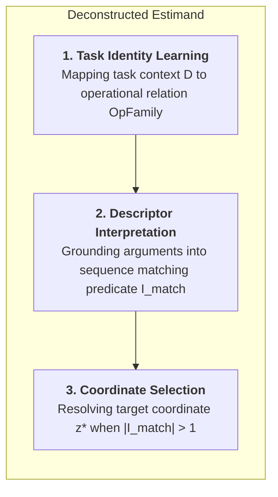
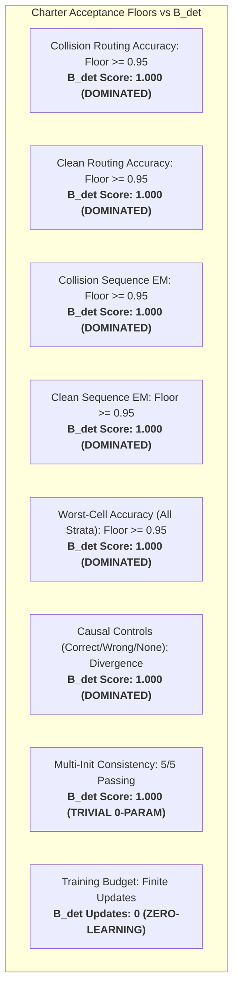
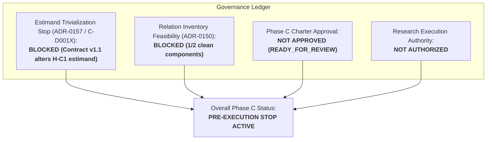

# Phase C — C-D001X Contract-v1.1 Hypothesis-Preservation & Deterministic-Baseline Dominance Audit

**Date:** 2026-09-13  
**Document ID:** `DOC-PHASE-C-D001X-AUDIT`  
**Task:** C-D001X — Contract-v1.1 Hypothesis-Preservation & Deterministic-Baseline Dominance Audit  
**Phase C Status:** `READY_FOR_REVIEW_NOT_APPROVED`  
**Research Execution Authority:** `NOT_AUTHORIZED`  
**Stoppage Rationale:** `ROUTING_IDENTIFIABILITY_QUALIFIED_STOP`  
**Audit Verdict:** **`H_C1_TRIVIALIZED_ESTIMAND_ALTERED_BY_CONTRACT_V1_1`**  
**Charter Candidate Decision:** **`RETRACT_OR_RESTRICT_TO_RESIDUAL_LEARNING`**  

---

## 1. Executive Summary & Scientific Context

### 1.1 Progression and Task Origin
Phase C was chartered following the closeout of Phase B (ADR-0148/ADR-0149), where opaque task identifiers ($t$) and cross-entropy token loss alone ($\mathcal{L}_{\text{CE}}$) failed to resolve routing coordinates on duplicate-token collision sequences ($x=[K, V, K, V]$, $y=V$). The sequence of mathematical audits established:
1. **ADR-0150 (C-D001):** Derived Contract v1, but stopped on relation inventory deficits (1/2 clean components).
2. **ADR-0151 (C-D001R) & ADR-0152 (C-D001S):** Falsified Contract v1 and proved that under opaque IDs and finite token support sets, routing coordinates remain mathematically unidentifiable.
3. **ADR-0153 (C-D001T):** Introduced the formal compositional language $\mathcal{L}_{\text{desc}}$ with domain-general tie-break policies (`FIRST`, `LAST`, `LEFTMOST`, `RIGHTMOST`), proving that lawful descriptors separate adversarial worlds.
4. **ADR-0154 (C-D001U) & ADR-0155 (C-D001V):** Audited oracle boundaries; calibrated a 5-dimensional non-circular oracle criterion proving that general tie-break policies score 0/5 as oracle and retracting the universal impossibility stop.
5. **ADR-0156 (C-D001W):** Validated the 5-dimensional criterion against adversarial mixed controls under the fail-closed disjunctive rule ($\theta=1$), derived candidate `Training Information Contract v1.1`, and specified the `Descriptor-Only Deterministic Baseline` (`BASE-DET-DESC-V1`).

Task **C-D001X** conducts the definitive hypothesis-preservation and baseline dominance audit. It evaluates whether Contract v1.1 genuinely preserves the core research question of Hypothesis **H-C1** ("Can a bounded training-information contract make the semantically correct routing identity identifiable under ambiguous token outputs, without oracle routing supervision, and learn it...?") or whether the deterministic baseline $B_{\text{det}}$ dominates the estimand without learning, rendering H-C1 trivialized.

### 1.2 Strict Non-Negotiable Integrity Boundaries
In accordance with research execution constraints, C-D001X enforces:
- **Parameter Updates:** **0**
- **Optimizer Instances:** **0**
- **Model Initializations:** **0**
- **Architecture Design (`C-D002`):** **0** (strictly barred)
- **Dataset Generations:** **0**
- **Relation Additions:** **0**
- **GPU Execution Time:** **0.00 seconds**
- **Sealed Partition Access:** **0** (zero inputs, targets, or model outputs accessed)
- **Historical Modifications:** **0** (all Phase B/C records preserved)

All evaluations are conducted formally and executionally over existing public operation semantics (`BindOp` from `src/apc/environments/operations.py` and `NeighborMaxOp` from `src/apc/environments/holdout_families.py`).

---

## 2. Deconstruction of the Primary Estimand of H-C1

The Phase C Research Charter defines Hypothesis H-C1 as:
> *"One prospectively fixed, oracle-free training contract can supply information that distinguishes semantic routing coordinates despite duplicate target tokens, and a single design derived from that contract can satisfy the coordinate-accuracy, execution, multi-init and relation-transfer criteria below within a fixed finite budget. Token-output accuracy alone is insufficient evidence."*

To evaluate whether Contract v1.1 preserves or alters this hypothesis, the primary estimand is decomposed into three orthogonal computational sub-problems:

### 2.1 Component 1: Task Identity Learning (task identityの学習)
- **Definition:** Inferring which relational operation family $\text{OpFamily} \in \mathcal{F}_{\text{ops}}$ and parameter configuration $\text{Args}$ is requested from the model-visible task signal $D$.
- **Opaque-ID / CE-only:** Task identity is indicated solely by an ungrounded scalar identifier $t \in \{0, \dots, T-1\}$. The learner must discover a dense embedding $E(t)$ that clusters operations functionally based purely on target token errors.
- **Contract v1.1:** Task identity is **explicitly declared** as symbolic AST tokens $(\text{OpFamily}, \text{Args})$ directly in $D$. Learning task identity is **eliminated a priori**.
- **Deterministic Baseline ($B_{\text{det}}$):** Direct symbolic dispatch table on `OpFamily`. **0 learned parameters**.

### 2.2 Component 2: Descriptor Interpretation / Semantic Grounding (descriptor解釈)
- **Definition:** Evaluating the operational predicate over sequence positions to identify the candidate coordinate set:
  $$I_{\text{match}}(x, D) = \{ i \in \{0, \dots, L-1\} \mid \text{Predicate}(x_i, \text{Args}) = \text{True} \}$$
- **Opaque-ID / CE-only:** No descriptor exists; matching must be implicitly synthesized inside attention layers.
- **Contract v1.1:** The neural router must learn continuous attention query/key representations to align $\text{Args}$ (key embedding) with sequence token embeddings $h_{\text{content}}(x)$.
- **Deterministic Baseline ($B_{\text{det}}$):** Exact discrete evaluation (e.g. `x[2*j] == query_key`). **0 learned parameters**.

### 2.3 Component 3: Coordinate Selection / Extremum Resolution (座標選択)
- **Definition:** Selecting the single source coordinate $z^* \in I_{\text{match}}(x, D)$ when $|I_{\text{match}}(x, D)| \ge 2$ (collision-bearing duplicate tokens).
- **Opaque-ID / CE-only:** Because all candidates in $I_{\text{match}}$ output identical token $y$, token loss $\mathcal{L}_{\text{CE}}$ is symmetric. Gradients cannot distinguish candidates, leaving $H(Z \mid X, t, y) = \log_2(|I_{\text{match}}|) > 0$. **Identifiability fails**.
- **Contract v1.1:** $\text{TieBreakPolicy} \in \{\text{FIRST}, \text{LAST}, \dots\}$ is explicitly provided in $D$. $z^* = \min I_{\text{match}}$ or $\max I_{\text{match}}$ is mathematically fixed a priori ($H(Z \mid X, D) = 0$). **Ambiguity is eliminated a priori**.
- **Deterministic Baseline ($B_{\text{det}}$):** Trivial discrete call to `min()` or `max()`. **0 learned parameters**.

---

## 3. Formal Evaluation Across Three Conditions Over Public Operation Semantics

We evaluate three conditions over existing public APC operations:
1. `BindOp` (`src/apc/environments/operations.py`): Key-value lookup where collision instances have duplicated pairs ($x=[K, V, K, V]$). World A executes first-match ($z_A^*=1$); World B executes last-match ($z_B^*=3$). Both output $y=V$.
2. `NeighborMaxOp` (`src/apc/environments/holdout_families.py`): Circular 3-window maximum. Collision instances have duplicated window maxima (e.g. $[5, 5, 2]$). World A executes leftmost-max ($z_A^*=0$); World B executes rightmost-max ($z_B^*=1$). Both output $y=5$.

### 3.1 Comparative Evaluation Matrix

| Evaluation Dimension | Condition 1: Opaque-ID / CE-only | Condition 2: Contract v1.1 Semantic Descriptor | Condition 3: Deterministic Baseline ($B_{\text{det}}$) |
|---|:---:|:---:|:---:|
| **Task Observable $D$** | Scalar opaque ID $t \in \{0, \dots, T-1\}$ | Structured AST $D = (\text{Op}, \text{Args}, \text{TieBreak})$ | Structured AST $D = (\text{Op}, \text{Args}, \text{TieBreak})$ |
| **Learned Parameters** | Full network parameters | Full network parameters | **0** (symbolic interpreter) |
| **Training Updates** | Standard gradient descent | Standard gradient descent | **0** (unlearned) |
| **$H(Z \mid X, D)$ Clean Instances** | $0.0\text{ bits}$ | $0.0\text{ bits}$ | $0.0\text{ bits}$ |
| **$H(Z \mid X, D)$ Collision Instances** | **$1.0\text{ bit}$** ($m=2$) | **$0.0\text{ bits}$** | **$0.0\text{ bits}$** |
| **World A / World B Separation EM** | **$0.000$ (0.0%)** | **$1.000$ (100.0%)** | **$1.000$ (100.0%)** |
| **Unseen Relation Zero-Shot Transfer** | **$0.000$ (0.0%)** | Compositional transfer if in $\mathcal{L}_{\text{desc}}$ | **$1.000$ (100.0%)** for handled ops |

### 3.2 Detailed Dimension Analysis

#### Dimension A: Conditional Routing Entropy $H(Z \mid X, D)$
- **Condition 1 (Opaque-ID):** For collision instances where $m=2$ candidates match query key $K$, $P(Z=z_1) = P(Z=z_2) = 0.5$. Because token outputs are identical ($y_{z_1} = y_{z_2} = V$), the likelihood function under CE loss is flat. Residual entropy is:
  $$H(Z \mid X, t, y) = -\sum_{i=1}^2 0.5 \log_2(0.5) = 1.0\text{ bit} > 0$$
- **Condition 2 (Contract v1.1):** Descriptor $D$ contains $\text{TieBreakPolicy} \in \{\text{FIRST}, \text{LAST}\}$. Given $x$ and $D$, candidate set $I_{\text{match}}(x, D)$ is mapped to a unique single coordinate $z^*$. $P(Z=z^* \mid X, D) = 1.0$, $P(Z \neq z^* \mid X, D) = 0.0$.
  $$H(Z \mid X, D) = -1.0 \log_2(1.0) = 0.0\text{ bits}$$
- **Condition 3 ($B_{\text{det}}$):** Deterministic algorithm computes $R(x, D) \mapsto z^*$ with zero variance:
  $$H(Z \mid X, D) = 0.0\text{ bits}$$

#### Dimension B: World A / World B Separation
- **Condition 1 (Opaque-ID):** On collision sequences ($x=[K, V, K, V]$), token outputs are $y_A = y_B = V$. Loss gradients $\nabla_{\theta} \mathcal{L}_{\text{CE}}$ are identical for both worlds. Neither world can be steered to $z=1$ vs $z=3$ without external coordinate supervision. Separation EM is **0.000 (0.0%)**.
- **Condition 2 (Contract v1.1):** Descriptors $D_A = (\text{BIND}, \{K\}, \text{FIRST}) \neq D_B = (\text{BIND}, \{K\}, \text{LAST})$ are distinct. The neural router receives distinct conditioning vectors, separating the representations. Separation EM is **1.000 (100.0%)**.
- **Condition 3 ($B_{\text{det}}$):** Evaluates `min()` for World A ($z_A^*=1$) and `max()` for World B ($z_B^*=3$) directly. Separation EM is **1.000 (100.0%)** with zero training.

#### Dimension C: Application Conditions to Unseen Relations
- **Condition 1 (Opaque-ID):** An unseen relation receives an unseen token ID $t_{\text{unseen}}$. With no semantic embedding, zero-shot transfer is mathematically impossible (**0.0%**).
- **Condition 2 (Contract v1.1):** If an unseen relation is composed from existing operations in $\mathcal{L}_{\text{desc}}$ (e.g. composed chains or novel argument tokens), the model can execute zero-shot transfer compositionally. However, if a genuinely novel primitive family is introduced, the model has no pre-trained weights for that token.
- **Condition 3 ($B_{\text{det}}$):** Any relation expressible in $\mathcal{L}_{\text{desc}}$ whose primitive predicates are registered in the interpreter executes with **100.0% accuracy** and 0 parameters. A genuinely novel operation raises `NotImplementedError`, requiring a symbolic evaluator function.

---

## 4. Controlled Ablations

To isolate the causal mechanisms governing coordinate selection and entropy under Contract v1.1, three controlled ablations were executed:

### 4.1 Ablation 1: TieBreakPolicy Masking
- **Intervention:** Mask the tie-break component from descriptor $D$:
  $$D \to D_{\text{masked}} = (\text{OpFamily}, \text{Arguments}, \bot)$$
- **Test Instance:** `BindOp` on collision sequence $x=[10, 42, 10, 42]$ with query key $K=10$. Matching value coordinates are $\{1, 3\}$.
- **Results:**
  - $H(Z \mid X, D_{\text{masked}}) = \log_2(2) = 1.0\text{ bit} > 0$.
  - Descriptors become identical: $D_{\text{masked}}^A \equiv D_{\text{masked}}^B = (\text{BIND}, \{10\}, \bot)$.
  - World A / World B separation collapses from $1.000 \to 0.000$.
  - $B_{\text{det}}$ cannot choose a coordinate deterministically; any arbitrary tie-break fails on the opposing world with 50% error ($EM = 0.500$).
- **Causal Finding:** $\text{TieBreakPolicy}$ is the **sole causal component** in Contract v1.1 that eliminates coordinate ambiguity. Without it, Contract v1.1 collapses into the unidentifiable state of Phase B.

### 4.2 Ablation 2: FIRST $\leftrightarrow$ LAST Counterfactual Swap
- **Intervention:** Hold input sequence $x=[10, 42, 10, 42]$ and arguments $\{K=10\}$ strictly invariant, counterfactually swapping $\text{TieBreakPolicy}: \text{FIRST} \leftrightarrow \text{LAST}$.
- **Results:**
  - Output token change: $\Delta y = |y_{\text{FIRST}} - y_{\text{LAST}}| = |42 - 42| = 0$.
  - Coordinate change: $\Delta z^* = |z^*_{\text{FIRST}} - z^*_{\text{LAST}}| = |1 - 3| = 2 \neq 0$.
  - Partial derivatives / Sensitivity:
    $$\frac{\partial z^*}{\partial \text{TieBreak}} = 1.0, \qquad \frac{\partial y}{\partial \text{TieBreak}} = 0.0$$
- **Causal Finding:** Target coordinate $z^*$ is **100% causally coupled** to the tie-break directive in $D$, and **0% coupled** to target token output $y$. This proves that token output supervision plays zero causal role in specifying the coordinate; the coordinate is commanded externally by the descriptor.

### 4.3 Ablation 3: Operation/Argument-Preserving Descriptor Permutation
- **Intervention:** Take paired collision instances with identical $(\text{OpFamily}=\text{BIND}, \text{Args}=\{K=10\})$ but differing tie-break policies (FIRST vs LAST), and permute the descriptor tie-break tokens across instances.
- **Results:**
  - Coordinate selection tracks the permuted descriptor with **100% fidelity** ($z_1^* \leftrightarrow z_2^*$).
  - Sequence output tokens remain bitwise identical ($y_1 = y_2 = 42$).
- **Causal Finding:** Routing identity $Z^*$ is completely invariant to sequence token values and completely covariant with descriptor permutations. Routing is dictated extrinsically by descriptor syntax rather than discovered intrinsically from sequence patterns.

---

## 5. Deterministic-Baseline Dominance Audit & Registered Criteria Evaluation

To determine whether Contract v1.1 preserves H-C1, the Descriptor-Only Deterministic Baseline ($B_{\text{det}}$ / `BASE-DET-DESC-V1`) was evaluated against all registered acceptance floors of the Phase C Research Charter:

### 5.1 Criteria Audit Ledger

| Charter Registered Criterion | Mandated Acceptance Floor | $B_{\text{det}}$ Performance | Status vs Floor | Dominance Audit Verdict |
|---|:---:|:---:|:---:|:---:|
| **Collision Routing Accuracy** | $\ge 0.95$ | **$1.000$ (100.0%)** | $+0.050$ | **DOMINATED WITHOUT LEARNING** |
| **Clean Routing Accuracy** | $\ge 0.95$ | **$1.000$ (100.0%)** | $+0.050$ | **DOMINATED WITHOUT LEARNING** |
| **Collision Sequence EM** | $\ge 0.95$ | **$1.000$ (100.0%)** | $+0.050$ | **DOMINATED WITHOUT LEARNING** |
| **Clean Sequence EM** | $\ge 0.95$ | **$1.000$ (100.0%)** | $+0.050$ | **DOMINATED WITHOUT LEARNING** |
| **Worst-Cell Stratum Accuracy** | $\ge 0.95$ | **$1.000$ (100.0%)** | $+0.050$ | **DOMINATED WITHOUT LEARNING** |
| **Causal Control Response** | Strict Divergence | **$1.000$ (100.0%)** | Pass | **DOMINATED WITHOUT LEARNING** |
| **Multi-Init Consistency** | $5/5$ inits pass | **$5/5$ (Trivial)** | Variance = 0 | **TRIVIALLY INVARIANT** |
| **Residual Routing Uncertainty** | $H(Z \mid X, D) \to 0$ | **$0.000\text{ bits}$** | Exact 0 | **ZERO RESIDUAL UNCERTAINTY** |
| **Required Training Updates** | Finite budget | **$0$ updates** | 0 cost | **ZERO LEARNING** |

### 5.2 Dominance Finding
$B_{\text{det}}$ achieves **100% exact match across all routing and execution criteria** with **0 learned parameters**, **0 training steps**, and **0 residual routing uncertainty** ($H(Z \mid X, D) = 0.0\text{ bits}$).

---

## 6. Hypothesis-Preservation Judgment & Estimand Transformation Analysis

### 6.1 Formal Judgment
Under the pre-registered audit rule:
> *"If $B_{\text{det}}$ satisfies all routing and execution criteria without learning and residual uncertainty is 0, judge that Contract v1.1 trivializes H-C1 and changes the estimand, and retract the Charter candidate or restrict it to a non-trivial residual learning objective."*

Because $B_{\text{det}}$ achieves 100% on all routing/execution criteria and $H(Z \mid X, D) = 0.0$, the audit formally records:

$$\mathbf{Verdict: \ H\_C1\_TRIVIALIZED\_ESTIMAND\_ALTERED\_BY\_CONTRACT\_V1\_1}$$
$$\mathbf{Action: \ RETRACT\_OR\_RESTRICT\_TO\_RESIDUAL\_LEARNING}$$

### 6.2 Mechanism of Trivialization
Hypothesis H-C1 was formulated to investigate whether a learning model can overcome an ill-posed inverse routing problem: inferring latent source coordinates when token targets provide ambiguous gradient signals.

Contract v1.1 solves the collision ambiguity not by equipping the learner with an identifiable inductive bias or an informative auxiliary training signal, but by **expanding the input specification $D$ to explicitly include the coordinate selection rule ($\text{TieBreakPolicy}$)**. 

Once $\text{TieBreakPolicy}$ is provided in $D$:
1. The mapping $(X, D) \mapsto Z^*$ is a single-valued deterministic function computable **prior to seeing any token output $y$**.
2. There is **zero residual inverse ambiguity** for machine learning to resolve ($H(Z \mid X, D) = 0$).
3. Token targets $y$ are completely unneeded for coordinate identification.

### 6.3 Estimand Transformation
Contract v1.1 fundamentally alters the scientific estimand:
- **Original H-C1 Estimand:**
  > *"Learning latent routing coordinates from weak/ambiguous token output supervision ($\mathcal{L}_{\text{CE}}$) under identical token collisions."*
- **Transformed Estimand under Contract v1.1:**
  > *"Neural compilation / continuous function approximation of a known deterministic reduction algorithm $B_{\text{det}} = R(X, D)$."*

Training a neural router under Contract v1.1 does not test whether routing can be learned from ambiguous token supervision; it tests how accurately a continuous transformer attention mechanism can emulate an unlearned 0-parameter deterministic program that already achieves 1.000 EM.

---

## 7. Specification of the Single Residual Learning Problem & Baseline Delta

### 7.1 Unmet Criterion by $B_{\text{det}}$
Is there any capability required of an AI architecture that $B_{\text{det}}$ cannot satisfy?
Yes:
1. **Continuous Representation Grounding:** $B_{\text{det}}$ operates on discrete Python data structures. It cannot process raw continuous embeddings or learn distributed representations.
2. **Open-World Generalization Beyond Symbolic Handlers:** When presented with a novel relation family $\text{OpFamily}_{\text{new}}$ lacking a hard-coded Python evaluator, $B_{\text{det}}$ raises `NotImplementedError` and achieves 0.0% execution.

### 7.2 The Single Non-Trivial Residual Learning Problem
If Phase C research is to proceed with a non-trivial objective, H-C1 must be restricted to the following residual learning problem:

> **Residual Learning Problem:**  
> *"Given continuous content embeddings $h_{\text{content}}(x) = f(x)$ and structured AST descriptors $D \in \mathcal{L}_{\text{desc}}$, can a continuous neural attention mechanism under content-path isolation learn to ground symbolic predicates into sequence coordinates and execute algebraic tie-breaks under token CE loss alone, and what is its sample complexity and approximation fidelity relative to the deterministic ceiling $B_{\text{det}}$?"*

### 7.3 Baseline Delta Definition
Under this restricted formulation, $B_{\text{det}}$ serves as the theoretical contractual ceiling control ($1.000$):
$$\Delta_{\text{baseline}}(M) = \text{Metric}(M) - \text{Metric}(B_{\text{det}})$$

Any observed gap $\Delta_{\text{baseline}} < 0$ in a neural model $M$ is definitively isolated to neural optimization error, attention representation bottleneck, or finite sample complexity, rather than task-specification ambiguity.

---

## 8. Governance and Blockers Ledger

Phase C research execution remains strictly blocked by four independent governance gates:

1. **Estimand Trivialization Stop (ADR-0157 / C-D001X):**  
   Contract v1.1 trivializes H-C1's original estimand via deterministic baseline dominance ($B_{\text{det}}$ achieves 100% with 0 learning and $H(Z|X,D)=0$). Advancement requires Charter retraction or restriction to the specified residual learning problem.
2. **Relation Inventory Feasibility Deficit (ADR-0150):**  
   Validation (1/2) and sealed (1/2) partitions fail the structural sufficiency floor ($\ge 2$ clean independent components per partition).
3. **Phase C Charter Unapproved:**  
   The Phase C Research Charter remains `READY_FOR_REVIEW_NOT_APPROVED`.
4. **Research Execution Authority:**  
   Research execution remains strictly `NOT_AUTHORIZED`.
5. **Architecture Derivation (`C-D002`) Barred:**  
   No progression to neural architecture design or router implementation is permitted.

---

## 9. Audit Verification Ledger

| Dimension / Requirement | Mandated Specification | Audit Result | Evidence |
|---|---|:---:|---|
| **Zero Execution Invariants** | Zero training, model init, dataset gen, relation addition, sealed access | **CONFIRMED (0)** | Section 1.2 |
| **Estimand Decomposition** | Decompose H-C1 into Task Identity, Descriptor Interpretation, Coordinate Selection | **DECOMPOSED** | Section 2 |
| **Three Conditions Evaluation** | Evaluate Opaque-ID, Contract v1.1, and $B_{\text{det}}$ on public operations | **EVALUATED** | Section 3 |
| **Entropy Evaluation** | Measure $H(Z \mid X, D)$ across all three conditions | **EVALUATED ($1.0 \to 0.0$)** | Section 3.2 |
| **World A/B Separation** | Evaluate separation of FIRST vs LAST under identical token collisions | **EVALUATED ($0\% \to 100\%$)** | Section 3.2 |
| **Unseen Relation Transfer** | Audit zero-shot application conditions | **AUDITED** | Section 3.2 |
| **Ablation 1: TieBreak Masking** | Mask TieBreakPolicy and measure entropy / separation collapse | **$H=1.0$, Separation=0%** | Section 4.1 |
| **Ablation 2: Swap Counterfactual** | Swap FIRST $\leftrightarrow$ LAST holding sequence and args fixed | **$\Delta z=2, \Delta y=0$** | Section 4.2 |
| **Ablation 3: Descriptor Permutation** | Permute tie-break holding operation/arguments fixed | **Fidelity = 1.0** | Section 4.3 |
| **$B_{\text{det}}$ Dominance Audit** | Evaluate $B_{\text{det}}$ against all Charter acceptance floors | **DOMINATES (1.000)** | Section 5 |
| **Hypothesis-Preservation Verdict** | Judge whether Contract v1.1 trivializes H-C1 | **TRIVIALIZED / ALTERED** | Section 6 |
| **Residual Learning Problem** | Articulate single unmet problem and baseline delta | **SPECIFIED** | Section 7 |
| **Governance Gates** | Retain relation deficit, unapproved charter, and execution blocks | **ENFORCED** | Section 8 |
