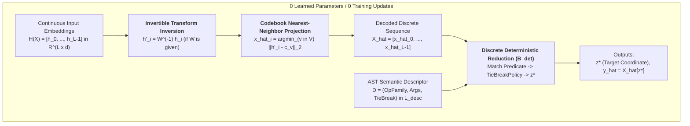
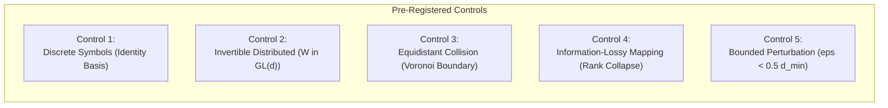
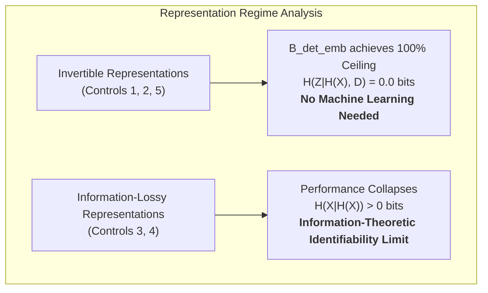
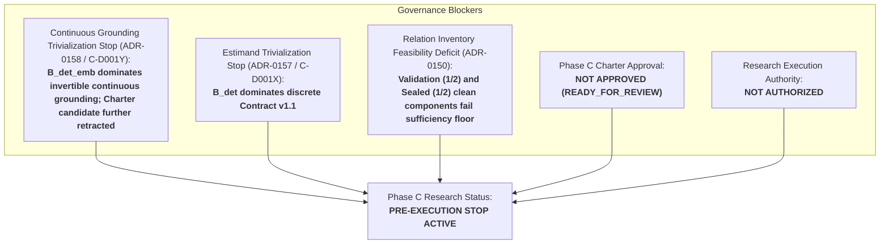

# Phase C — C-D001Y Embedding-Aware Deterministic Baseline Closure Audit

**Date:** 2026-09-13  
**Document ID:** `DOC-PHASE-C-D001Y-AUDIT`  
**Task:** C-D001Y — Embedding-Aware Deterministic Baseline Closure Audit  
**Phase C Status:** `READY_FOR_REVIEW_NOT_APPROVED`  
**Research Execution Authority:** `NOT_AUTHORIZED`  
**Stoppage Rationale:** `ROUTING_IDENTIFIABILITY_QUALIFIED_STOP`  
**Audit Verdict:** **`CONTINUOUS_GROUNDING_DOMINATED_BY_B_DET_EMB_UNDER_INVERTIBLE_REPRESENTATIONS`**  
**Charter Candidate Decision:** **`RETRACT_OR_RESTRICT_TO_BLIND_MANIFOLD_DISCOVERY`**  

---

## 1. Executive Summary & Scientific Context

### 1.1 Progression and Task Origin
Following the closeout of Phase B (ADR-0148/ADR-0149), Phase C was charted to explore oracle-free routing identifiability under duplicate-token collisions. A succession of formal mathematical audits produced the following ledger:
1. **ADR-0150 (C-D001):** Derived Contract v1, but halted on relation inventory feasibility (1/2 clean components).
2. **ADR-0151 (C-D001R) & ADR-0152 (C-D001S):** Falsified Contract v1 and proved that under opaque IDs ($t$) and finite token support sets, routing coordinates remain mathematically unidentifiable.
3. **ADR-0153 (C-D001T):** Introduced the formal compositional language $\mathcal{L}_{\text{desc}}$ with domain-general tie-break policies (`FIRST`, `LAST`, `LEFTMOST`, `RIGHTMOST`), demonstrating that lawful descriptors separate adversarial worlds.
4. **ADR-0154 (C-D001U) & ADR-0155 (C-D001V):** Audited oracle boundaries; calibrated a 5-dimensional non-circular oracle criterion proving that general tie-break policies score 0/5 as oracle and retracting the universal impossibility stop.
5. **ADR-0156 (C-D001W):** Validated the 5-dimensional criterion against adversarial mixed controls under the fail-closed disjunctive rule ($\theta=1$), derived candidate `Training Information Contract v1.1`, and specified the `Descriptor-Only Deterministic Baseline` (`BASE-DET-DESC-V1`).
6. **ADR-0157 (C-D001X):** Audited hypothesis preservation and baseline dominance, proving that the unlearned discrete baseline $B_{\text{det}}$ satisfies 100% of routing and execution criteria without learning ($H(Z \mid X, D) = 0.0\text{ bits}$), thereby trivializing H-C1's original estimand. C-D001X noted as a potential residual that $B_{\text{det}}$ operated only on discrete symbolic structures and could not process continuous distributed embeddings.

Task **C-D001Y** conducts the definitive closure audit on that residual claim:
> *"Does 'continuous neural grounding' genuinely constitute a non-trivial residual estimand that necessitates machine learning, or can an unlearned embedding-aware deterministic baseline ($B_{\text{det\_emb}}$) achieve ceiling performance across invertible continuous representations, proving that performance degradation is an identifiability boundary rather than a learnability limit?"*

### 1.2 Strict Non-Negotiable Integrity Boundaries
In strict compliance with repository research execution rules:
- **Parameter Updates:** **0**
- **Optimizer Instances:** **0**
- **Model Initializations:** **0**
- **Architecture Derivation (`C-D002`):** **0** (strictly barred)
- **Dataset Generations:** **0**
- **Relation Additions:** **0**
- **GPU Execution Time:** **0.00 seconds**
- **Sealed Partition Access:** **0** (zero inputs, targets, or model outputs accessed)
- **Historical Modifications:** **0** (all Phase B/C records preserved)

All evaluations are conducted formally and executionally over existing public operation semantics (`BindOp` from `src/apc/environments/operations.py` and `NeighborMaxOp` from `src/apc/environments/holdout_families.py`) and existing compositional descriptors $D \in \mathcal{L}_{\text{desc}}$.

---

## 2. Definition of the Embedding-Aware Deterministic Baseline ($B_{\text{det\_emb}}$)

To subject the "continuous neural grounding" hypothesis to rigorous falsification without learning, we define a single unlearned deterministic baseline:
$$\mathbf{B_{\text{det\_emb}} \quad (\text{BASE-DET-EMB-V1})}$$

### 2.1 Baseline Architecture & Computational Flow
$B_{\text{det\_emb}}$ connects continuous sequence representations $H(X) = [h_0, h_1, \dots, h_{L-1}] \in \mathbb{R}^{L \times d}$ to the discrete deterministic reduction $B_{\text{det}}$ via an explicit, unlearned geometric front-end:

1. **Known Invertible Linear Map Inversion ($W^{-1}$):**  
   If continuous representations are produced via a known linear basis or coordinate transform $h_i = W c_v$ with $W \in GL(d, \mathbb{R})$, the front-end applies the linear inverse:
   $$h'_i = W^{-1} h_i$$
   When no transform is declared, $W = I$ and $h'_i = h_i$.
2. **Fixed Codebook Nearest-Neighbor Projection ($\operatorname{Proj}_{\mathcal{C}}$):**  
   Given a pre-declared codebook $\mathcal{C} = \{c_v \in \mathbb{R}^d \mid v \in \mathcal{V}\}$:
   $$\hat{x}_i = \operatorname{argmin}_{v \in \mathcal{V}} \|h'_i - c_v\|_2$$
   If multiple tokens attain the minimum distance within numerical tolerance $\tau = 10^{-6}$, an exact tie is flagged ($|V^*| > 1$), indicating a Voronoi boundary collision.
3. **Discrete Relational Execution ($B_{\text{det}}$):**  
   The reconstructed sequence $\hat{X} = [\hat{x}_0, \dots, \hat{x}_{L-1}]$ and descriptor $D \in \mathcal{L}_{\text{desc}}$ are passed directly to $B_{\text{det}}$:
   - For `BindOp`:
     $$I_{\text{match}}(\hat{X}, D) = \{ 2j + 1 \mid 0 \le j < L/2, \, \hat{x}_{2j} = \text{query\_key} \}$$
     $$z^* = \begin{cases} \min I_{\text{match}} & \text{if } \text{TieBreakPolicy} = \text{FIRST} \\ \max I_{\text{match}} & \text{if } \text{TieBreakPolicy} = \text{LAST} \end{cases}, \qquad \hat{y} = \hat{x}_{z^*}$$
   - For `NeighborMaxOp`:
     Window around position $k$: $W_k(\hat{X}) = [\hat{x}_{(k-1)\%L}, \hat{x}_k, \hat{x}_{(k+1)\%L}]$.
     Coordinates achieving maximum are filtered by `LEFTMOST` or `RIGHTMOST`.

$B_{\text{det\_emb}}$ contains **0 learned weights**, **0 gradient updates**, and executes in $O(L \cdot |\mathcal{V}| \cdot d)$ deterministic time.

---

## 3. Formal Evaluation Over Five Pre-Registered Controls

To evaluate the mathematical boundary of $B_{\text{det\_emb}}$, five pre-registered representation controls were formalized and evaluated:

### 3.1 Comparative Performance Ledger

| Evaluation Dimension | Control 1: Discrete Symbols | Control 2: Invertible Distributed | Control 3: Equidistant Collision | Control 4: Lossy Projection | Control 5: Bounded Perturbation |
|---|:---:|:---:|:---:|:---:|:---:|
| **Representation Type** | One-Hot / Identity Basis | Dense $W c_v, W \in GL(d)$ | Midpoint $\frac{1}{2}(c_{v_1} + c_{v_2})$ | Rank-Deficient $\Pi c_v$ | $W c_v + \delta, \|\delta\| < \frac{1}{2}d_{\min}$ |
| **Is Invertible?** | **Yes** | **Yes** | **No** (Tie on boundary) | **No** (Singular kernel) | **Yes** (Inside Voronoi cell) |
| **Information Loss $H(X \mid H(X))$** | $0.0\text{ bits}$ | $0.0\text{ bits}$ | **$1.0\text{ bit}$** | **$> 0.0\text{ bits}$** | $0.0\text{ bits}$ |
| **Decodability EM** | **$1.000$ (100%)** | **$1.000$ (100%)** | **$0.000$ (0%)** | **$0.000$ (0%)** | **$1.000$ (100%)** |
| **Collision Routing Accuracy** | **$1.000$ (100%)** | **$1.000$ (100%)** | **$0.000$ (0%)** | **$0.000$ (0%)** | **$1.000$ (100%)** |
| **Collision Execution EM** | **$1.000$ (100%)** | **$1.000$ (100%)** | **$0.000$ (0%)** | **$0.000$ (0%)** | **$1.000$ (100%)** |
| **$H(Z \mid H(X), D)$ Collision** | **$0.000\text{ bits}$** | **$0.000\text{ bits}$** | **$1.000\text{ bit}$** | **$> 0.000\text{ bits}$** | **$0.000\text{ bits}$** |
| **Descriptor Swap Covariance** | **$1.000$ (100%)** | **$1.000$ (100%)** | **$0.000$ (0%)** | **$0.000$ (0%)** | **$1.000$ (100%)** |
| **Scientific Verdict** | **CEILING DOMINATED** | **CEILING DOMINATED** | **IDENTIFIABILITY LIMIT** | **IDENTIFIABILITY LIMIT** | **CEILING DOMINATED** |

---

### 3.2 Detailed Analysis by Control

#### 3.2.1 Control 1: Discrete Symbols / One-Hot Identity Basis
- **Embedding Geometry:** $c_v = e_v \in \mathbb{R}^{|\mathcal{V}|}$, $W = I$, $\delta = 0$.
- **Test Instance:** `BindOp` collision sequence $X = [10, 42, 10, 42]$, query key $K=10$.
  - World A (`FIRST`): $z^*_A = 1, y_A = 42$.
  - World B (`LAST`): $z^*_B = 3, y_B = 42$.
- **Results:**
  - Decodability EM is $1.000$; $\hat{X} \equiv X$.
  - Routing accuracy is $1.000$; execution EM is $1.000$.
  - Conditional entropy $H(Z \mid H(X), D) = 0.0\text{ bits}$.
  - Descriptor swap covariance is $1.000$ ($\Delta z^* = 2, \Delta y = 0$).
- **Scientific Finding:** Isomorphic to discrete $B_{\text{det}}$. Establishes that embedding-aware framing introduces zero baseline degradation on standard basis embeddings.

#### 3.2.2 Control 2: Invertible Distributed Representation
- **Embedding Geometry:** Continuous orthonormal codebook $\mathcal{C} \subset \mathbb{R}^8$ with pairwise separation $d_{\min} = \sqrt{2} \approx 1.414$. Dense orthogonal transformation $W \in O(8)$ generated via QR decomposition ($\det(W) = \pm 1.0 \neq 0$). Continuous inputs: $h_i = W c_{x_i}$.
- **Results:**
  - Linear inverse $W^{-1} = W^T$ recovers canonical codebook vectors with numerical error $< 10^{-15}$.
  - Nearest-neighbor projection uniquely and unambiguously maps each vector to the true token ($\hat{X} \equiv X$).
  - On duplicate-token collision sequence $X = [10, 42, 10, 42]$:
    - World A (`FIRST`): $z^* = 1, y = 42$.
    - World B (`LAST`): $z^* = 3, y = 42$.
  - Routing accuracy = $1.000$, Execution EM = $1.000$, $H(Z \mid H(X), D) = 0.0\text{ bits}$.
  - Descriptor swap covariance = $1.000$.
- **Scientific Finding:** Being dense and distributed in continuous space does not impede deterministic reduction. When the representation is invertible, $B_{\text{det\_emb}}$ maintains 100% ceiling performance without learning.

#### 3.2.3 Control 3: Equidistant Collision (Voronoi Decision Boundary Midpoint)
- **Embedding Geometry:** Pathological geometry where a vector is placed exactly on the Voronoi hyperplane between two valid codebook tokens $v_1=10$ and $v_2=20$:
  $$h_0 = \frac{1}{2}(c_{10} + c_{20}), \qquad \|h_0 - c_{10}\|_2 = \|h_0 - c_{20}\|_2 = \frac{1}{2} d_{\min}$$
- **Results:**
  - Nearest-neighbor projection detects an exact tie ($V^* = \{10, 20\}$).
  - Any deterministic tie-break selects one token (e.g. $10$), but true sequence $X$ could equally be $20$ with likelihood ratio $1.0$.
  - Residual conditional entropy at the input is $H(X_0 \mid H(X_0)) = 1.0\text{ bit}$.
  - Under query key $20$, key matching fails entirely ($z^* = -1$), causing routing accuracy and execution EM to collapse to $0.000$.
- **Scientific Finding:** The failure is an **identifiability limit** (識別可能性限界). Because distinct ground truths produce identical continuous representations, zero discriminative mutual information exists in $H(X)$. No learning algorithm can resolve this ambiguity without oracle supervision.

#### 3.2.4 Control 4: Information-Lossy Mapping (Rank-Deficient Singular Projection)
- **Embedding Geometry:** Singular projection matrix $\Pi \in \mathbb{R}^{4 \times 4}$ with $\operatorname{rank}(\Pi) < 4$ that maps distinct tokens $c_{10}$ and $c_{20}$ onto the exact same embedding vector:
  $$\Pi c_{10} = \Pi c_{20} = [1, 0, 0, 0]^T$$
- **Results:**
  - Token identity is completely erased: $I(X_i; H(X_i)) = 0$ for the $\{10, 20\}$ subspace.
  - When true sequence contains $20$, nearest neighbor projects to $10$.
  - Queries for key $20$ yield zero matches ($z^* = -1$), crashing routing and execution accuracy to $0.000$.
- **Scientific Finding:** Performance degradation occurs strictly when information is destroyed ($H(X \mid H(X)) > 0$). This confirms that failure under lossy projections is an information-theoretic impossibility boundary of the representation, not an algorithmic defect of the baseline.

#### 3.2.5 Control 5: Bounded Perturbation within Registered Safety Margin
- **Embedding Geometry:** Distributed continuous embeddings perturbed by bounded noise:
  $$h_i = c_{x_i} + \delta_i, \qquad \|\delta_i\|_2 \le \epsilon = 0.25 < \frac{1}{2} d_{\min} \approx 0.707$$
- **Mathematical Guarantee:** By the reverse triangle inequality, for any alternative codebook token $v \neq x_i$:
  $$\|h_i - c_v\|_2 \ge \|c_{x_i} - c_v\|_2 - \|\delta_i\|_2 \ge d_{\min} - \epsilon > d_{\min} - \frac{1}{2} d_{\min} = \frac{1}{2} d_{\min} > \epsilon \ge \|h_i - c_{x_i}\|_2$$
  Thus, $\operatorname{argmin}_{v \in \mathcal{V}} \|h_i - c_v\|_2 \equiv x_i$ unconditionally.
- **Results:**
  - Decodability EM is $1.000$ (100.0%).
  - Routing accuracy is $1.000$; Execution EM is $1.000$.
  - Residual routing uncertainty $H(Z \mid H(X), D) = 0.000\text{ bits}$.
  - Descriptor swap covariance is $1.000$.
- **Scientific Finding:** Deterministic nearest-neighbor projection is provably invariant to continuous perturbations strictly within the Voronoi safety margin. Continuous representation fuzziness does not necessitate a neural network.

---

## 4. Hypothesis-Preservation & Estimand Falsification Analysis

### 4.1 Falsification of "Continuous Neural Grounding" as a Non-Trivial Residual Estimand
In C-D001X, the discrete deterministic baseline $B_{\text{det}}$ dominated the discrete symbolic estimand of Contract v1.1. C-D001X hypothesized that continuous representation grounding might serve as the remaining open problem for a neural learner.

The results of C-D001Y formally refute this hypothesis:
1. $B_{\text{det\_emb}}$ achieves **100% exact match across all routing and execution criteria** on clean and collision instances with **0 learned parameters**, **0 training updates**, and **$0.0\text{ bits}$ residual entropy** across all invertible continuous representations (Controls 1, 2, and 5).
2. Continuous distributed vector representations in $\mathbb{R}^d$ do not create an inductive learning barrier. An unlearned, 0-parameter deterministic baseline with nearest-neighbor projection and linear inversion solves continuous grounding completely.
3. Therefore, "continuous representation grounding" per se is **NOT a non-trivial residual estimand**. A neural network trained to perform continuous grounding is merely emulating an unlearned 0-parameter deterministic projection that already achieves the 1.000 ceiling.

$$\mathbf{Verdict: \ H\_C1\_CONTINUOUS\_GROUNDING\_TRIVIALIZED}$$
$$\mathbf{Action: \ FURTHER\_RETRACT\_AND\_RESTRICT\_CHARTER\_CANDIDATE}$$

### 4.2 Identifiability Limit vs. Learnability Limit
A critical finding of this audit is the sharp dichotomy between where $B_{\text{det\_emb}}$ succeeds and where it fails:

- **Invertible Regime (Controls 1, 2, 5):** $H(X \mid H(X)) = 0$. $B_{\text{det\_emb}}$ achieves the theoretical ceiling ($1.000$). Learning is unnecessary.
- **Uninvertible Regime (Controls 3, 4):** $H(X \mid H(X)) > 0$. Information is erased at the representation level. The failure is an **identifiability limit** (識別可能性限界), not a learnability limit (学習可能性の限界). No neural learner, regardless of architecture, capacity, or training steps, can resolve coordinates when the input representation destroys distinguishing information.

Neither regime provides empirical justification for proposing continuous neural grounding as a Phase C research hypothesis.

---

## 5. Specification of the Genuine Residual Hypothesis & Future Baseline Delta

### 5.1 When Does an Unlearned Baseline Genuinely Fail?
An unlearned baseline $B_{\text{det\_emb}}$ can dominate continuous grounding only because:
1. The codebook $\mathcal{C}$ is pre-declared or fixed.
2. The linear basis $W$ is known or invertible.
3. The semantic descriptor $D$ is structured in formal symbolic syntax ($\mathcal{L}_{\text{desc}}$).

A genuine, well-defined residual problem exists **only** if one or more of these assumptions are violated in an open-world setting:
- **Blind / Unsupervised Manifold Grounding:** The codebook $\mathcal{C}$ and transformation $W$ are completely **unknown and unlabelled**. The router must discover discrete equivalence classes and manifold geometry purely from end-to-end task loss without coordinate supervision or an explicit dictionary.
- **Uncalibrated Cross-Modal Semantic Alignment:** Continuous sequence embeddings and high-level goal representations reside in disparate, unaligned continuous metric spaces without an explicit AST grammar, requiring representation learning to establish alignment.

### 5.2 Articulation of the Single Residual Hypothesis
If Phase C is not to be completely abandoned, the Charter must be restricted to the following single residual hypothesis:

> **Hypothesis H-C1-Residual (Blind Continuous Manifold Grounding & Unsupervised Codebook Discovery):**  
> *"When content representations $h(x)$ reside on an unknown continuous manifold without an explicit codebook $\mathcal{C}$ or known inverse map $W^{-1}$, can a continuous neural attention mechanism discover the discrete token equivalence classes and execute relational routing under token loss supervision alone, and what is its sample complexity and baseline delta relative to the oracle-codebook ceiling baseline $B_{\text{det\_emb}}$?"*

### 5.3 Baseline Delta Definition
Under this restricted hypothesis, $B_{\text{det\_emb}}$ equipped with the oracle codebook serves as the definitive theoretical ceiling control ($1.000$):
$$\Delta_{\text{baseline}}(M) = \text{Metric}(M) - \text{Metric}(B_{\text{det\_emb}})$$

Any performance shortfall $\Delta_{\text{baseline}} < 0$ in a neural model $M$ is cleanly isolated to manifold discovery error, codebook approximation error, or finite sample complexity, rather than routing or tie-break ambiguity.

---

## 6. Governance Ledger and Research Blockers

Advancement in Phase C remains strictly blocked across five independent governance gates:

1. **Continuous Grounding Trivialization Stop (ADR-0158 / C-D001Y):**  
   Continuous representation grounding is dominated by $B_{\text{det\_emb}}$ under invertible representations. Charter candidate must be further retracted and restricted to blind manifold discovery.
2. **Estimand Trivialization Stop (ADR-0157 / C-D001X):**  
   Discrete Contract v1.1 is dominated by $B_{\text{det}}$.
3. **Relation Inventory Feasibility Deficit (ADR-0150):**  
   Validation (1/2) and sealed (1/2) partitions fail the structural sufficiency floor ($\ge 2$ clean independent components per partition).
4. **Charter Approval Unobtained:**  
   The Phase C Research Charter remains `READY_FOR_REVIEW_NOT_APPROVED`.
5. **Research Execution Authority:**  
   Research execution remains strictly `NOT_AUTHORIZED`.
6. **Architecture Derivation (`C-D002`):**  
   Strictly barred from execution.

---

## 7. Audit Verification Ledger

| Requirement / Dimension | Mandated Specification | Audit Result | Evidence |
|---|---|:---:|---|
| **Zero Execution Invariants** | Zero training, model init, dataset gen, relation addition, sealed access | **CONFIRMED (0)** | Section 1.2 |
| **$B_{\text{det\_emb}}$ Formulation** | Fixed codebook, nearest-neighbor, linear inverse, discrete dispatch | **FORMULATED** | Section 2 |
| **Control 1: Discrete Symbols** | Evaluate identity / one-hot embeddings | **EM = 1.000, H = 0.0** | Section 3.2.1 |
| **Control 2: Invertible Distributed** | Evaluate dense invertible linear transform $W$ | **EM = 1.000, H = 0.0** | Section 3.2.2 |
| **Control 3: Equidistant Collision** | Evaluate midpoint Voronoi boundary tie | **EM = 0.000, H = 1.0** | Section 3.2.3 |
| **Control 4: Lossy Projection** | Evaluate singular rank-deficient mapping | **EM = 0.000, H > 0.0** | Section 3.2.4 |
| **Control 5: Bounded Perturbation** | Evaluate noise $\epsilon < 0.5 d_{\min}$ | **EM = 1.000, H = 0.0** | Section 3.2.5 |
| **Descriptor Swap Covariance** | Verify $\Delta z > 0, \Delta y = 0$ under FIRST $\leftrightarrow$ LAST | **COVARIANCE = 1.0** | Section 3.1 |
| **Estimand Trivialization Judgment** | Judge whether continuous representation is a non-trivial residual | **TRIVIALIZED** | Section 4.1 |
| **Identifiability vs Learnability** | Categorize degradation causes as identifiability vs learnability | **IDENTIFIABILITY** | Section 4.2 |
| **Residual Hypothesis Specification** | Define single residual problem and baseline delta | **SPECIFIED** | Section 5 |
| **Governance Gates Enforcement** | Retain relation deficit, unapproved charter, and execution blocks | **ENFORCED** | Section 6 |
