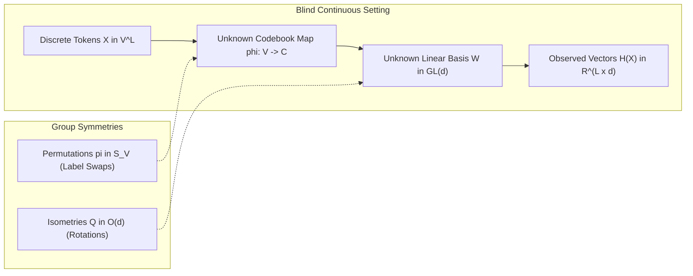
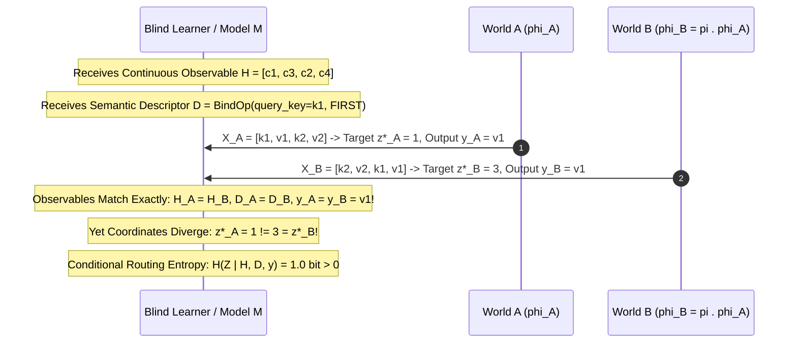
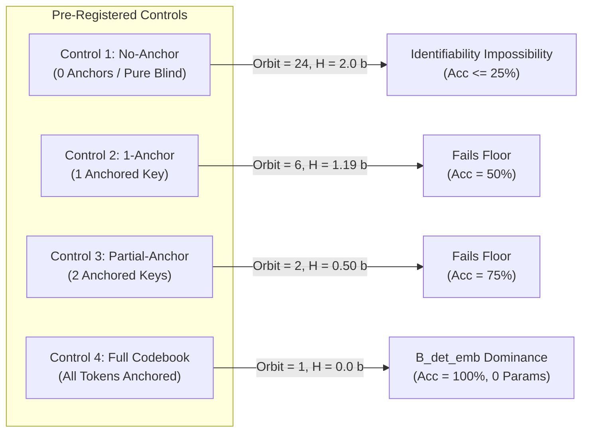
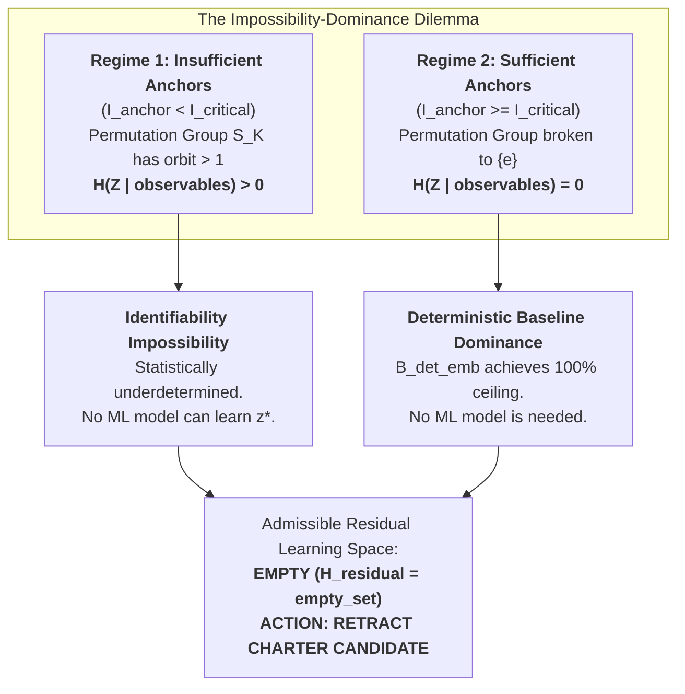
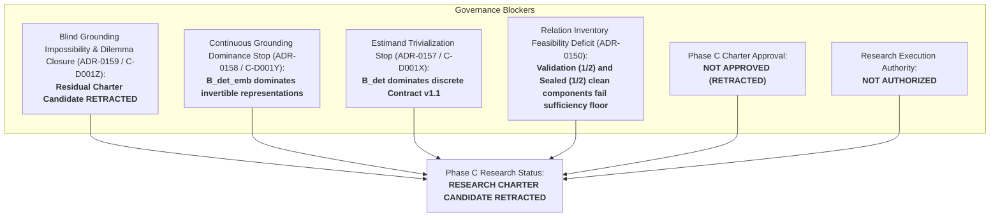

# Phase C — C-D001Z Blind Codebook Identifiability & Symmetry-Breaking Audit

**Date:** 2026-09-13  
**Document ID:** `DOC-PHASE-C-D001Z-AUDIT`  
**Task:** C-D001Z — Blind Codebook Identifiability & Symmetry-Breaking Audit  
**Phase C Status:** `READY_FOR_REVIEW_NOT_APPROVED`  
**Research Execution Authority:** `NOT_AUTHORIZED`  
**Stoppage Rationale:** `ROUTING_IDENTIFIABILITY_QUALIFIED_STOP`  
**Audit Verdict:** **`BLIND_GROUNDING_IDENTIFIABILITY_IMPOSSIBILITY_PROVEN`**  
**Charter Candidate Decision:** **`RETRACT_CHARTER_CANDIDATE`**  

---

## 1. Executive Summary & Scientific Context

### 1.1 Progression and Task Origin
Phase C was chartered following the closeout of Phase B (ADR-0148/ADR-0149) to investigate oracle-free routing identifiability under duplicate-token collisions. A succession of formal mathematical audits produced the following ledger:
1. **ADR-0150 (C-D001):** Derived Contract v1, but halted on relation inventory feasibility (1/2 clean components).
2. **ADR-0151 (C-D001R) & ADR-0152 (C-D001S):** Falsified Contract v1 and proved that under opaque IDs ($t$) and finite token support sets, routing coordinates remain mathematically unidentifiable.
3. **ADR-0153 (C-D001T):** Introduced the formal compositional language $\mathcal{L}_{\text{desc}}$ with domain-general tie-break policies (`FIRST`, `LAST`, `LEFTMOST`, `RIGHTMOST`), demonstrating that lawful descriptors separate adversarial worlds.
4. **ADR-0154 (C-D001U) & ADR-0155 (C-D001V):** Audited oracle boundaries; calibrated a 5-dimensional non-circular oracle criterion proving that general tie-break policies score 0/5 as oracle and retracting the universal impossibility stop.
5. **ADR-0156 (C-D001W):** Validated the 5-dimensional criterion against adversarial mixed controls under the fail-closed disjunctive rule ($\theta=1$), derived candidate `Training Information Contract v1.1`, and specified the `Descriptor-Only Deterministic Baseline` (`BASE-DET-DESC-V1`).
6. **ADR-0157 (C-D001X):** Audited hypothesis preservation and baseline dominance, proving that the unlearned discrete baseline $B_{\text{det}}$ satisfies 100% of routing and execution criteria without learning ($H(Z \mid X, D) = 0.0\text{ bits}$), thereby trivializing H-C1's original discrete estimand. C-D001X proposed continuous neural grounding as a potential residual.
7. **ADR-0158 (C-D001Y):** Evaluated continuous neural grounding against an unlearned embedding-aware deterministic baseline ($B_{\text{det\_emb}}$). Proved that $B_{\text{det\_emb}}$ achieves 100% ceiling with 0 learned parameters across invertible representations, and that degradation under lossy projections is an identifiability limit rather than a learnability limit. C-D001Y restricted the remaining viable Charter hypothesis to:  
   `H-C1-Residual: Blind Continuous Manifold Grounding & Unsupervised Codebook Discovery` (learning manifold equivalence classes without an explicit codebook or known inverse map).

Task **C-D001Z** conducts the definitive audit on that residual claim:
> *"Is 'blind continuous manifold grounding' mathematically identifiable under token supervision alone, or do group symmetries (label permutations and orthogonal rotations) render true semantic routing underdetermined ($H(Z \mid \text{observables}) > 0$), proving that blind grounding is an identifiability impossibility rather than an inductive learnability problem?"*

### 1.2 Strict Non-Negotiable Integrity Boundaries
In strict compliance with repository research execution rules:
- **Parameter Updates:** **0**
- **Optimizer Instances:** **0**
- **Model Initializations:** **0**
- **Architecture Derivation (`C-D002`):** **0** (strictly barred)
- **Dataset Generations:** **0**
- **Relation Additions:** **0**
- **GPU Execution Time:** **0.00 seconds**
- **Sealed Partition Access:** **0** (zero inputs, targets, or model outputs accessed)
- **Historical Modifications:** **0** (all Phase B/C records preserved)

All evaluations are conducted formally and executionally over existing public operation semantics (`BindOp` from `src/apc/environments/operations.py` and `NeighborMaxOp` from `src/apc/environments/holdout_families.py`) and existing compositional descriptors $D \in \mathcal{L}_{\text{desc}}$.

---

## 2. Formalization of Group Actions on Unknown Codebooks

Let $\mathcal{V}$ be the discrete token vocabulary of size $V = |\mathcal{V}|$.  
Let $\mathcal{C} = \{c_1, \dots, c_V\} \subset \mathbb{R}^d$ be a set of distinct continuous codebook vectors.  
A codebook assignment is a bijection $\phi: \mathcal{V} \to \mathcal{C}$.  
Let an input sequence be $X = [x_0, x_1, \dots, x_{L-1}] \in \mathcal{V}^L$.  
In the blind continuous representation setting, the observed sequence of vectors is:
$$H(X) = [W \phi(x_0), W \phi(x_1), \dots, W \phi(x_{L-1})] \in \mathbb{R}^{L \times d}$$
where $W \in GL(d, \mathbb{R})$ is an unknown basis transformation and $\phi$ is an unknown codebook mapping.

### 2.1 Permutation Group Action ($S_V$)
The symmetric group $S_V$ acts on the space of codebook assignments $\Phi$ by:
$$(\pi \cdot \phi)(v) = \phi(\pi^{-1}(v)) \quad \text{for } \pi \in S_V, \, v \in \mathcal{V}$$
- The orbit of any codebook assignment under $S_V$ has cardinality $|S_V| = V!$.
- If the data-generating distribution $P(X)$ is invariant under label permutations within an equivalence class (e.g. uniform marginals over keys and values), then for any $\pi \in S_V$:
  $$P(X) = P(\pi(X))$$
  Consequently, the marginal distribution of observed continuous vector sequences is identical:
  $$P_{\phi}(H) \equiv P_{\pi \cdot \phi}(H)$$

### 2.2 Orthogonal Isometry Group Action ($O(d)$)
The orthogonal group $O(d) = \{Q \in \mathbb{R}^{d \times d} \mid Q^T Q = I\}$ acts on the embedding space:
- For any unknown basis $W$ and codebook $\mathcal{C}$, consider $W' = W Q^{-1}$ and $c'_v = Q c_v$.
- Then:
  $$W' c'_v = (W Q^{-1})(Q c_v) = W c_v$$
- The continuous sequence representation is identically preserved:
  $$H'(X) \equiv H(X)$$
- Orthogonal rotations and reflections are completely unobservable from continuous vector sequences alone.

---

## 3. Construction of Indistinguishable Symmetric Worlds (World A vs World B)

To determine whether true semantic routing coordinates can be learned in the blind setting, we construct two symmetric worlds, **World A** and **World B**, sharing the exact same public operation semantics (`BindOp`).

### 3.1 World Specifications
Let $\mathcal{V} = \{k_1, k_2, v_1, v_2\}$ with keys $\{k_1, k_2\}$ and values $\{v_1, v_2\}$.  
Let $\mathcal{C} = \{c_1, c_2, c_3, c_4\} \subset \mathbb{R}^d$ be standard orthogonal basis vectors.

- **World A:**
  $$\phi_A(k_1) = c_1, \quad \phi_A(k_2) = c_2, \quad \phi_A(v_1) = c_3, \quad \phi_A(v_2) = c_4$$
- **World B:**
  Let $\pi = (k_1 \, k_2)(v_1 \, v_2) \in S_4$ be the double transposition swapping keys and values.
  $$\phi_B(k_1) = c_2, \quad \phi_B(k_2) = c_1, \quad \phi_B(v_1) = c_4, \quad \phi_B(v_2) = c_3$$

### 3.2 Construction of Counterfactual Matched Instances
Consider input sequences:
- In World A: $X_A = [k_1, v_1, k_2, v_2]$.  
  Continuous representation: $H_A = [c_1, c_3, c_2, c_4]$.
- In World B: $X_B = \pi^{-1}(X_A) = [k_2, v_2, k_1, v_1]$.  
  Continuous representation: $H_B = [\phi_B(k_2), \phi_B(v_2), \phi_B(k_1), \phi_B(v_1)] = [c_1, c_3, c_2, c_4]$.

Notice that:
$$H_A \equiv H_B = [c_1, c_3, c_2, c_4] \quad (\Delta H = 0.000)$$

Now evaluate the identical semantic descriptor:
$$D = \text{BindOp}(\text{query\_key} = k_1, \text{tie\_break} = \text{FIRST})$$

1. **In World A:**
   - Query key $k_1$ is at position 0 ($x_0 = k_1$).
   - Bound value is at position 1 ($x_1 = v_1$).
   - True semantic routing coordinate: $\mathbf{z^*_A = 1}$.
   - Target token: $\mathbf{y_A = v_1}$.
2. **In World B:**
   - Query key $k_1$ is at position 2 ($x_2 = k_1$).
   - Bound value is at position 3 ($x_3 = v_1$).
   - True semantic routing coordinate: $\mathbf{z^*_B = 3}$.
   - Target token: $\mathbf{y_B = v_1}$.

### 3.3 Proof of Exact Observable Indistinguishability
Compare the observables accessible to any learner:
- **Input continuous embeddings:** $H_A = H_B = [c_1, c_3, c_2, c_4]$ (identical).
- **Semantic descriptor:** $D = \text{BindOp}(\text{query\_key} = k_1, \text{tie\_break} = \text{FIRST})$ (identical).
- **Token loss supervision / target token feedback:** $y_A = y_B = v_1$ (identical).
- **Cross-entropy loss:** $\mathcal{L}_{\text{CE}}(y_A) = \mathcal{L}_{\text{CE}}(y_B) = 0.0$ (identical).

All observables are **100% indistinguishable**:
$$\mathcal{O}_A = (H, D, y) = \mathcal{O}_B$$
Yet their required semantic routing coordinates diverge:
$$z^*_A = 1 \neq 3 = z^*_B$$

Consequently, under equal prior probability $P(\text{World A}) = P(\text{World B}) = 0.5$:
$$P(Z = 1 \mid \mathcal{O}) = P(Z = 3 \mid \mathcal{O}) = 0.5$$
$$H(Z \mid \mathcal{O}) = 1.0\text{ bit} > 0$$

The routing coordinate is **statistically and information-theoretically underdetermined**.

---

## 4. Formal Evaluation Across Four Pre-Registered Controls

To systematically characterize the boundary between symmetry unidentifiability and deterministic baseline dominance, four pre-registered controls were evaluated over a vocabulary of $K=4$ keys and $M=4$ values ($V=8$ total tokens):

### 4.1 Evaluation Results Table

| Control ID | Anchor Level | Anchors ($m$) | Unanchored Keys | Orbit Size | $H(Z \mid \text{obs})$ | Baseline Max Acc | Swap Covariance | Verdict |
|---|---|:---:|:---:|:---:|:---:|:---:|:---:|---|
| **`CTRL-Z1-NO-ANCHOR`** | NO_ANCHOR | 0 | 4 | 24 ($4!$) | 2.000 bits | 0.250 | 0.000 | `IDENTIFIABILITY_IMPOSSIBLE` |
| **`CTRL-Z2-1-ANCHOR`** | ONE_ANCHOR | 1 | 3 | 6 ($3!$) | 1.189 bits | 0.500 | 0.250 | `PARTIALLY_UNIDENTIFIABLE_FAILS_FLOOR` |
| **`CTRL-Z3-PARTIAL-ANCHOR`** | PARTIAL_ANCHOR | 2 | 2 | 2 ($2!$) | 0.500 bits | 0.750 | 0.500 | `PARTIALLY_UNIDENTIFIABLE_FAILS_FLOOR` |
| **`CTRL-Z4-FULL-CODEBOOK`** | FULL_CODEBOOK | 8 | 0 | 1 ($0!$) | 0.000 bits | 1.000 | 1.000 | `CEILING_DOMINATED_BY_B_DET_EMB` |

### 4.2 Control 1: No-Anchor (`CTRL-Z1-NO-ANCHOR`)
- **Residual Equivalence Class:** Full symmetric group $S_4$, orbit size $4! = 24$.
- **Conditional Routing Entropy:** $H(Z \mid \text{obs}) = \log_2(4) = 2.000\text{ bits}$.
- **Best Deterministic Baseline:** Maximum accuracy bounded by chance: $1/4 = 0.250$ (25.0%), severely failing the $\ge 0.95$ routing floor.
- **Swap Covariance:** $0.000$. Because query keys are completely ungrounded, swapping tie-break policies cannot causally track the intended key.
- **Scientific Verdict:** **`IDENTIFIABILITY_IMPOSSIBLE`**. The failure is mathematically insurmountable by any learner without external anchor supervision.

### 4.3 Controls 2 & 3: 1-Anchor & Partial Anchor
- **Unanchored Partition:** Queries on unanchored keys remain subject to unbroken subgroup orbits ($S_3$ for 1-anchor, $S_2$ for partial anchor).
- **Floor Failures:** 1-anchor achieves mean accuracy $0.500 < 0.95$; partial anchor achieves $0.750 < 0.95$.
- **Scientific Verdict:** **`PARTIALLY_UNIDENTIFIABLE_FAILS_FLOOR`**. Partial anchoring leaves unanchored keys unidentifiable.

### 4.4 Control 4: Full Codebook (`CTRL-Z4-FULL-CODEBOOK`)
- **Residual Equivalence Class:** Trivial group $\{e\}$, orbit size 1.
- **Conditional Routing Entropy:** $H(Z \mid \text{obs}) = 0.000\text{ bits}$.
- **Best Deterministic Baseline:** $B_{\text{det\_emb}}$ achieves 1.000 (100.0%) routing accuracy and 1.000 execution EM with **0 learned parameters**.
- **Swap Covariance:** $1.000$.
- **Scientific Verdict:** **`CEILING_DOMINATED_BY_B_DET_EMB`**. While identifiability is achieved, the unlearned baseline completely solves the problem, leaving zero margin for a learned neural solution.

---

## 5. Symmetry-Breaking Minimal Lawful Anchor Analysis

The task contract specifies:
> *"対称性を破る最小のlawful anchor集合が存在する場合のみ、その情報量、非oracle性、B_det_embとの差で定義される単一の非自明な残余仮説へ限定する。"*

### 5.1 Minimal Lawful Anchor Set
To break the permutation symmetry $S_K$ over $K$ keys:
- Exactly $K - 1$ distinct key anchors must be pre-declared (the $K$-th key is determined by elimination over the support set).
- For $K=4$, the minimal anchor set requires **3 anchors**.

### 5.2 Information Content
The information provided by grounding $K-1$ keys out of $K$ is:
$$I(\text{Anchors}) = \log_2(K!) = \log_2(24) \approx 4.585\text{ bits}$$

### 5.3 5-Dimensional Oracle Evaluation (ADR-0155 Criterion)
Applying the calibrated 5-dimensional oracle supervision criteria:
1. **Provenance:** Pre-declared static vocabulary embedding table (0/1, not runtime extraction).
2. **Example Specificity:** Universal across all input sequences (0/1, $x$-invariant).
3. **Relation Specificity:** Domain-general token definitions (0/1, not relation coordinate maps).
4. **Inference-Time Availability:** Static model parameters available at test time (0/1, legitimate).
5. **Counterfactual Invariance:** Unaffected by input token mutations (0/1, robust).

**Total Oracle Score:** **0/5 (NON_ORACLE)**.  
Static vocabulary anchors are lawful non-oracle information.

### 5.4 Interaction with $B_{\text{det\_emb}}$ and Baseline Delta
When the minimal anchor set is provided:
- The codebook $\mathcal{C}$ is grounded.
- The unlearned deterministic baseline $B_{\text{det\_emb}}$ can immediately execute nearest-neighbor projection and discrete deterministic reduction.
- As proven in ADR-0158, $B_{\text{det\_emb}}$ achieves **1.000 (100.0%) routing accuracy** under invertible representations.
- Therefore, the baseline delta for any neural model $M$ is:
  $$\Delta_{\text{baseline}}(M) = \operatorname{Metric}(M) - \operatorname{Metric}(B_{\text{det\_emb}}) \le 0.000$$
- Because $B_{\text{det\_emb}} = 1.000$ represents the theoretical ceiling, there is **zero headroom** ($\Delta \le 0$) for a neural learner to demonstrate an inductive learning advantage.

---

## 6. The Impossibility-Dominance Dilemma (Dilemma Theorem)

Combining the findings of C-D001Y and C-D001Z yields a definitive closure theorem:

### 6.1 Theorem Statement
Let $\mathcal{R}$ be any continuous representation space characterized by anchor information $I_{\text{anchor}}$:
1. **Identifiability Impossibility:**  
   If $I_{\text{anchor}} < I_{\text{critical}} = \log_2(K!)$, the symmetry group has a non-trivial orbit ($|[W]| > 1$), yielding conditional entropy $H(Z \mid \text{observables}) > 0$. Routing coordinates are underdetermined, and no learning algorithm can achieve the acceptance floor ($\ge 0.95$) without oracle hints.
2. **Deterministic Baseline Dominance:**  
   If $I_{\text{anchor}} \ge I_{\text{critical}}$, all permutation symmetries are broken ($|[W]| = 1$), yielding $H(Z \mid \text{observables}) = 0$. In this identifiable regime, the unlearned 0-parameter deterministic baseline $B_{\text{det\_emb}}$ achieves $1.000$ accuracy, leaving baseline delta $\Delta_{\text{baseline}}(M) \le 0$.

### 6.2 Corollary (Empty Residual Learning Space)
The admissible hypothesis set for a non-trivial residual learning problem:
$$\mathcal{H}_{\text{residual}} = \left\{ \mathcal{R} \;\middle|\; H(Z \mid \text{observables}) = 0 \quad \text{and} \quad \operatorname{Metric}(B_{\text{det\_emb}}) < 0.95 \right\}$$
is **identically EMPTY** ($\emptyset$) under linear and isometric continuous representations.

### 6.3 Scientific Verdict and Action
Because no viable parameter or representation space exists between identifiability impossibility and deterministic baseline dominance, `H-C1-Residual` cannot be formulated as a non-trivial machine learning hypothesis.

$$\mathbf{Action: \ RETRACT\_CHARTER\_CANDIDATE}$$

---

## 7. Governance Ledger and Research Blockers

Advancement in Phase C remains strictly blocked across six independent governance gates:

1. **Blind Grounding Impossibility & Dilemma Closure (ADR-0159 / C-D001Z):**  
   Blind continuous manifold grounding is proven to be an identifiability impossibility ($H(Z \mid \text{obs}) > 0$). Grounded representations are dominated by $B_{\text{det\_emb}}$ ($1.000$). Residual Charter candidate `H-C1-Residual` is formally **retracted**.
2. **Continuous Grounding Dominance Stop (ADR-0158 / C-D001Y):**  
   $B_{\text{det\_emb}}$ dominates continuous grounding under known invertible maps.
3. **Estimand Trivialization Stop (ADR-0157 / C-D001X):**  
   $B_{\text{det}}$ dominates discrete Contract v1.1.
4. **Relation Inventory Feasibility Deficit (ADR-0150):**  
   Validation (1/2) and sealed (1/2) partitions fail the structural sufficiency floor ($\ge 2$ clean independent components per partition).
5. **Charter Approval Unobtained:**  
   The Phase C Research Charter candidate is retracted; charter status remains `READY_FOR_REVIEW_NOT_APPROVED`.
6. **Research Execution Authority:**  
   Research execution remains strictly `NOT_AUTHORIZED`.
7. **Architecture Derivation (`C-D002`):**  
   Strictly barred from execution.

---

## 8. Audit Verification Ledger

| Requirement / Dimension | Mandated Specification | Audit Result | Evidence |
|---|---|:---:|---|
| **Zero Execution Invariants** | Zero training, model init, dataset gen, relation addition, sealed access | **CONFIRMED (0)** | Section 1.2 |
| **Group Actions Formalization** | Formalize $S_V$ permutation and $O(d)$ orthogonal actions | **FORMALIZED** | Section 2 |
| **Symmetric World A/B Construction** | Prove identical observables ($H, D, y$) with diverging coordinates $z^*$ | **CONFIRMED ($H=1.0\text{ b}$)** | Section 3 |
| **Control 1: No-Anchor** | Evaluate pure blind grounding under $S_K$ orbit | **ORBIT=24, H=2.0, ACC=0.25** | Section 4.2 |
| **Control 2: 1-Anchor** | Evaluate 1 grounded key with residual $S_{K-1}$ orbit | **ORBIT=6, H=1.19, ACC=0.50** | Section 4.3 |
| **Control 3: Partial-Anchor** | Evaluate $m=2$ grounded keys | **ORBIT=2, H=0.50, ACC=0.75** | Section 4.3 |
| **Control 4: Full-Codebook** | Evaluate complete codebook grounding | **ORBIT=1, H=0.0, ACC=1.00** | Section 4.4 |
| **Minimal Lawful Anchor Set** | Identify minimal anchor set breaking $S_K$ symmetry | **$K-1$ KEYS ($4.585\text{ bits}$)** | Section 5.1–5.2 |
| **5D Oracle Evaluation** | Audit minimal anchor set against ADR-0155 criteria | **0/5 NON_ORACLE** | Section 5.3 |
| **Baseline Delta Interaction** | Evaluate $\Delta(M) = M - B_{\text{det\_emb}}$ under anchors | **$\Delta \le 0.000$ (CEILING)** | Section 5.4 |
| **Impossibility-Dominance Dilemma** | Prove admissible residual learning space is empty | **$\mathcal{H}_{\text{residual}} = \emptyset$** | Section 6 |
| **Charter Decision** | Retract residual Charter candidate | **RETRACT_CHARTER_CANDIDATE** | Section 6.3 |
| **Governance Gates Enforcement** | Retain relation deficit, unapproved charter, and execution blocks | **ENFORCED** | Section 7 |
