# C-D001 — Oracle-Free Routing Identifiability Contract Derivation & Relation-Inventory Feasibility Audit

**Document ID:** `DOC-PHASE-C-D001-REVIEW`  
**Date:** 2026-09-13  
**Status:** Completed Review; `DECISION: RELATION_INVENTORY_FEASIBILITY_STOP`  
**Charter State:** `READY_FOR_REVIEW_NOT_APPROVED` (Research Execution: `NOT_AUTHORIZED`)  
**Task Type:** Non-Experimental Structural Design & Feasibility Audit  

---

## 1. Executive Summary & Approval Gate Status

### 1.1 Task Objectives
This task executes design review `C-D001` under the prospective [Phase C Research Charter](../research/PHASE_C_RESEARCH_CHARTER.md). The objectives are strictly bounded:
1. **Mathematical Identifiability:** Determine whether a lawful training-information contract exists that can resolve duplicate-token collision ambiguity and identify semantic routing coordinates without oracle routing supervision.
2. **Information Contract Convergence:** If identifiable, converge deductively to a single prospective `Phase C Training Information Contract v1` without architecture/optimizer sweeps or trial-and-error candidate search.
3. **Relation Inventory Feasibility Audit:** Audit existing non-sealed metadata, registries, and manifests to verify whether the requirement of at least two independent clean relation components in validation and at least two in sealed can be satisfied before any training or data generation.

### 1.2 Charter Approval Gate Review
Per Section 0 of the task contract:
- The Phase C Research Charter remains at `Version: charter-v1, READY_FOR_REVIEW_NOT_APPROVED` with `Research execution: NOT_AUTHORIZED`.
- Inspection of the repository commit history (`git log`) and decision ledgers confirms that **no formal approval record exists**.
- In accordance with non-negotiable governance invariants, research execution authority **cannot and must not be inferred**.
- This review provides the mathematical contract derivation, observable provenance audit, indistinguishable-world analysis, relation inventory audit, and proposed charter approval ADR, but declares **zero research execution**.

### 1.3 Integrity Boundary Summary
- Parameter / training updates: **0**
- Optimizer / loss function instantiations: **0**
- Model initializations / seed draws: **0**
- Dataset / sequence generations: **0**
- New relation registrations: **0**
- GPU experiment execution time: **0 s**
- Sealed partition inputs / labels / outputs accessed: **0**

---

## 2. Formalization of Duplicate-Token Collision Ambiguity

### 2.1 General Mathematical Formulation
In Phase B, an optimization breakdown occurred on sequence tasks where identical token values appeared at multiple positions (ADR-0138–ADR-0146). To generalize this failure beyond the specific instances (such as key 0 vs key 7 in ADR-0146), we define the routing identifiability problem as follows:

Let:
- $\mathcal{V}$ be a finite token vocabulary.
- $x = (x_0, x_1, \dots, x_{L-1}) \in \mathcal{V}^L$ be an ordinary input sequence of length $L$.
- $k \in \{0, \dots, M-1\}$ be the query output position.
- $y_k \in \mathcal{V}$ be the ground truth target token at output position $k$.
- $z_k^* \in \{0, \dots, L-1\}$ be the true semantic source coordinate determined by the frozen task semantics $\mathcal{T}$, satisfying $x_{z_k^*} = y_k$.
- $t \in \mathcal{T}_{\text{vis}}$ be model-visible task-side information conveyed via a separate task path.
- $\mathcal{O}(x, y_k, t)$ be the set of allowed observables accessible to the learner during training.

### 2.2 Duplicate-Token Collision Cell Definition
A query step $(k, x, y_k, t)$ is a **duplicate-token collision cell** if there exists at least one competitor coordinate $z' \in \{0, \dots, L-1\}$ such that:
$$z' \neq z_k^* \quad \text{and} \quad x_{z'} = x_{z_k^*} = y_k$$

### 2.3 Identifiability Condition & Failure
Let $z_1, z_2 \in \{0, \dots, L-1\}$ be two distinct semantic routing hypotheses ($z_1 \neq z_2$).
The semantic routing identity is **unidentifiable** under the observable set $\mathcal{O}$ if:
$$\mathcal{O}(x, y_k, t, z_1) = \mathcal{O}(x, y_k, t, z_2)$$

When this equality holds:
1. Every loss function $\mathcal{L}(\hat{y}_k, y_k)$ depending solely on token prediction receives identical reward whether attention is directed to $z_1$ or $z_2$ (since both yield token $y_k$).
2. The standard cross-entropy loss gradient $\nabla_\theta \mathcal{L}_{\text{CE}}$ assigns credit symmetrically (or in proportion to arbitrary initialization bias and softmax temperature), providing no signal indicating which coordinate represents the underlying semantic rule.
3. Any learner relying exclusively on token-output supervision can fall into an incorrect false attractor (as demonstrated by ADR-0138's 89.4% error concentration at false attractor key 7).

---

## 3. Allowed Observable Inventory & Provenance Boundary

The table below classifies candidate training signals by provenance, learner visibility, dependence, and oracle leakage risk.

| Observable | Symbol | Provenance | Visible at Training | Input-Only | Uses Target | Uses Task ID | Directly/Indirectly Encodes $z^*$ | Sealed Knowledge | Status in Information Contract |
|---|---|---|---|---|---|---|---|---|---|
| Ordinary Input Sequence | $x$ | Task environment | Yes | Yes | No | No | No | No | **ALLOWED / ADOPTED** |
| Token Output Target | $y$ | Supervisor | Yes | No | Yes | No | No (value only) | No | **ALLOWED / ADOPTED** |
| Model Outputs & Posteriors | $\hat{y}, p(z)$ | Forward computation | Yes | No | No | Yes | No | No | **ALLOWED / ADOPTED** |
| Standard Token Loss Gradients | $\nabla_\theta \mathcal{L}_{\text{CE}}$ | Autograd | Yes | No | Yes | Yes | No | No | **CONDITIONALLY ADOPTED** (Masked on collision cells) |
| Input Position Statistics | $\text{pos}(x), k$ | Geometry | Yes | Yes | No | No | No | No | **ALLOWED / ADOPTED** |
| Input Length Statistics | $L = \|x\|$ | Sequence dimension | Yes | Yes | No | No | No | No | **ALLOWED / ADOPTED** |
| Duplicate Token Statistics | $\mathcal{D}(x)$ | String equality on $x$ | Yes | Yes | No | No | No | No | **ALLOWED / ADOPTED** |
| Declared Task-Side Info | $t$ | Separate task path | Yes | No | No | Yes | No | No | **ALLOWED / ADOPTED** |
| Oracle Source Coordinate Map | $z^*(k, x, t)$ | Ground-truth oracle | **No** | No | No | Yes | **Yes (Direct)** | No | **PROHIBITED** (Evaluator only) |
| Teacher Trajectory | $\tau_{\text{teacher}}$ | Dense teacher model | **No** | No | No | Yes | **Yes (Direct)** | No | **PROHIBITED** |
| Phase-B Failed Cell Patch | $\text{lookup}(k, L) \to z^*$ | Historical diagnostics | **No** | No | No | Yes | **Yes (Tailored)** | No | **PROHIBITED** |
| Sealed Benchmark Data | $\mathcal{S}_{\text{sealed}}$ | Sealed partition | **No** | No | Yes | Yes | **Yes** | **Yes** | **PROHIBITED** |

> [!IMPORTANT]
> **Admissibility Distinction:** Being "allowed in principle" under the charter does not imply that an observable alone solves the identifiability problem. In particular, standard token loss gradients $\nabla_\theta \mathcal{L}_{\text{CE}}$ are allowed, but on collision cells they convey destructive, ambiguous credit assignment (ADR-0140, ADR-0146).

---

## 4. Evaluation of the Three Conceptual Categories

The charter outlines three conceptual approaches to break routing ambiguity. Rather than evaluating them empirically as hyperparameter "arms", we analyze their deductive identifiability:

### 4.1 Category 3: Explicit Latent Routing Treatment
- **Formulation:** Formulate routing as a latent variable $z \in \{0, \dots, L-1\}$ with marginal likelihood $p(y_k \mid x, t) = \sum_z p(y_k \mid x, z) p(z \mid x, t)$.
- **Identifiability Test:** In a collision cell where $x_i = x_j = y_k$, we have $p(y_k \mid x, z=i) = 1$ and $p(y_k \mid x, z=j) = 1$. The marginal probability reduces to:
  $$p(y_k \mid x, t) = p(z=i \mid x, t) + p(z=j \mid x, t) + \sum_{m \notin \{i, j\}} p(y_k \mid x, z=m) p(z=m \mid x, t)$$
- **Falsification:** The observed evidence depends only on the *sum* $p(z=i \mid x, t) + p(z=j \mid x, t)$. Any parameter shift that increases $p(z=j)$ while decreasing $p(z=i)$ leaves the observed marginal likelihood completely invariant.
- **Conclusion:** Adding latent variables, variational inference, or EM without external constraints **cannot break collision symmetry**. Category 3 alone is insufficient.

### 4.2 Category 1: Separate Lawful Training Signal
- **Formulation:** Augment the objective with an auxiliary lawful training signal.
- **Identifiability Test:** What lawful signal can distinguish $i$ from $j$?
  - Providing $z^*(k)$ is an oracle label (strictly prohibited).
  - Providing input duplicate masks $\mathcal{D}(x) = \{(i, j) \mid x_i = x_j\}$ informs the learner that positions $i$ and $j$ collide, but contains zero information about which position is the semantic source.
- **Conclusion:** No auxiliary per-example signal derived lawfully from $x$ and $y$ can indicate whether $z^*=i$ or $z^*=j$ in an isolated collision cell.

### 4.3 Category 2: Task/Data Constraints & Cross-Example Identifiability
- **Formulation:** Leverage structural task consistency across diverse inputs within the same task family.
- **Identifiability Test:**
  - If evaluation excluded collisions, H-C1 would be violated. Thus collisions must remain in evaluation.
  - However, in training, input sequences $x_{\text{clean}}$ where all tokens are unique ($\forall m \neq n, x_m \neq x_n$) contain **zero duplicate tokens**.
  - In such clean examples, the condition $x_m = y_k$ holds for **exactly one** coordinate $m$.
  - Therefore, for clean examples, the true semantic coordinate $z_k^* = m$ is **uniquely identified** from token targets without oracle labels!
- **Conclusion:** Category 2 provides the mathematical foundation for identifiability, provided that the routing mechanism decouples content from position and enforces cross-example structural consistency.

---

## 5. Indistinguishable-World Falsification Test

The central decision criterion of C-D001 is the Indistinguishable-World Falsification Test:

### 5.1 Per-Example Falsification (Isolated Collision Cell)
Consider a candidate information contract $\mathcal{O}_{\text{local}} = \{x, y_k, t, \nabla \mathcal{L}_{\text{CE}}, \mathcal{D}(x)\}$.
Construct two possible ground-truth worlds for an isolated collision example:
- **Input:** $x = [A, B, C, D, A]$ ($L=5$)
- **Target:** $y_0 = A$
- **Declared Task:** $t$
- **World A:** Task semantics dictates FIRST_TOKEN: $z^*_A = 0$.
- **World B:** Task semantics dictates LAST_TOKEN: $z^*_B = 4$.

**Result:**
- Both worlds have identical input $x$, identical target $y_0=A$, identical duplicate statistic $\mathcal{D}(x) = \{(0, 4)\}$, and identical CE loss $\mathcal{L}_{\text{CE}} = 0$ if attention is focused on $\{0, 4\}$.
- $\mathcal{O}_{\text{local}}(\text{World A}) = \mathcal{O}_{\text{local}}(\text{World B})$.
- **Verdict:** Per-example token observations **fail** identifiability. Any contract attempting to learn routing from single collision examples without structural constraints is **falsified**.

### 5.2 Cross-Example Resolution (Structural Task Permutation)
Now consider the expanded information contract $\mathcal{O}^*$ incorporating structural cross-example consistency:
- Let the routing function be parameterized as a content-independent positional map $z_k = \pi_t(k, L)$, consistent with the architectural invariant $h_{\text{content}} = f(\text{content})$.
- Consider a clean counterpart example $x' = [A, B, C, D, E]$ where tokens are distinct.
  - In World A (FIRST_TOKEN): $y_0' = A \implies z^*_A = 0$. The observable $x'_m = y_0'$ uniquely identifies $m=0$.
  - In World B (LAST_TOKEN): $y_0' = E \implies z^*_B = 4$. The observable $x'_m = y_0'$ uniquely identifies $m=4$.
- Since $y_0'(\text{World A}) \neq y_0'(\text{World B})$, the two worlds generate distinct observable sequences:
  $$\mathcal{O}^*(\text{World A}) \neq \mathcal{O}^*(\text{World B})$$
- By conditioning routing parameter updates exclusively on collision-free cells (or masking collision-cell routing gradients via duplicate statistics $\mathcal{D}(x)$), the positional routing parameters $\theta_{\text{route}}$ converge to $\pi_t(k, L)$ without interference from collision noise.
- When applied to the collision example $x = [A, B, C, D, A]$, the frozen positional mapping $\pi_t(0, 5)$ deterministically outputs $z^* = 0$ (World A) or $z^* = 4$ (World B).
- **Verdict:** Under structural cross-example consistency and duplicate-aware gradient routing, **World A and World B are mathematically distinguishable**.

---

## 6. Oracle Leakage Audit & Boundary Protection

To ensure the derived information contract is lawful and free of oracle contamination:

1. **No Ground-Truth Coordinate Injection:** Neither $z_k^*$ nor any proxy rank or attention mask is supplied during training.
2. **No Teacher Guidance:** No external network or oracle trajectory generates supervisory gradients.
3. **No Failed-Cell Hardcoding:** No rules specific to Phase B's position 4 / key 0 / key 7 collision are introduced. Duplicate masking is defined purely over string equality $x_i == x_j$ for arbitrary tokens and coordinates.
4. **Task Identifier Separation:** The task embedding $t$ conveys only the declared relation identity. It does not encode coordinate offsets, routing tables, or operator logic. The mapping $k \mapsto z$ must be learned endogenously by the model.

---

## 7. Cross-Example Identifiability & Structural Task Consistency

Identifiability is achieved through a three-level hierarchy:

```mermaid
flowchart TD
    subgraph Level1["Level 1: Per-Example Observable"]
        A["Collision Example: x=[A,B,C,D,A], y=A"] --> B["Unidentifiable (z=0 vs z=4 symmetric)"]
    end
    subgraph Level2["Level 2: Cross-Example Observable (Same Task)"]
        C["Clean Examples: x'=[A,B,C,D,E], y'=A"] --> D["Uniquely identifies z=0 via x'_m == y'"]
        D --> E["Positional Rule pi(k, L) learned"]
        E --> F["Duplicate-Aware Masking blocks noisy collision gradients"]
        F --> G["pi(k, L) resolves collision cell x deterministically"]
    end
    subgraph Level3["Level 3: Cross-Relation Transfer"]
        H["New Held-out Relation t_new"] --> I["Requires Support Examples with Collision-Free Units"]
        I --> J["Generalizes without Oracle Map"]
    end
```



### 7.1 Mathematical Condition for Cross-Example Disambiguation
For a relation $\mathcal{T}$ defined over length $L$:
1. The training distribution $\mathcal{P}_{\mathcal{T}}(x)$ must satisfy:
   $$\mathbb{P}_{x \sim \mathcal{P}_{\mathcal{T}}}(\forall i \neq j, x_i \neq x_j) > 0$$
   That is, the probability of sampling a collision-free sequence is strictly non-zero.
2. The routing mechanism must be decoupled from token content:
   $$p(z_k = j \mid x, t, k, L) = g(j, k, L, t)$$
   Ensuring that routing parameters learned on clean examples transfer invariant to collision-bearing examples.
3. The routing loss update must be modulated by the duplicate indicator:
   $$\nabla_{\theta_{\text{route}}} = \mathbb{I}(x \text{ is collision-free at } k) \cdot \nabla_{\theta_{\text{route}}} \mathcal{L}_{\text{CE}}$$

---

## 8. Task-Side Information Boundary

To preserve the non-negotiable APC invariant $h_{\text{content}} = f(\text{content})$:
1. **Content Independence:** The content representation $h_{\text{content}}$ is produced by the frozen Core solely from input tokens $x$, with zero conditioning on $t$.
2. **Task Path Isolation:** The task identifier $t$ enters exclusively through the primitive/routing path, conditioning positional query/key transformations.
3. **Relation Transfer Semantics:** For novel, unseen relations, $t$ represents either a novel task ID or a task context vector inferred from support examples. The relation transfer protocol must ensure that support sets contain at least one collision-free demonstration.

---

## 9. Relation Inventory Feasibility Audit

Phase C Charter Section 3 explicitly requires:
> "Before any training, the design must be able to allocate **at least two independent clean relation components in validation and at least two in the sealed partition**, with a separate development partition. Audit the actual alias/coupling graph and parameter/optimizer exposure."

We performed a strict, non-sealed audit of existing metadata, catalogs, and coupling graphs (`relation_split.json`, `relation_coupling_graph.json`, `_RELATED_OPERATION`, `PARAMETERIZED_OPERATIONS`). Sealed inputs, labels, and outputs were **not read** (access count: 0).

### 9.1 Existing Component Inventory & Coupling Analysis

1. **L3 Hard-Negative Families (`_RELATED_OPERATION`):**
   - Registry entries: `SHIFT -> CYCLE_FOUR`, `SELECT -> BIND`, `COUNT -> BIND`, `BIND -> COUNT`.
   - Unordered pairs: `CYCLE_FOUR-SHIFT`, `BIND-COUNT`, `BIND-SELECT`.
   - **Coupling Graph:** `BIND-COUNT` and `BIND-SELECT` share the physical primitive `BIND`. In `relation_split_protocol.py`, modifying or tuning BIND perturbs the shared key geometry. Thus, they merge into a single coupled component: `L3:BIND-COUNT+BIND-SELECT`.
   - **Historical Exposure:** `L3:BIND-COUNT+BIND-SELECT` was diagnosed and repaired during Phase B development (ADR-0081, ADR-0085), making it contaminated for clean holdout transfer. It belongs strictly to **development**.
   - Remaining L3 clean components: Exactly **1** (`L3:CYCLE_FOUR-SHIFT`).

2. **L4 Parameterized Argument Variants:**
   - Parameterized ops: `SHIFT`, `SELECT`, `COUNT`, `BIND`.
   - While `ArgumentScorer.heads` uses separate linear projections, these heads operate directly on top of the base operations above. They are argument variations of existing operations, not independent relation families.

3. **Sealed Local Neighborhood Family (`sealed_local_neighborhood`):**
   - Operations: `MAJORITY_THREE`, `NEIGHBOR_MAX`, `NEIGHBOR_CONDITIONAL`.
   - **Coupling Graph (ADR-0147 / `relation_coupling_graph.json`):** All three operations belong to the same pre-registered inductive family. As audited in Task B-C005R3-002R, they form **exactly one coupled component** (`family:sealed_local_neighborhood`).

### 9.2 Audit Findings vs Charter Requirements

| Partition | Required Independent Clean Components | Actual Available Components | Component Identifiers | Status |
|---|---|---|---|---|
| **Development** | $\ge 1$ (Separate) | 1 | `L3:BIND-COUNT+BIND-SELECT` | **PASS** |
| **Validation** | $\ge 2$ | 1 | `L3:CYCLE_FOUR-SHIFT` | **FAIL (Deficit: 1)** |
| **Sealed** | $\ge 2$ | 1 | `family:sealed_local_neighborhood` | **FAIL (Deficit: 1)** |

> [!CAUTION]
> **Total Available vs Required:** Phase C requires a minimum of $2 + 2 = 4$ independent clean relation components across validation and sealed. The existing repository inventory provides **at most 2** clean components across both partitions ($1$ in validation and $1$ in sealed).

---

## 10. G1 Phase-B Failure Prevention

In Phase B Task B-C005R3-002R (ADR-0147), nominal operation counts (3 operations) were shown to collapse to 1 component under parameter coupling, causing a hard `G1_RELATION_TRANSFER_STOP`.

Per Section 10 of the current task contract:
- Manufacturing artificial relations, renaming aliases, or creating synthetic inverse relations within C-D001 is **strictly forbidden**.
- Defining new relation families constitutes an architectural and research expansion that requires a dedicated charter amendment and design decision.
- Therefore, C-D001 must **not** attempt to bypass the component deficit. It must fail closed and record `RELATION_INVENTORY_FEASIBILITY_STOP`.

---

## 11. Phase C Training Information Contract v1

Despite the inventory stop, we formalize the mathematical information contract derived from Sections 2–8 for prospective adoption once relations are available:

```yaml
Contract_ID: Phase_C_Training_Information_Contract_v1
Version: 1.0-prospective
Objective: Oracle-Free Disambiguation of Duplicate-Token Routing Coordinates

Learner_Visible_Inputs:
  - Input token sequence: x = (x_0, ..., x_{L-1})
  - Query output position index: k in {0, ..., M-1}
  - Sequence length: L in {1, ..., L_max}
  - Declared task identifier: t in T_vis (separate task path)

Learner_Visible_Targets:
  - Ground-truth target token: y_k in V

Allowed_Derived_Statistics:
  - Duplicate token indicator: D(x) = {(i, j) | x_i == x_j, i != j}
  - Collision cell predicate: IsCollision(k, x, y_k) <=> exists j != z: x_j == y_k == x_z

Temporal_Availability:
  - Input, length, position, duplicate statistics, and task identifier: Available at forward pass.
  - Target token: Available at training loss evaluation.

Prohibited_Information:
  - True source coordinate map z*(k, x, t)
  - Teacher routing trajectories or attention distributions
  - Oracle-derived loss gradients
  - Historical failed-cell lookup tables (e.g. key 0 / key 7 overrides)
  - Sealed partition inputs, labels, or outputs

Disambiguation_Mechanism:
  - Structural Cross-Example Decoupling: Routing scores are computed via content-decoupled positional cross-attention g_theta(j, k, L, t).
  - Duplicate-Aware Gradient Masking:
      dL_route/d_theta = (1 - IsCollision(k, x, y_k)) * dL_CE/d_theta
    Routing parameters are updated strictly on collision-free instances, preventing destructive alias gradients.
  - Fixed-Geometry Transfer: Frozen positional routing functions apply identically to collision-bearing instances during evaluation.

Falsifying_Counterexample_Condition:
  - If a task family exhibits zero clean (collision-free) examples in its natural distribution (e.g. vocabulary size smaller than sequence length), this contract fails identifiability and cannot converge.
```

*Note: Architecture dimensions, parameter budgets, learning rates, optimizers, loss weighting coefficients, and dataset sizes are deliberately omitted, per Section 11.*

---

## 12. Terminal Evaluation & Decision

### 12.1 Evaluation Matrix

| Criterion | Requirement | Result | Evidence |
|---|---|---|---|
| **1. Allowed Observable Set** | Explicitly defined & bounded | **PASS** | Section 3, Table & JSON matrix |
| **2. Collision Disambiguation** | Theoretical mechanism identified | **PASS** | Section 7, Cross-example structural decoupling |
| **3. Indistinguishable Worlds** | Falsification test passed | **PASS** | Section 5, Clean-example distinction proved |
| **4. Oracle Boundary** | Zero oracle coordinate leakage | **PASS** | Section 6, Strict prohibitions audited |
| **5. Task-Side Info Boundary** | `h_content = f(content)` preserved | **PASS** | Section 8, Separate task path invariant |
| **6. Single Contract Convergence** | One prospective contract derived | **PASS** | Section 11, Information Contract v1 |
| **7. Relation Inventory Feasibility** | Validation $\ge 2$, Sealed $\ge 2$ clean | **FAIL** | Section 9, Validation=1, Sealed=1 (Deficit=2) |
| **8. Charter Approval Gate** | Formally approved record | **FAIL** | Section 1, Currently `NOT_APPROVED` |

### 12.2 Final Decision

$$\mathbf{DECISION: \quad RELATION\_INVENTORY\_FEASIBILITY\_STOP}$$

**Reasoning:**  
While an oracle-free, mathematically sound information contract (`Phase C Training Information Contract v1`) was successfully derived to resolve duplicate-token collision ambiguity via structural cross-example decoupling, the existing non-sealed relation inventory cannot satisfy the mandatory Phase C prerequisite of allocating at least two independent clean relation components in validation and at least two in sealed.  
Furthermore, the Phase C Research Charter remains unapproved. In accordance with fail-closed research integrity rules, implementation work cannot proceed to task `C-D002`.

---

## 13. Recommended Next Steps

1. **Charter Approval & Amendment:** Submit ADR-0150 to record the C-D001 audit findings and formalize the charter status.
2. **Relation Inventory Expansion Task:** Prior to any architectural or training design (`C-D002`), commission a dedicated research decision task to specify and register at least two new, independent relation families with proven structural independence and no parameter coupling.
3. **Execution Gate:** Keep architecture selection, dataset generation, and model training strictly blocked (`Research execution: NOT_AUTHORIZED`).
