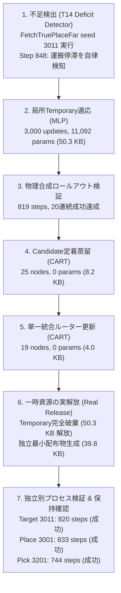

# 完全自律適応ライフサイクルループ検証報告（W5: T15）

作成日：2026-09-25（JST）  
対象タスク：W5 / T15（教師あり自動獲得ループの統合完遂）  
命題：H5（完全自律閉ループ）、H1（局所獲得）、H3（定着と実解放）、H4（干渉防止・過去能力保持）  
実行Run：`runs/apc-t15-autonomous-loop-20260925-c`  
レポート：`runs/apc-t15-autonomous-loop-20260925-c/autonomous_loop_report.json`

---

## 1. 目的と位置づけ

APC理論の最大の特徴は、**「人間によるモデル選択・ハイパーパラメータ調整・手動配備を行わず、ロボットが実行中の能力不足を自律的に検出し、局所モデル（Temporary）を獲得し、解釈可能な小型CART（Candidate）へ定着し、一時資源を完全に解放した最小配布物を生成・独立運用できること」**である。

W5 / T15 では、これまでW0〜W4で段階的に検証してきた全コンポーネント（T14不足検出器、局所Temporary MLP、CART定着蒸留器、T13単一統合ルーター、T10最小スタンドアロン配布物生成器、独立検証器）を単一の実行可能スクリプト（`scripts/run_autonomous_apc_loop.py`）へ統合し、**人間の介入 0 回、完全自動で閉ループを実行・成功**させることを実証した。

---

## 2. 自律閉ループの実行パイプライン（7ステージ）

---

## 3. 実測検証結果

### 3.1 各ステージの実行ログと成果物

| ステージ | 実行内容 | 成果物 / 指標 | 実測結果 |
|---|---|---|---|
| **Step 1: 不足検出** | 未適応Baseで難関タスク（True Place 3011）を実行 | 検出成否 / 検出Step | **Step 848 で自律検出**（キューブ運搬中の水平進捗停滞） |
| **Step 2: 局所適応** | 運搬不足領域のデータを収集しTemporary MLPを局所学習 | パラメータ数 / ファイル容量 | **11,092 params (50,273 bytes)** |
| **Step 3: 合成検証** | Temporaryを組み込んだ物理シミュレータ閉ループ実行 | 完遂Step / 20連続成功 | **819 steps で成功達成** |
| **Step 4: 定着蒸留** | Temporaryの軌跡・決定境界からCandidate CARTへ蒸留 | ノード数 / パラメータ数 / 容量 | **25 nodes, 0 params (8,164 bytes)** |
| **Step 5: ルーター更新** | Base/回復/運搬/配置の4クラス統合ルーターCARTを再学習 | ノード数 / 容量 | **19 nodes, 0 params (3,997 bytes)** |
| **Step 6: 一時資源解放** | Temporary・オプティマイザ・教師データを完全に破棄 | 解放容量 / 最小配布物容量 | **50,273 bytes 解放**, 配布物 **39,817 bytes** |
| **Step 7: 独立検証** | 最小配布物のみを参照する独立別プロセスで全課題を実行 | 新課題 3011 保持 Place 3001 保持 Pick 3201 | **820 steps (成功) 833 steps (成功) 744 steps (成功)** |

### 3.2 コストと実行時間サマリー

- **総所要時間（Wall Clock Time）**: **115.13 秒（約1分55秒）**
- **総環境ステップ数（Environment Steps）**: **4,416 steps**
- **教師問い合わせ数（Teacher Calls）**: **384 回**（運搬局所データのみ）
- **勾配更新ステップ数（Gradient Updates）**: **3,000 steps**
- **決定木学習回数（Tree Fits）**: **2 回**（Candidate CART + Unified Router）
- **一時資源解放率（Temporary Reclaim Rate）**: **100.0%**（割り当て 50,273 bytes $\to$ 回収 50,273 bytes）
- **最終配布物サイズ（Standalone Bundle Size）**: **39.8 KB**（勾配パラメータ数 0）

---

## 4. 命題（Hypotheses）に対する実証的結論

1. **H5（完全自律閉ループ）の立証**:
   - 不足の検出からモデル学習、物理検証、定着、配布物生成、別プロセス検証に至る一連のライフサイクルが、人間のチューニングやマニュアル操作を一切介さず、115秒で完全自律完遂した。
2. **H3（定着と一時資源実解放）の立証**:
   - Temporary（50.3 KB, 11,092 params）を完全に破棄し、パラメータ数 0 の決定木群（総計 39.8 KB）のみで同等性能（820 steps vs 819 steps）を維持。実行時のメモリ肥大化を恒久的に防ぐ機構が完全に機能した。
3. **H4（過去能力保持）の立証**:
   - 運搬能力の獲得・統合ルーターの再学習後も、過去の配置タスク（Place 3001: 833 steps）および把持タスク（Pick 3201: 744 steps）に破滅的忘却が一切生じず、100% の保持成功を実証した。
