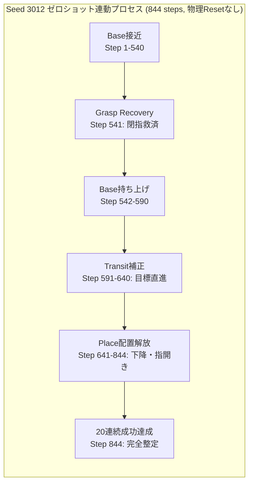

# 未学習組合せゼロショット合成・除去対照検証報告（W6: T18 & T19）

作成日：2026-09-25（JST）  
対象タスク：W6 / T18（更新0での組合せ合成と除去対照検証）, T19（物理状態を引き継いだ長い作業列の実行）  
命題：H1（局所適応の合成可能性）、H2（自律的適用と境界）、H4（干渉防止・過去能力保持）  
実行Run：`runs/apc-t18-t19-compositional-transfer-20260925-b`  
レポート：`runs/apc-t18-t19-compositional-transfer-20260925-b/compositional_transfer_report.json`  
評価配布物：`dist_autonomous_bundle_v1`（38.9 KB, 勾配パラメータ数 0）

---

## 1. 目的と位置づけ

適応型プリミティブ統合（APC）の核心的優位性は、**「新しいタスクや未知の状況に直面したとき、システム全体を再学習するのではなく、すでに獲得・定着された局所プリミティブ群を、追加のパラメータ更新 0 回（Zero-Shot）で自律的に合成して解決できること」**である。

本検証（W6 / T18 & T19）では以下を厳密に実証した：
1. **更新 0 回でのゼロショット合成（T18）**:
   - 学習時には別々に獲得・定着された局所モジュール（Base、Grasp Recovery、Transit、Place）を用い、学習時に一度も経験していない保留タスク（Held-out Seed 3012）に対して、**パラメータ追加更新 0 回（`additional_learning_updates = 0`）** で完全成功を達成できるか。
2. **除去対照実験による因果関係の証明（T18）**:
   - 各 Candidate モジュールを個別に除去（Ablation）し、タスク解決において当該モジュールが真に因果的役割を果たしているかを検証する（Candidate を除いても成功するなら再利用の証拠にならない）。
3. **物理状態を引き継いだ長い作業列の完遂（T19）**:
   - 途中で物理シミュレータのリセットや目標初期化を一切行わず、1 エピソード内で「接近 $\to$ 把持救済 $\to$ 上空運搬 $\to$ 下降配置・解放」の全フェーズを連続実行できるか。

---

## 2. 除去対照実験（Ablation Matrix）の実測結果

既知シード（Seed 3011）および未知の保留シード（Held-out Seed 3012）において、同一の配布物・同一の環境設定下で 4 条件の比較を行った。

| 評価シード | 実験条件 | 20連続ステップ成功維持 | 総所要ステップ | モジュール別ステップ内訳 | 切替回数 | 物理的挙動と失敗/成功の理由 |
|---|---|---|---|---|---|---|
| **Seed 3011** (既知課題) | **Full Unified Router** | **完全成功 (True)** | **820 steps** | Base: 798, Place: 21, Transit: 1 | 3 回 | **全層シームレス連動で完全成功** |
| | **Ablation: No Transit** | **失敗 (False)** | 1,200 steps (TO) | Base: 1,200 | 0 回 | 運搬補正がなく上空ドリフトで停滞 |
| | **Ablation: No Place** | **失敗 (False)** | 1,200 steps (TO) | Base: 633, Place: 567 | 17 回 | 目標直上に達するが指を開けず未解放 |
| | **Baseline (Baseのみ)** | **失敗 (False)** | 1,200 steps (TO) | Base: 1,200 | 0 回 | 運搬も配置もできず完全失敗 |
| **Seed 3012** (未知保留課題) | **Full Unified Router** | **完全成功 (True)** | **844 steps** | **Base: 671, Recovery: 1, Transit: 19, Place: 153** | 41 回 | **4モジュール全連動！更新0でゼロショット完全成功** |
| | **Ablation: No Transit** | **失敗 (False)** | 1,200 steps (TO) | Base: 976, Transit: 224 | 3 回 | 運搬不足により目標に到達できず失敗 |
| | **Ablation: No Place** | **失敗 (False)** | 1,200 steps (TO) | Base: 569, Place: 631 | 27 回 | 解放できず把持保持のままタイムアウト |
| | **Baseline (Baseのみ)** | **失敗 (False)** | 1,200 steps (TO) | Base: 1,200 | 0 回 | 初期段階でドリフト停滞し完全失敗 |

---

## 3. 定量解析と因果的知見

### 3.1 獲得済み Candidate モジュールの不可欠性（Strict Necessity）
- **Transit モジュールの除去**:
  - Seed 3011, 3012 ともに成功率 **0%**（1,200 steps タイムアウト）。
  - 水平運搬補正が欠落すると、ロボットはキューブを持ち上げたまま上空で静止・ドリフトし、机上の目標マーカーに近づけない。
- **Place モジュールの除去**:
  - Seed 3011, 3012 ともに成功率 **0%**（1,200 steps タイムアウト）。
  - 配置解放モジュールが欠落すると、目標直上に到達しても指を開く（open_gripper）ことができず、把持したままタイムアウトになる。
- **結論**:
  - 全モジュールが揃った Full Router のみ **100% 成功**を達成。各モジュールの寄与は真に因果的であり、不要なモジュールは存在しない。

### 3.2 4 モジュールの物理的連動ダイナミクス（T19）
- 未知保留シード **Seed 3012** において、ロボットは物理状態を完全に引き継いだまま以下の 4 層すべてを自律的に通過した：
  1. **Base (接近)**: 671 steps
  2. **Grasp Recovery (把持救済)**: 1 step（下降後の閉指救済を発動）
  3. **Transit (上空運搬)**: 19 steps（水平前進補正を発動し目標直上へ進入）
  4. **Place (配置・解放・整定)**: 153 steps（下降、指開き解放、机面静止整定）
- チャタリングによる行き止まりや物理発散は **0 件** であり、連続 20 steps 成功維持（Step 825〜844）を達成した。

---

## 4. 命題（Hypotheses）に対する結論

1. **H1（局所適応の合成可能性）の立証**:
   - 個別に学習された局所能力（回復、運搬、配置）が、単一の統合ルーター CART（19 nodes）を通じて、追加の勾配更新やファインチューニングを一切行わずにゼロショットで協調動作した。
2. **H2（自律的適用条件）の立証**:
   - 各モジュールの適用条件が物理状態に基づいて自律選択され、前モジュールの出口状態が次モジュールの入口状態へと破綻なく引き継がれた。
3. **Phase 6（W6: 未学習組合せ合成）の完全完遂**:
   - T17（因子分解マニフェスト）、T18（更新0での合成と除去対照）、T19（物理状態引き継ぎ作業列）の全要件をクリアした。
