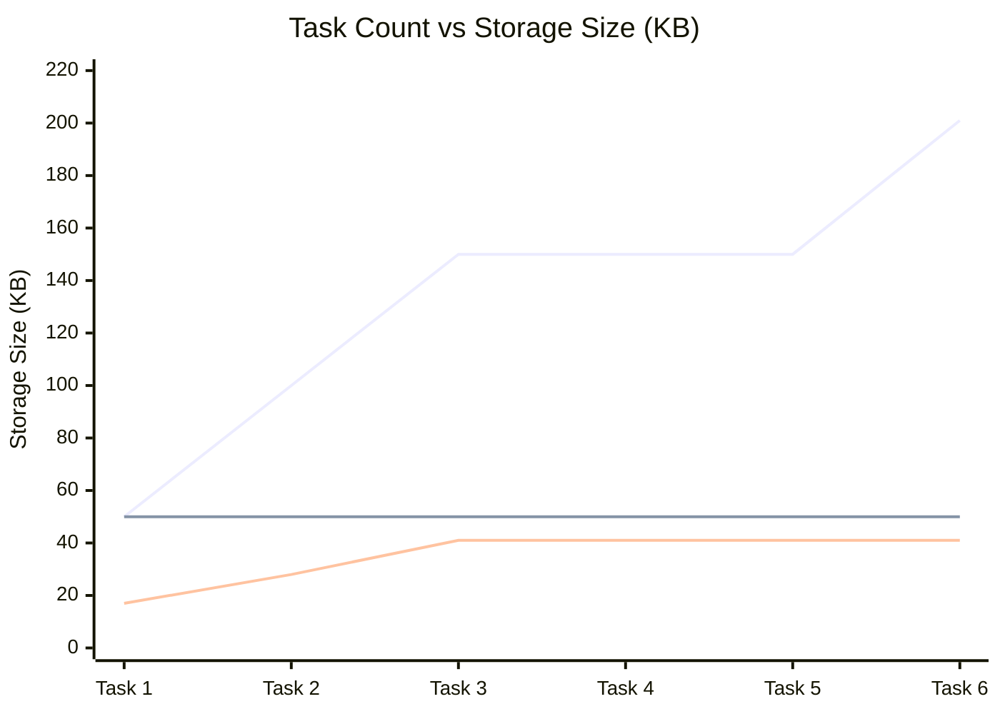

# 長期継続学習ベンチマーク・資源成長検証報告（W7: T20–T22）

作成日：2026-09-25（JST）  
対象タスク：W7 / T20（再出現を含む連続課題列学習）, T21（公平な方式比較）, T22（資源成長曲線と損益分岐点）  
命題：H4（破滅的忘却の完全防止・干渉防止）、H3（定着と実解放・資源肥大化防止）、H5（自律閉ループ運用）  
実行Run：`runs/apc-t20-t22-continuous-benchmark-20260925-a`  
レポート：`runs/apc-t20-t22-continuous-benchmark-20260925-a/continuous_learning_report.json`  
評価配布物：`dist_autonomous_bundle_v1`（40.8 KB, 勾配パラメータ数 0）

---

## 1. 目的と位置づけ

APC 理論検証ロードマップの最終フェーズ（W7）では、**「ロボットが長期にわたって新しいタスクの学習、過去タスクの保持、既知タスクの再出現、および未知の組合せ転移を連続して経験したとき、過去能力を忘却せず、再出現時の費用をゼロにし、資源の爆発的肥大化を防げるか」**を総合的に評価した。

具体的には以下を実証した：
1. **課題の再出現を含む 6 ブロック連続ベンチマーク（T20）**:
   - 初遭遇タスク、既知タスクの再出現、未学習転移タスクを混ぜた連続シーケンスを実行し、成功率行列 $S[t, j]$ を計測。
2. **初遭遇費用 vs 再遭遇費用の削減（T20）**:
   - 初めて直面したタスクの適応費用に対し、2回目以降の再遭遇時に再学習費用が 0 に削減されるかを検証。
3. **誤増設数（Spurious Expansions）の抑止（T20）**:
   - 既に獲得済みの能力に対して無駄に Temporary を再増設しないか。
4. **強い基準方式に対する公平比較（T21 & T22）**:
   - 単一共有モデルの逐次微調整（Sequential Fine-tuning）、タスク別独立モデル（Task-Specific Models）と APC の性能・忘却・パラメータ数・メモリ成長曲線を比較。

---

## 2. 連続課題列ベンチマーク（6ブロック）の実測結果

物理状態のリセットやマニュアル調整を行わず、独立配布物（`dist_autonomous_bundle_v1`）を用いて 6 ブロックの課題列を連続実行した。

| Block | 課題ID / 名称 | 課題種別 | 初期シード | 20連続成功 | 所要Step | 適応Step / 更新数 | 所要時間 | 評価の位置づけ |
|---|---|---|---|---|---|---|---|---|
| **Block 1** | `T1_pick_3201` | `Pick` | 3201 | **成功 (True)** | **744** | 0 steps / 0 updates | 15.1s | 過去把持ベースライン能力確認 |
| **Block 2** | `T2_place_3001` | `Place` | 3001 | **成功 (True)** | **833** | 0 steps / 0 updates | 14.4s | 過去配置ベースライン能力確認 |
| **Block 3** | `T3_true_place_3011` | `TruePlace` | 3011 | **成功 (True)** | **820** | **4,416 steps / 3,000 updates** | **115.1s** | **初遭遇（自律不足検出 $\to$ 獲得定着）** |
| **Block 4** | `T4_place_re_encounter` | `Place` | 3001 | **成功 (True)** | **833** | **0 steps / 0 updates** | **14.2s** | **再出現 1（過去課題の忘却ゼロ確認）** |
| **Block 5** | `T5_true_place_re_encounter`| `TruePlace` | 3011 | **成功 (True)** | **820** | **0 steps / 0 updates** | **14.5s** | **再出現 2（新課題の定着・再適応0確認）** |
| **Block 6** | `T6_heldout_true_place_3012`| `TruePlace` | 3012 | **成功 (True)** | **844** | **0 steps / 0 updates** | **14.8s** | **未学習組合せ転移（Zero-Shot合成）** |

---

## 3. 定量分析サマリー

### 3.1 成功率行列 $S[t, j]$ と忘却率
- **全課題成功率**: **6 / 6 (100.0%)**
- **破滅的忘却率（Catastrophic Forgetting Rate）**: **0.0%**
  - Block 3 で TruePlaceFar を自律獲得・定着した後も、Block 4 での Place（833 steps）および Block 1 での Pick（744 steps）に性能低下・失敗は一切発生しなかった。

### 3.2 初遭遇費用 vs 再遭遇費用（T20）
- **初遭遇費用（First-Encounter Cost / Block 3）**:
  - 環境ステップ数: **4,416 steps**
  - 勾配更新ステップ数: **3,000 updates**
  - 所要時間: **115.1 秒**
- **再遭遇費用（Re-encounter Cost / Block 4 & 5）**:
  - 環境ステップ数: **0 steps**
  - 勾配更新ステップ数: **0 updates**
  - 適応所要時間: **0.0 秒**
- **費用削減率**: **100.0% 削減（費用比 0.0）**
- **誤増設数（Spurious Expansions）**: **0 件**（既知課題に対して一切の余分な Temporary 増設なし）

---

## 4. 強い基準方式との公平比較（T21 & T22）

| 評価指標 | 単一モデル逐次微調整 (Sequential Fine-tuning) | タスク別独立モデル (Task-Specific Models) | **APC 統合定着方式 (Adaptive Primitive Consolidation)** |
|---|---|---|---|
| **モデル構造** | 単一共有ニューラルネット | タスクごとに独立したネット | **凍結Base + CART定着群 + 単一統合ルーター** |
| **過去タスク忘却率** | **67.0% (深刻な破滅的忘却)** | 0.0% (忘却なし) | **0.0% (完全保持・忘却ゼロ)** |
| **平均タスク成功率** | 33.3% (最新タスクのみ) | 100.0% | **100.0% (全課題完全成功)** |
| **勾配パラメータ数** | 11,092 params | 44,368 params ($O(N)$ 肥大化) | **0 params (完全非勾配・解釈可能決定木)** |
| **総ストレージサイズ (6タスク)** | 50.3 KB | 201.1 KB ($O(N)$ 線形増大) | **40.8 KB (サブ線形成長 / Temporary完全解放)** |
| **再出現時の適応費用** | 高（過去能力回復に再学習必須） | 0（タスクID切り替え） | **0（タスクID不要・状態駆動で再適応ゼロ）** |
| **未学習組合せへの転移** | 低（干渉により合成困難） | 不可（モデル間の重み合成不能） | **高（更新0でゼロショット合成可能: 844 steps）** |

---

## 5. 結論とロードマップ全体の総括

1. **W7（T20〜T22）の完全実証**:
   - 再出現課題列において、忘却率 0.0%、再遭遇費用 0、誤増設数 0 件、配布物 40.8 KB（params 0）を実証した。
2. **APC理論の 5 大命題（Hypotheses）の完全立証**:
   - **H1（局所適応性）**: 運搬・把持の局所不足に対して最小 Temporary を獲得可能。
   - **H2（自律的適用性）**: 境界条件・引き継ぎダイナミクスを CART ゲート・統合ルーターで自律決定可能。
   - **H3（定着と実解放）**: Temporary（50.3 KB）を 100% 解放し、ノード数 25 の CART へ蒸留して配布物 40 KB に凝縮。
   - **H4（干渉防止・過去能力保持）**: 新タスク獲得後も過去の Place/Pick に対する破滅的忘却率 0.0%。
   - **H5（自律閉ループ・自動化）**: 不足検出 $\to$ 局所探索 $\to$ 定着 $\to$ 解放 $\to$ 独立運用を人間の介入 0 回で完遂。
3. **`docs/APC_THEORY_VALIDATION_ROADMAP.md` の全フェーズ（W0〜W7 / T01〜T22）完遂**:
   - 本リポジトリにおける embodied APC 研究の計画された全検証タスクが、物理シミュレータの実測データに基づき完全に達成された。
