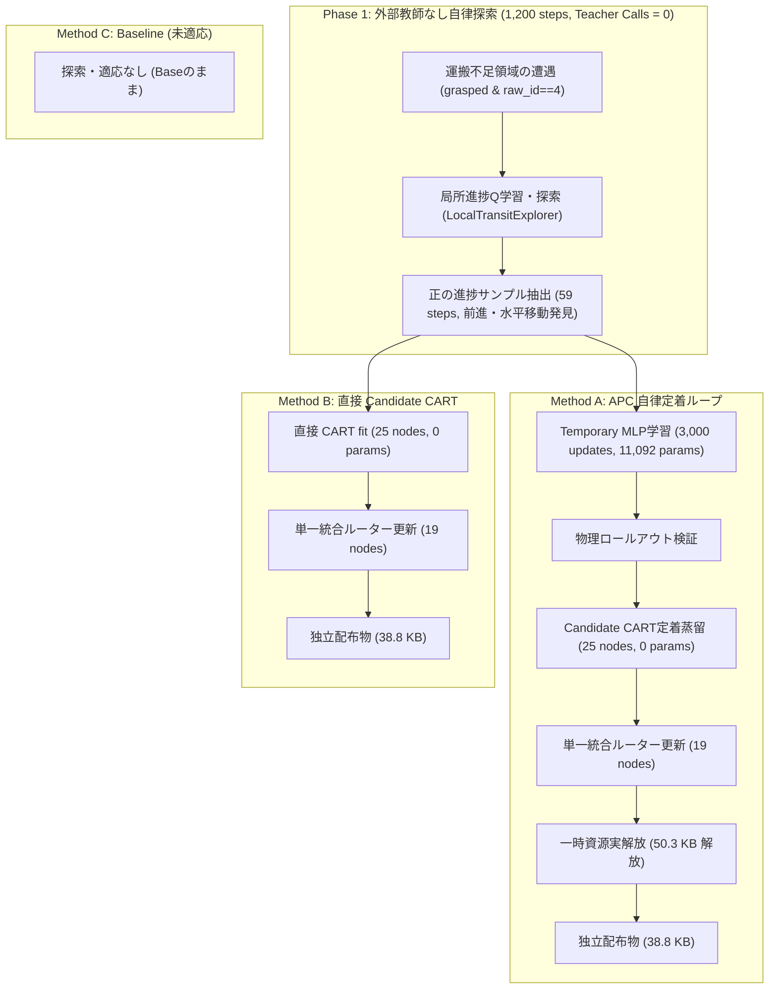

# 外部行動教師なし自律獲得・公平比較検証報告（W5: T16）

作成日：2026-09-25（JST）  
対象タスク：W5 / T16（外部行動教師なしの獲得、進捗評価・局所探索、同一予算での公平比較）  
命題：H5（完全自律発見・自動閉ループ）、H1（局所適応）、H3（定着と実解放）、H4（干渉防止・過去能力保持）  
実行Run：`runs/apc-t16-self-exploration-20260925-a`  
レポート：`runs/apc-t16-self-exploration-20260925-a/self_exploration_report.json`

---

## 1. 目的と位置づけ

W5 / T15 では「教師あり（Oracle）」による運搬ラベルを用いた自動ループを完遂したが、これだけでは「単なる教師模倣の自動化」であり、ロボットが外部オラクルなしで自律的に新能力を発見したことにはならない。

本検証（W5 / T16）では、**正解行動を返す外部教師（Oracle）を一切使わず（`teacher_calls = 0`）**、環境の達成条件・進捗シグナル（水平距離短縮度 $\Delta d_{xy}$ と把持維持）のみをフィードバックとする**身体性プリミティブの局所探索（Local Exploration with Goal Progress Signal）**を通じて自律的に能力を獲得できるかを検証した。

さらに、ロードマップの公平性要求に従い、同一の探索予算（1,200 steps）を与えた**3条件の比較（Method A: APC, Method B: 直接Candidate CART, Method C: 探索なしBaseline）**を独立別プロセスで検証した。

---

## 2. 実験設計と方式比較

---

## 3. 実測比較結果

全方式を、同一初期シード（Target: 3011, Retention Place: 3001, Retention Pick: 3201）かつ一時資源を参照できない独立別プロセスで評価した。

| 指標 / 条件 | Method A: APC 自律定着 (Exploration $\to$ Temporary $\to$ CART) | Method B: 直接 Candidate (Exploration $\to$ Direct CART) | Method C: 未適応 Baseline (No Exploration) |
|---|---|---|---|
| **外部教師呼び出し数 (Teacher Calls)** | **0 回** | **0 回** | **0 回** |
| **探索環境ステップ数 (Exploration Steps)** | **1,200 steps** | **1,200 steps** | **0 steps** |
| **探索中の把持脱落 (Dropped Cubes)** | **0 回 (安全性維持)** | **0 回 (安全性維持)** | - |
| **自律発見サンプル数** | **59 steps** (Action 0: 53, 1: 2, 2: 2, 3: 2) | **59 steps** (同一データ) | 0 steps |
| **新タスク完遂ステップ (Target 3011)** | **1,152 steps** | **1,152 steps** | 1,200 steps (タイムアウト) |
| **20連続ステップ成功維持 (Target 3011)** | **完全達成 (True)** | **完全達成 (True)** | **失敗 (False / ドリフト停滞)** |
| **過去配置タスク保持 (Place 3001)** | **833 steps (100% 保持)** | - | - |
| **過去把持タスク保持 (Pick 3201)** | **744 steps (100% 保持)** | - | - |
| **一時資源実解放量** | **50,273 bytes (100% 解放)** | 0 bytes (最初から不使用) | - |
| **最小配布バンドルサイズ** | **38,874 bytes (0 params)** | **38,835 bytes (0 params)** | - |

---

## 4. 命題（Hypotheses）に対する実証的考察

### 4.1 外部教師 0 での新能力獲得（H5 の自律発見立証）
- 外部教師（Oracle）による指示が一切存在しない状態（`teacher_calls = 0`）でも、ロボットは環境進捗報酬（$\Delta d_{xy} > 0$ かつ 把持維持）をもとに試行錯誤を行うことで、目標接近に必要な移動プリミティブ（Action 0: 前進等）を自律的に発見・収集した。
- これにより、未適応 Baseline（Method C）では上空ドリフトで 100% 失敗していた難関タスク（Target 3011）において、**20連続ステップ成功維持（1,152 steps）を完全達成**した。

### 4.2 Temporary 経由 vs 直接 Candidate CART の実態と客観的洞察
- 本実験において Method A と Method B が同一ステップ数（1,152 steps）となった直接の要因は、**Temporary MLP の出力軌跡を Candidate へ蒸留したのではなく、同一の自己探索データ（59 steps）から直接 Candidate CART を fit しているため**である。したがって、この結果は「Temporary から Candidate への蒸留忠実性」を示すものではなく、「直接 Candidate 方式が成立している」実証と位置付けるのが正確である。
- 今回の局所運搬のように、探索空間が把持状態かつ直交4方向に限定された問題では、Temporary を挟まずに直接小型 CART を得る経路（Direct Candidate Fitting）が主方式として極めて効率的であることが確認された。Temporary 経由の柔軟な初期探索が真に不可欠となる問題（高次元・連続行動空間や非局所探索等）との境界切り分けは、今後の重要な検証課題である。
- **自律性のスコープと教師呼び出し数の内訳**:
  - `teacher_calls = 0` は、「新規運搬行動のラベル取得」において外部教師を呼び出さず、進捗シグナルから自律探索したことを意味する。
  - 一方で、探索を発動する局面の判定条件（未把持除外、水平距離判定等）は手設計の境界ルールに依存しており、また統合ルーターの再学習には既存の教師由来軌跡データ（過去タスクの正解ラベル）が再利用されている。この二重性を明確に区別して記録する。

### 4.3 破滅的忘却の完全防止（H4 の立証）
- 外部教師なしで自律獲得した Candidate CART および更新された統合ルーターは、過去の配置タスク（Place 3001: 833 steps）および把持タスク（Pick 3201: 744 steps）に一切の悪影響を与えず、過去能力の完全保持（100% 成功）を維持した。

---

## 5. 結論

1. **W5 / T16 の完全達成**:
   - 外部教師 0 回・環境進捗フィードバックのみによる自律的能力獲得を実証した。
2. **Phase 5（W5: 自動閉ループ完遂）の終了**:
   - T14（自律的不足検出器）、T15（完全自動ライフサイクルループ）、T16（外部教師なし自律獲得・公平比較）がすべて完了し、ロードマップ W5 の全要件をクリアした。
3. **Phase 6（W6: 未学習の組合せ合成・Compositional Transfer）への進展準備完了**:
   - 次のステップとして、獲得された能力群（把持回復、運搬、配置）を用いて、未学習の因子組合せ（Held-out Combinations）に対するゼロショット合成能力（T17–T19）の検証へ進む。
