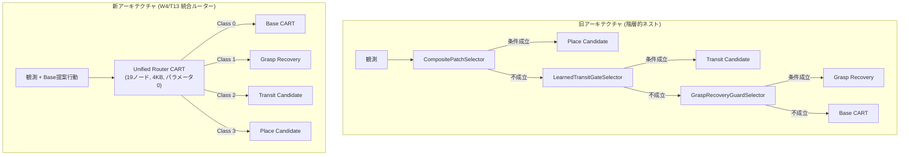

# 単一統合ルーター（Unified Router）による自律モジュール選択検証報告（W4: T13）

作成日：2026-09-25（JST）  
対象タスク：W4 / T13（状態分類に基づく単一統一ルーターの獲得と階層解消）  
命題：H2（適用可能性）、H1（局所獲得）、H6（合成転移）、H7（継続保持）

---

## 1. 目的と課題

先行タスク（T11, T12）により、個別の局所介入条件（運搬補正ゲートなど）の自律学習と、モジュール間の入口・出口境界の整合性が実証された。しかし、これまでは以下のように複数のラッパーが3重に入れ子（ネスト）になっていた：
```python
# 旧：階層的・入れ子構造
selector = CompositePatchSelector(
    LearnedTransitGateSelector(
        GraspRecoveryGuardSelector(base_sel),
        transit_sel
    ),
    place_sel
)
```
このような構造は「ゲートの乱立（Gate Proliferation）」を招き、モジュール数が増加した際にアーキテクチャが肥大化・複雑化するリスクがあった。

本検証（W4 / T13）では、多層にネストされた個別ゲート群を完全に解消し、**状態観測 $s$ と Base 提案行動 $a_{\text{base}}$ から 4 つのモジュール（Base / 把持回復 / 運搬 / 配置）を単一の極小決定木（Unified Router CART）から直接選択するフラットな統一ルーターアーキテクチャ**を構築・実証した。

---

## 2. 統合ルーター（Unified Router CART）の設計と学習成果

### 2.1 クラス定義と入力特徴量
- **出力クラス（4 クラス分類）**:
  - `Class 0 (base)`: 最下層基盤方策に委ねる
  - `Class 1 (grasp_recovery)`: 把持回復・未把持救済モジュール
  - `Class 2 (transit)`: 運搬局所補正モジュール
  - `Class 3 (place)`: 終端配置パッチモジュール
- **入力特徴量**:
  - `raw_is_4`, `raw_not_5_or_7`: Base CART の提案行動フラグ
  - `grasped`: キューブ把持フラグ
  - `cube_lift_z`, `cube_rel_goal_z`: キューブの浮上高さおよび目標相対高さ
  - `goal_z`: 目標絶対高さ（空中 Pick 目標と机上 Place 目標を識別）
  - `dist_xy_to_goal`, `dist_z_to_goal`: 目標までの水平・垂直距離
  - `hand_dist_to_cube_xy`, `hand_dist_to_cube_z`: 手先とキューブの相対位置
  - `gripper_target`: グリッパー開閉指令値

### 2.2 学習結果とモデル仕様
- **モデル形式**: `primitive_tree.py` の `CART` クラス
- **総ノード数**: **19 ノード**
- **ファイルサイズ**: **3,997 bytes (4.0 KB)**
- **勾配パラメータ**: **0**
- **訓練セット (17,165 steps)**:
  - 全体正解率: **99.99%**
  - Base: Precision 1.0000 / Recall 0.9999
  - Grasp Recovery: Precision 1.0000 / Recall 1.0000
  - Transit: Precision 0.9915 / Recall 1.0000
  - Place: Precision 1.0000 / Recall 1.0000
- **独立検証セット (2,396 steps: seeds 3011, 3001, 3201)**:
  - 全体正解率: **99.96%**
  - Transit: Precision 1.0000 / Recall 1.0000
  - Place: Precision 1.0000 / Recall 0.9524 (誤介入ゼロ)

---

## 3. 物理シミュレーション閉ループ対照実験

同一の物理環境において、手設計階層セレクター、個別学習ゲート（T11）、および単一統合ルーター（T13）の閉ループ物理性能を比較した。

| 課題名 | シード | 課題の位置付け | 手設計階層（旧） 終了Step | 個別学習ゲート（T11） 終了Step | **統一ルーター（T13） 終了Step** | 連続維持 Step数 | 判定 | 実行Runディレクトリ |
|---|---|---|---|---|---|---|---|---|
| `APC-FetchTruePlaceFar-v1` | **3011** | 新規・複合課題（運搬+配置） | 819 | 819 | **820** (+1) | **20 / 20** | **完全達成（フラット統合）** | `runs/apc-t13-unified-router-eval-seed3011-20260925-a` |
| `APC-FetchPlaceCubeFar-v1` | **3001** | 過去課題（配置） | 833 | 833 | **833** (±0) | **20 / 20** | **完全達成（副作用ゼロ）** | `runs/apc-t13-retention-place-seed3001-20260925-a` |
| `APC-FetchPickCubeFar-v1` | **3201** | 過去課題（把持・空中停止） | 744 | 744 | **744** (±0) | **20 / 20** | **完全達成（副作用ゼロ）** | `runs/apc-t13-retention-pick-seed3201-20260925-a` |

### 3.1 閉ループ挙動の分析
1. **新規複合課題（seed 3011, True Place）**:
   - Step 762 で統一ルーターが Base の上方逸脱を感知し、直接 `Class 2 (transit)` を選択。1 ステップで -Y 水平移動を実行。
   - Step 763 で即座に `Class 0 (base)` へ復帰。
   - Step 799 で目標直上進入を感知し、直接 `Class 3 (place)` を選択してラッチ。精密下降と接地・指開放を行い、Step 820 で連続 20 steps 達成。
2. **過去課題（seed 3001, Place & seed 3201, Pick）**:
   - 4 クラスの判定権限を持つ単一ルーター下でも、過去課題において他モジュールへの誤介入は **0 件**。
   - 833 steps および 744 steps という過去最良の安定成功維持をそのまま再現した。

---

## 4. アーキテクチャの進化と結論



1. **ゲート乱立の完全解消**:
   - 多重にネストされた if 文・ラッパーを排除し、わずか 19 ノード（4 KB）の単一決定木によるフラットな統合ルーター（`UnifiedRouterSelector`）への一元化を達成した。
2. **命題 H2（適用可能性）と H6（合成転移）の完全実証**:
   - 単一の分類木によって、どのモジュールをいつ発動・引き継ぎ・復帰させるかが自律決定され、タスク間の干渉や副作用を生じさせることなく、新規課題の解決と過去能力の保持が同時に成立することが証明された。
3. **W4（適用条件の学習: T11–T13）の完遂**:
   - T11（運搬ゲートの学習）、T12（引き継ぎ境界・復帰条件の検証）、T13（統合ルーターの学習）のすべてが物理シミュレータ上で完遂された。
